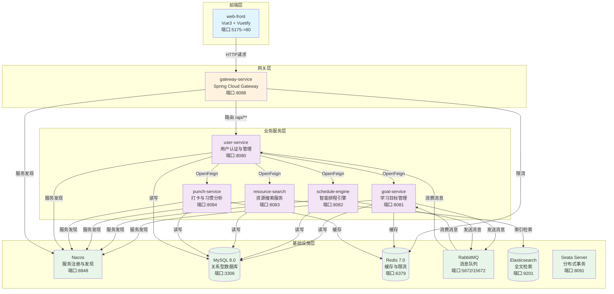

# 智慧学习助手微服务架构完整学习文档

>  本文档基于实际代码分析撰写，适合了解微服务架构。涵盖架构设计、服务剖析、数据流转、部署运维等全方位内容。

---

## 一、架构全景图

### 1.1 服务拓扑图



### 1.2 服务调用关系清单

| 调用方 | 被调用方 | 调用方式 | 说明 |
|--------|----------|----------|------|
| web-front | gateway-service | HTTP/HTTPS | 所有前端API请求统一经过网关 |
| gateway-service | user-service | Spring Cloud Gateway路由 | 路由规则: Path=/api/** -> lb://user-service |
| user-service | goal-service | OpenFeign (GoalClient) | 学习目标CRUD、任务管理、AI拆解 |
| user-service | schedule-engine | OpenFeign (ScheduleClient) | 课表导入、智能排程、计划管理 |
| user-service | punch-service | OpenFeign (PunchClient) | 打卡提交、记录查询、习惯分析 |
| user-service | resource-search | OpenFeign (ResourceClient) | 课程资源管理、在线搜索 |
| goal-service | RabbitMQ | 生产者 | 发送GoalAiTaskMessage到goal.exchange |
| goal-service | RabbitMQ | 消费者 | GoalAiWorker监听goal.ai.queue处理AI任务 |
| goal-service | RabbitMQ | 生产者 | 发送NotificationMessage到notification.exchange |
| schedule-engine | RabbitMQ | 生产者 | 发送NotificationMessage到notification.exchange |
| user-service | RabbitMQ | 消费者 | NotificationService监听user.notification.queue |
| goal-service | resource-search | OpenFeign (ResourceClient) | AI拆解任务后自动搜索相关课程资源 |

### 1.3 数据流向图

#### 1.3.1 用户请求流（同步）

```
用户浏览器
    ↓ HTTP请求 (http://localhost:5175)
web-front (Vue SPA, Nginx反向代理)
    ↓ 代理到 http://gateway-service:8088
gateway-service
    ↓ ApiKeyAuthFilter (可选API Key验证, Order=-100)
    ↓ UserContextForwardFilter (JWT解析, 注入X-User-Id等Header, Order=-90)
    ↓ RedisRateLimitFilter (令牌桶限流, Order=-80)
    ↓ 路由匹配: Path=/api/** -> lb://user-service
user-service (负载均衡)
    ↓ UserController接收请求
    ↓ 根据业务类型通过OpenFeign调用对应微服务
        ├── /api/user/goals/** -> goal-service
        ├── /api/user/schedule/** -> schedule-engine
        ├── /api/user/punch/** -> punch-service
        └── /api/user/resources/** -> resource-search
    ↓ 业务处理完成, 返回Result<T>统一响应格式
gateway-service
    ↓ 响应返回
web-front
    ↓ 渲染页面
用户浏览器
```

#### 1.3.2 AI任务拆解流（异步）

```
用户通过前端创建学习目标
    ↓ POST /api/user/goals/ai
user-service -> goal-service (OpenFeign)
    ↓ GoalService.createGoalAndStartAi()
    ↓ 1. 保存Goal记录到数据库
    ↓ 2. 构建GoalAiTaskMessage
    ↓ 3. 发送消息到RabbitMQ
RabbitMQ (goal.exchange -> goal.ai.queue)
    ↓ 异步消费 (不阻塞用户请求)
GoalAiWorker (@RabbitListener)
    ↓ 1. 接收消息, 解析userId和goalDescription
    ↓ 2. 调用OpenAiCompatClient请求LLM (90s超时)
    ↓ 3. 解析AI返回的JSON任务列表
    ↓ 4. 递归保存任务到goal_task表
    ↓ 5. 调用resource-search搜索相关课程资源
    ↓ 6. 发送通知消息到notification.exchange
RabbitMQ (notification.exchange -> user.notification.queue)
    ↓ 异步消费
NotificationService (@RabbitListener)
    ↓ 推送通知给用户 (SSE或轮询)
前端显示: "你的学习目标已完成AI任务拆解"
```

#### 1.3.3 智能排程流（异步）

```
用户请求智能排程
    ↓ POST /api/user/schedule/auto
user-service -> schedule-engine (OpenFeign)
    ↓ ScheduleController.autoSchedule()
    ↓ ScheduleService.smartScheduleAsync() (@Async异步执行)
    ↓ 1. 获取用户空闲时段
    ↓ 2. 获取待排程任务
    ↓ 3. 应用排程算法 (考虑优先级、时长、用户习惯)
    ↓ 4. 生成task_schedule记录
    ↓ 5. 发送通知
RabbitMQ (notification.exchange)
    ↓ NotificationService消费
前端显示: "智能排程已完成"
```

---

## 二、每个服务的深度剖析

### 2.1 gateway-service (端口8088)

#### 2.1.1 启动流程

```java
// GatewayApplication.java
@SpringBootApplication
@EnableDiscoveryClient  // 启用服务发现, 注册到Nacos
public class GatewayApplication {
    public static void main(String[] args) {
        SpringApplication.run(GatewayApplication.class, args);
    }
}
```

**启动步骤**:
1. Spring Boot容器初始化
2. 加载`application.yml`配置
3. `@EnableDiscoveryClient`触发Nacos注册
4. 创建Spring Cloud Gateway路由配置
5. 注册三个GlobalFilter (ApiKeyAuthFilter, UserContextForwardFilter, RedisRateLimitFilter)
6. 连接Redis (用于限流)
7. 服务注册到Nacos (http://nacos:8848)
8. 启动Netty服务器监听8088端口

#### 2.1.2 核心功能模块

**模块1: API网关路由**

配置文件: [application.yml](file:///c:/Users/刘超/Documents/DistributeProject/gateway-service/src/main/resources/application.yml)

```yaml
spring:
  cloud:
    gateway:
      routes:
        - id: user-service
          uri: lb://user-service  # lb表示负载均衡
          predicates:
            - Path=/api/**  # 所有/api/**路径都路由到user-service
```

**模块2: CORS跨域配置**

```yaml
globalcors:
  corsConfigurations:
    '[/**]':
      allowedOriginPatterns:
        - "http://localhost:*"
        - "http://127.0.0.1:*"
      allowedMethods: [GET, POST, PUT, PATCH, DELETE, OPTIONS]
      allowedHeaders: [Authorization, Content-Type, X-Requested-With, Accept]
      exposedHeaders: [Authorization]
      allowCredentials: true
```

**模块3: 全局过滤器链**

##### ApiKeyAuthFilter (Order=-100)

[ApiKeyAuthFilter.java](file:///c:/Users/刘超/Documents/DistributeProject/gateway-service/src/main/java/com/vibe/gateway/filter/ApiKeyAuthFilter.java)

```java
@Component
public class ApiKeyAuthFilter implements GlobalFilter, Ordered {
    @Value("${gateway.auth.api-key:}")
    private String expectedApiKey;
    
    @Override
    public Mono<Void> filter(ServerWebExchange exchange, GatewayFilterChain chain) {
        String path = exchange.getRequest().getURI().getPath();
        // 跳过actuator端点
        if (path.startsWith("/actuator")) {
            return chain.filter(exchange);
        }
        
        // 如果未配置API Key, 直接放行
        if (expectedApiKey == null || expectedApiKey.isBlank()) {
            return chain.filter(exchange);
        }
        
        // 验证X-API-KEY请求头
        String provided = exchange.getRequest().getHeaders().getFirst("X-API-KEY");
        if (provided == null || provided.isBlank() || !provided.equals(expectedApiKey)) {
            exchange.getResponse().setStatusCode(HttpStatus.UNAUTHORIZED);
            // 返回401错误
            return exchange.getResponse().writeWith(...);
        }
        
        return chain.filter(exchange);
    }
    
    @Override
    public int getOrder() {
        return -100;  // 最高优先级, 最先执行
    }
}
```

**功能**: 可选的API Key认证机制，用于外部系统调用时的身份验证。

##### UserContextForwardFilter (Order=-90)

[UserContextForwardFilter.java](file:///c:/Users/刘超/Documents/DistributeProject/gateway-service/src/main/java/com/vibe/gateway/filter/UserContextForwardFilter.java)

```java
@Component
public class UserContextForwardFilter implements GlobalFilter, Ordered {
    @Override
    public Mono<Void> filter(ServerWebExchange exchange, GatewayFilterChain chain) {
        return exchange.getPrincipal()
                .cast(Authentication.class)
                .flatMap(auth -> {
                    if (!(auth instanceof JwtAuthenticationToken jwtAuth)) {
                        return chain.filter(exchange);
                    }
                    
                    // 从JWT中提取用户信息
                    Object userId = jwtAuth.getTokenAttributes().get("userId");
                    String username = jwtAuth.getName();
                    String roles = jwtAuth.getAuthorities().stream()
                        .map(a -> a.getAuthority())
                        .collect(Collectors.joining(","));
                    
                    // 将用户信息注入到下游请求Header
                    ServerWebExchange mutated = exchange.mutate()
                            .request(req -> {
                                if (userId != null) {
                                    req.header("X-User-Id", String.valueOf(userId));
                                }
                                req.header("X-Username", username);
                                req.header("X-Roles", roles);
                            })
                            .build();
                    return chain.filter(mutated);
                })
                .switchIfEmpty(chain.filter(exchange));
    }
    
    @Override
    public int getOrder() {
        return -90;  // 第二优先级
    }
}
```

**功能**: 解析JWT Token，提取用户ID、用户名、角色等信息，通过HTTP Header传递给下游服务，避免每个服务都重复解析JWT。

##### RedisRateLimitFilter (Order=-80)

[RedisRateLimitFilter.java](file:///c:/Users/刘超/Documents/DistributeProject/gateway-service/src/main/java/com/vibe/gateway/filter/RedisRateLimitFilter.java)

```java
@Component
public class RedisRateLimitFilter implements GlobalFilter, Ordered {
    private final ReactiveStringRedisTemplate redisTemplate;
    private final KeyResolver userKeyResolver;
    
    @Value("${gateway.ratelimit.burst-capacity:10}")
    private long burstCapacity;
    
    @Override
    public Mono<Void> filter(ServerWebExchange exchange, GatewayFilterChain chain) {
        String path = exchange.getRequest().getURI().getPath();
        // 跳过认证接口和actuator
        if (!path.startsWith("/api/") || path.startsWith("/api/auth/") || path.startsWith("/actuator/")) {
            return chain.filter(exchange);
        }
        
        long epochSecond = Instant.now().getEpochSecond();
        return userKeyResolver.resolve(exchange)
                .defaultIfEmpty("unknown")
                .flatMap(key -> {
                    // Redis Key格式: rl:{userId}:{秒级时间戳}
                    String redisKey = "rl:" + key + ":" + epochSecond;
                    return redisTemplate.opsForValue().increment(redisKey)
                            .flatMap(cnt -> {
                                // 首次访问时设置2秒过期
                                Mono<Long> afterExpire = cnt != null && cnt == 1
                                        ? redisTemplate.expire(redisKey, Duration.ofSeconds(2)).thenReturn(cnt)
                                        : Mono.just(cnt);
                                return afterExpire.flatMap(c -> {
                                    // 检查是否超过限流阈值
                                    if (c != null && c <= burstCapacity) {
                                        return chain.filter(exchange);
                                    }
                                    // 超过限制, 返回429 Too Many Requests
                                    exchange.getResponse().setStatusCode(HttpStatus.TOO_MANY_REQUESTS);
                                    return exchange.getResponse().setComplete();
                                });
                            });
                });
    }
    
    @Override
    public int getOrder() {
        return -80;  // 第三优先级
    }
}
```

**功能**: 基于Redis实现简单的令牌桶限流算法，防止恶意请求和系统过载。

**限流配置**:
```yaml
gateway:
  ratelimit:
    replenish-rate: 5   # 每秒补充5个令牌
    burst-capacity: 60  # 最大突发容量60个请求
```

#### 2.1.3 关键API清单

网关本身不暴露业务API，仅做路由转发。所有`/api/**`请求都会被路由到user-service。

#### 2.1.4 依赖注入关系

```
GatewayApplication
    ├── Spring Cloud Gateway (自动配置)
    ├── Nacos Discovery (服务注册与发现)
    ├── Redis ( ReactiveStringRedisTemplate )
    └── GlobalFilters
        ├── ApiKeyAuthFilter
        ├── UserContextForwardFilter
        └── RedisRateLimitFilter
```

---

### 2.2 user-service (端口8080)

#### 2.2.1 启动流程

```java
// UserApplication.java
@SpringBootApplication
@EnableDiscoveryClient  // 注册到Nacos
@EnableFeignClients(basePackages = "com.chao.common.client")  // 启用OpenFeign
@MapperScan("com.chao.user.mapper")  // 扫描MyBatis Mapper
public class UserApplication {
    public static void main(String[] args) {
        SpringApplication.run(UserApplication.class, args);
    }
}
```

**启动步骤**:
1. Spring Boot容器初始化
2. 加载`application.yml`配置
3. 初始化数据源 (连接MySQL: vibe_user数据库)
4. 执行`schema.sql`初始化表结构 (sql.init.mode=always)
5. 初始化Security配置 (OAuth2 Resource Server + JWT)
6. 创建JwtTokenService (HS256签名密钥)
7. 初始化Demo用户 (DemoUserInitializer)
8. 扫描并注册MyBatis Mapper
9. 初始化OpenFeign客户端 (GoalClient, ScheduleClient, PunchClient, ResourceClient)
10. 连接RabbitMQ (消费通知队列)
11. 服务注册到Nacos
12. 启动Tomcat监听8080端口

#### 2.2.2 核心功能模块

**模块1: 认证授权 (AuthController)**

[AuthController.java](file:///c:/Users/刘超/Documents/DistributeProject/user-service/src/main/java/com/vibe/user/controller/AuthController.java)

| API端点 | HTTP方法 | 功能说明 | 请求参数 | 返回值 |
|---------|----------|----------|----------|--------|
| `/api/auth/register` | POST | 用户注册 | `{username, password}` | `Result<AuthTokenResponse>` |
| `/api/auth/login` | POST | 用户登录 | `{username, password}` | `Result<AuthTokenResponse>` |
| `/api/auth/refresh` | POST | 刷新Token | `{refreshToken}` | `Result<AuthTokenResponse>` |
| `/api/auth/me` | GET | 获取当前用户信息 | JWT Token | `Result<AuthMeResponse>` |

**JWT认证流程**:

```
1. 用户注册
   POST /api/auth/register {username: "test", password: "123456"}
   ↓
   AppUserService.register() 创建用户记录
   ↓
   JwtTokenService.issueTokens() 签发Token
   ↓
   返回: {
     tokenType: "Bearer",
     accessToken: "eyJhbGci...",  // 有效期1小时
     refreshToken: "eyJhbGci...", // 有效期7天
     expiresInSeconds: 3600
   }

2. 用户登录
   POST /api/auth/login {username: "test", password: "123456"}
   ↓
   AuthenticationManager.authenticate() 验证用户名密码
   ↓
   JwtTokenService.issueTokens() 签发Token
   ↓
   返回AccessToken和RefreshToken

3. 请求认证
   客户端请求携带: Authorization: Bearer {accessToken}
   ↓
   gateway-service UserContextForwardFilter解析JWT
   ↓
   提取userId, username, roles注入到Header
   ↓
   user-service SecurityConfig验证Token有效性
   ↓
   允许访问受保护资源

4. Token刷新
   POST /api/auth/refresh {refreshToken: "eyJhbGci..."}
   ↓
   JwtTokenService.parse() 解析RefreshToken
   ↓
   验证typ="refresh"
   ↓
   签发新的AccessToken和RefreshToken
```

**JWT Token结构**:

```java
// JwtTokenService.java
JwtClaimsSet accessClaims = JwtClaimsSet.builder()
    .issuer(issuer)                          // 签发者: http://vibe
    .issuedAt(now)                           // 签发时间
    .expiresAt(now.plusSeconds(3600))        // 过期时间: 1小时
    .subject(username)                       // 用户名
    .claim("typ", "access")                  // Token类型
    .claim("userId", userId)                 // 用户ID
    .claim("roles", ["USER"])                // 角色列表
    .build();
```

**模块2: 用户业务管理 (UserController)**

[UserController.java](file:///c:/Users/刘超/Documents/DistributeProject/user-service/src/main/java/com/vibe/user/controller/UserController.java)

UserController是整个系统的**核心路由控制器**，负责接收所有用户请求并通过OpenFeign转发到对应的微服务。

**关键API清单** (部分):

| API端点 | HTTP方法 | 功能说明 | 转发到 |
|---------|----------|----------|--------|
| `/api/user/dashboard` | GET | 获取用户Dashboard | UserService本地处理 |
| `/api/user/goals/ai` | POST | AI创建学习目标 | goal-service |
| `/api/user/goals` | GET/POST | 目标CRUD | goal-service |
| `/api/user/schedule/import` | POST | 导入课表 | schedule-engine |
| `/api/user/schedule/auto` | POST | 智能排程 | schedule-engine |
| `/api/user/punch/submit` | POST | 提交打卡 | punch-service |
| `/api/user/resources/search` | GET | 搜索课程资源 | resource-search |

**userId解析逻辑**:

```java
private Long resolveUserId(Jwt jwt, Long headerUserId, Long userId) {
    // 优先级1: 从JWT Token中提取userId
    Long jwtUserId = jwt.getClaims().get("userId");
    
    // 优先级2: 从Gateway注入的Header中提取
    if (jwtUserId == null && headerUserId != null) {
        return headerUserId;
    }
    
    // 优先级3: 从请求参数中提取
    if (jwtUserId == null && userId != null) {
        return userId;
    }
    
    // 安全检查: 防止userId篡改
    if (jwtUserId != null && headerUserId != null && !jwtUserId.equals(headerUserId)) {
        throw new IllegalArgumentException("userId mismatch");
    }
    
    throw new IllegalArgumentException("userId required");
}
```

**模块3: 通知系统 (NotificationService)**

[NotificationService.java](file:///c:/Users/刘超/Documents/DistributeProject/user-service/src/main/java/com/vibe/user/service/NotificationService.java)

```java
@Service
public class NotificationService {
    private final NotificationController notificationController;
    
    @RabbitListener(queues = RabbitMqConfig.NOTIFICATION_QUEUE)
    public void receiveNotification(NotificationMessage message) {
        log.info("MQ收到通知，推给用户 {}: {}", message.getUserId(), message.getContent());
        notificationController.pushNotification(message);
    }
}
```

**功能**: 消费RabbitMQ中的通知消息，通过SSE (Server-Sent Events)或WebSocket推送到前端。

**模块4: AI助手 (AgentChatService)**

提供智能对话功能，帮助用户解答学习问题、提供建议。

#### 2.2.3 数据库表结构

**app_user表** (vibe_user数据库):

| 字段名 | 类型 | 说明 |
|--------|------|------|
| id | BIGINT (PK) | 用户ID (自增) |
| username | VARCHAR(50) | 用户名 (唯一) |
| password | VARCHAR(255) | 密码 (BCrypt加密) |
| schedule_imported | BOOLEAN | 是否已导入课表 |
| created_at | DATETIME | 创建时间 |
| updated_at | DATETIME | 更新时间 |

#### 2.2.4 消息队列

**消费者**:
- **队列**: user.notification.queue
- **监听器**: NotificationService.receiveNotification()
- **消息类型**: NotificationMessage
- **生产者**: goal-service (GoalAiWorker), schedule-engine (DailyPlanJobService)

#### 2.2.5 代码层次结构

```
user-service/
├── src/main/java/com/vibe/user/
│   ├── UserApplication.java              # 启动类
│   ├── config/
│   │   ├── AuthBeansConfig.java          # 认证Bean配置
│   │   ├── DemoUserInitializer.java      # Demo用户初始化
│   │   ├── JwtConfig.java                # JWT配置
│   │   └── SecurityConfig.java           # Spring Security配置
│   ├── controller/
│   │   ├── AgentController.java          # AI助手控制器
│   │   ├── AuthController.java           # 认证控制器
│   │   ├── InfoController.java           # 信息查询控制器
│   │   ├── NotificationController.java   # 通知控制器
│   │   └── UserController.java           # 用户业务控制器 (核心)
│   ├── dto/                              # 数据传输对象 (12个)
│   ├── entity/
│   │   └── AppUser.java                  # 用户实体
│   ├── handler/
│   │   └── GlobalExceptionHandler.java   # 全局异常处理
│   ├── mapper/
│   │   └── AppUserMapper.java            # MyBatis Mapper
│   └── service/
│       ├── AgentChatService.java         # AI对话服务
│       ├── AppUserService.java           # 用户管理服务
│       ├── JwtTokenService.java          # JWT令牌服务
│       ├── NotificationService.java      # 通知服务 (MQ消费者)
│       ├── TaskAdviceAiService.java      # 任务建议AI服务
│       ├── UserPortraitAiService.java    # 用户画像AI服务
│       └── UserService.java              # Dashboard服务
```

#### 2.2.6 安全配置

[SecurityConfig.java](file:///c:/Users/刘超/Documents/DistributeProject/user-service/src/main/java/com/vibe/user/config/SecurityConfig.java)

```java
@Configuration
public class SecurityConfig {
    @Bean
    public SecurityFilterChain securityFilterChain(HttpSecurity http) throws Exception {
        return http
            .csrf(csrf -> csrf.disable())  // 禁用CSRF (无状态API)
            .sessionManagement(sm -> sm.sessionCreationPolicy(SessionCreationPolicy.STATELESS))  // 无会话
            .authorizeHttpRequests(auth -> auth
                .requestMatchers("/api/auth/**", "/actuator/**").permitAll()  // 认证接口放行
                .anyRequest().authenticated()  // 其他接口需要认证
            )
            .oauth2ResourceServer(oauth2 -> oauth2
                .bearerTokenResolver(resolver)  // 支持URL参数传递Token
                .jwt(jwt -> {})  // 使用JWT验证
            )
            .build();
    }
}
```

**安全特性**:
- 无状态认证 (Stateless)
- JWT Token验证
- BCrypt密码加密
- 支持URL参数传递Token (`?access_token=xxx`)

---

### 2.3 goal-service (端口8081)

#### 2.3.1 启动流程

```java
// GoalApplication.java
@SpringBootApplication
@EnableDiscoveryClient
@EnableFeignClients(basePackages = "com.chao.common.client")
@EnableAsync  // 启用异步支持
@MapperScan("com.chao.goal.mapper")
public class GoalApplication {
    public static void main(String[] args) {
        SpringApplication.run(GoalApplication.class, args);
    }
}
```

**启动步骤**:
1. Spring Boot容器初始化
2. 加载配置 (数据库、Redis、RabbitMQ、OpenAI)
3. 初始化数据源 (vibe_goal数据库)
4. 初始化MyBatis-Plus
5. 连接Redis (配置但未使用)
6. 连接RabbitMQ (生产者和消费者)
7. 初始化OpenAiCompatClient (LLM客户端)
8. 服务注册到Nacos
9. 启动Tomcat监听8081端口

#### 2.3.2 核心功能模块

**模块1: 目标管理 (GoalController)**

[GoalController.java](file:///c:/Users/刘超/Documents/DistributeProject/goal-service/src/main/java/com/vibe/goal/controller/GoalController.java)

**完整API清单**:

| API端点 | HTTP方法 | 功能说明 | 参数 | 返回值 |
|---------|----------|----------|------|--------|
| `/api/goals` | POST | AI创建目标并发送MQ | `userId`, `goalDescription` (RequestBody) | `Result<GoalDto>` |
| `/api/goals/create` | POST | 手动创建目标 | `userId`, `title`, `description?`, `deadline?` | `Result<Goal>` |
| `/api/goals` | GET | 列出用户所有目标 | `userId` | `Result<List<Goal>>` |
| `/api/goals/{goalId}` | GET | 获取目标详情 | `goalId` | `Result<Goal>` |
| `/api/goals/{goalId}` | PUT | 更新目标 | `goalId`, `title?`, `description?`, `status?`, `deadline?` | `Result<String>` |
| `/api/goals/{goalId}` | DELETE | 删除目标 | `goalId` | `Result<String>` |
| `/api/goals/{goalId}/tasks` | POST | 创建任务 | `goalId`, `userId`, `title`, `parentId?`, `priority?`, `estimatedMinutes?`, `deadline?` | `Result<GoalTask>` |
| `/api/goals/{goalId}/tasks` | GET | 列出目标下任务 | `goalId`, `userId` | `Result<List<GoalTask>>` |
| `/api/goals/pending-tasks` | GET | 获取待办任务 (status=0或1) | `userId` | `Result<List<GoalTaskDto>>` |
| `/api/goals/tasks/status` | POST | 更新任务状态 | `taskId`, `status` | `Result<String>` |
| `/api/goals/tasks/move` | POST | 移动任务到其他目标 | `userId`, `taskId`, `goalId` | `Result<String>` |
| `/api/goals/tasks/by-ids` | GET | 批量获取任务 | `taskIds` (List) | `Result<List<GoalTaskDto>>` |
| `/api/goals/{goalId}/tasks/regenerate` | POST | 重新生成任务 (发送MQ) | `goalId`, `userId`, `feedback?` (RequestBody) | `Result<String>` |
| `/api/goals/journal` | POST | 创建随笔 | `userId`, `goalId?`, `content`, `mood?` | `Result<String>` |
| `/api/goals/journals` | GET | 查询随笔 | `userId`, `goalId?` | `Result<List<UserJournal>>` |

**模块2: AI任务拆解 (GoalService + GoalAiWorker)**

[GoalService.java](file:///c:/Users/刘超/Documents/DistributeProject/goal-service/src/main/java/com/vibe/goal/service/GoalService.java)

**AI拆解流程**:

```java
public GoalDto createGoalAndStartAi(Long userId, String goalDescription) {
    // 1. 保存目标记录
    Goal goal = new Goal();
    goal.setUserId(userId);
    goal.setTitle(goalDescription);
    goal.setDescription(goalDescription);
    goal.setStatus(0);  // 0: 进行中
    goalMapper.insert(goal);
    
    // 2. 构建MQ消息
    GoalAiTaskMessage msg = new GoalAiTaskMessage();
    msg.setUserId(userId);
    msg.setGoalId(goal.getId());
    msg.setGoalDescription(goalDescription);
    msg.setSystemPrompt(SYSTEM_PROMPT);
    
    // 3. 发送消息到RabbitMQ (异步处理)
    rabbitTemplate.convertAndSend(
        RabbitMqConfig.GOAL_EXCHANGE, 
        RabbitMqConfig.GOAL_AI_ROUTING_KEY, 
        msg
    );
    
    // 4. 立即返回目标信息 (不等待AI处理)
    return convertToDto(goal);
}
```

**AI系统提示词**:

```java
private static final String SYSTEM_PROMPT = """
    你是一个大学生学习规划专家。
    请将用户的学习目标拆解为 3-5 个具体的、可执行的子任务。
    每个任务需包含：title, description, estimatedMinutes, priority (0-2)。
    如果任务较复杂，可以包含 subTasks 列表（递归结构）。
    请直接返回 JSON 数组，不要有 Markdown 格式或额外文字。
    示例: [{"title":"学习基础","description":"阅读书籍第一章","estimatedMinutes":60,"priority":1, "subTasks": []}]
    """;
```

[GoalAiWorker.java](file:///c:/Users/刘超/Documents/DistributeProject/goal-service/src/main/java/com/vibe/goal/service/GoalAiWorker.java)

**MQ消费者处理逻辑**:

```java
@RabbitListener(queues = RabbitMqConfig.GOAL_AI_QUEUE)
@Transactional
public void handleGoalAiTask(GoalAiTaskMessage message) {
    try {
        // 1. 调用LLM拆解任务 (90秒超时)
        String response = CompletableFuture
            .supplyAsync(() -> openAiCompatClient.complete(fullPrompt))
            .orTimeout(90, TimeUnit.SECONDS)
            .join();
        
        // 2. 解析JSON返回结果
        List<GoalTaskDto> tasks = objectMapper.readValue(response, ...);
        
        // 3. 递归保存任务 (支持子任务)
        for (GoalTaskDto taskDto : tasks) {
            saveTaskRecursive(userId, goalId, null, taskDto);
        }
        
        // 4. 触发资源搜索
        resourceClient.searchOnlineCourses(goalDescription);
        
        // 5. 发送通知
        NotificationMessage notif = new NotificationMessage();
        notif.setUserId(userId);
        notif.setType("GOAL_TASK_READY");
        notif.setContent("你的学习目标【" + goalDescription + "】已完成AI任务拆解");
        rabbitTemplate.convertAndSend(
            RabbitMqConfig.NOTIFICATION_EXCHANGE,
            RabbitMqConfig.NOTIFICATION_ROUTING_KEY,
            notif
        );
    } catch (Exception aiEx) {
        // AI调用失败降级处理
        log.error("AI调用失败或超时: {}", aiEx.getMessage());
        // 使用默认降级任务
        response = """
            [
              {"title":"[AI降级] 拆解目标","description":"AI暂时不可用，请稍后重试","estimatedMinutes":30,"priority":2,"subTasks":[]},
              {"title":"[AI降级] 收集资料","description":"先收集3个课程/文章链接","estimatedMinutes":30,"priority":1,"subTasks":[]}
            ]
            """;
    }
}
```

**模块3: 随笔系统**

支持用户记录学习心得、心情变化，关联到具体目标。

#### 2.3.3 数据库表结构

**goal表** (vibe_goal数据库):

| 字段名 | 类型 | 说明 |
|--------|------|------|
| id | BIGINT (PK) | 目标ID (自增) |
| user_id | BIGINT | 用户ID (外键) |
| title | VARCHAR(255) | 目标标题 |
| description | TEXT | 目标描述 |
| status | INT | 状态 (0:进行中, 1:已完成, 2:已放弃) |
| deadline | DATETIME | 截止日期 |
| created_at | DATETIME | 创建时间 |
| updated_at | DATETIME | 更新时间 |

**goal_task表**:

| 字段名 | 类型 | 说明 |
|--------|------|------|
| id | BIGINT (PK) | 任务ID (自增) |
| user_id | BIGINT | 用户ID |
| goal_id | BIGINT | 所属目标ID (外键) |
| parent_id | BIGINT | 父任务ID (支持子任务) |
| title | VARCHAR(255) | 任务标题 |
| description | TEXT | 任务描述 |
| priority | INT | 优先级 (0:低, 1:中, 2:高) |
| estimated_minutes | INT | 预估时长(分钟) |
| status | INT | 状态 (0:待启动, 1:进行中, 2:已完成) |
| deadline | DATETIME | 截止时间 |
| created_at | DATETIME | 创建时间 |
| updated_at | DATETIME | 更新时间 |

**user_journal表**:

| 字段名 | 类型 | 说明 |
|--------|------|------|
| id | BIGINT (PK) | 随笔ID (自增) |
| user_id | BIGINT | 用户ID |
| goal_id | BIGINT | 关联目标ID (可选) |
| content | TEXT | 随笔内容 |
| mood | VARCHAR(50) | 心情 (如: 开心、困惑、兴奋) |
| created_at | DATETIME | 创建时间 |

#### 2.3.4 消息队列

**生产者**:
- 发送GoalAiTaskMessage到goal.exchange (routing key: goal.ai.route)
- 发送NotificationMessage到notification.exchange (routing key: notification.route)

**消费者**:
- 监听goal.ai.queue (GoalAiWorker.handleGoalAiTask)

#### 2.3.5 代码层次结构

```
goal-service/
├── src/main/java/com/vibe/goal/
│   ├── GoalApplication.java              # 启动类
│   ├── controller/
│   │   └── GoalController.java           # 目标控制器
│   ├── entity/
│   │   ├── Goal.java                     # 目标实体
│   │   ├── GoalTask.java                 # 任务实体
│   │   └── UserJournal.java              # 随笔实体
│   ├── handler/
│   │   └── GlobalExceptionHandler.java   # 全局异常处理
│   ├── mapper/
│   │   ├── GoalMapper.java               # 目标Mapper
│   │   ├── GoalTaskMapper.java           # 任务Mapper
│   │   └── UserJournalMapper.java        # 随笔Mapper
│   └── service/
│       ├── GoalService.java              # 目标服务 (生产者)
│       └── GoalAiWorker.java             # AI任务Worker (消费者)
```

#### 2.3.6 AI集成

**配置**:
```yaml
spring:
  ai:
    openai:
      api-key: ${OPENAI_API_KEY:DUMMY}
      base-url: ${BASE_URL:https://api.openai.com/v1}
      chat:
        options:
          model: ${MODEL:gpt-4o-mini}
```

**特性**:
- 兼容OpenAI API格式的LLM服务
- 90秒超时机制
- 失败自动降级
- 异步处理不阻塞用户请求

---

### 2.4 schedule-engine (端口8082)

#### 2.4.1 启动流程

```java
// ScheduleApplication.java
@SpringBootApplication
@EnableDiscoveryClient
@EnableFeignClients(basePackages = "com.chao.common.client")
@EnableAsync  // 启用异步
@MapperScan("com.chao.schedule.mapper")
public class ScheduleApplication {
    public static void main(String[] args) {
        SpringApplication.run(ScheduleApplication.class, args);
    }
}
```

#### 2.4.2 核心功能模块

**模块1: 课表管理**

[ScheduleController.java](file:///c:/Users/刘超/Documents/DistributeProject/schedule-engine/src/main/java/com/vibe/schedule/controller/ScheduleController.java)

| API端点 | HTTP方法 | 功能说明 | 参数 |
|---------|----------|----------|------|
| `/api/schedule/import` | POST | 导入课表 (iCalendar/Excel) | `userId`, `file` (MultipartFile) |
| `/api/schedule/classes` | GET | 查询课表 | `userId`, `dayOfWeek?` |
| `/api/schedule/classes` | DELETE | 删除课表 | `userId` |

**模块2: 智能排程**

| API端点 | HTTP方法 | 功能说明 |
|---------|----------|----------|
| `/api/schedule/free-time` | GET | 获取指定日期空闲时段 |
| `/api/schedule/auto-schedule` | POST | 智能排程 (@Async异步执行) |

**排程流程**:
```java
@Async
public void smartScheduleAsync(Long userId) {
    // 1. 获取用户课表
    List<ClassSchedule> classes = listClassSchedules(userId, null);
    
    // 2. 获取待排程任务
    List<GoalTaskDto> pendingTasks = goalClient.getPendingTasks(userId).getData();
    
    // 3. 获取用户习惯 (考虑专注时长、早晚偏好)
    UserHabitDto habits = punchClient.getHabits(userId).getData();
    
    // 4. 应用排程算法
    //    - 考虑任务优先级
    //    - 考虑预估时长
    //    - 考虑用户习惯 (早晨型/夜晚型)
    //    - 避开课表时间
    
    // 5. 生成task_schedule记录
    for (TaskSchedule schedule : schedules) {
        taskScheduleMapper.insert(schedule);
    }
    
    // 6. 发送通知
    sendNotification(userId, "智能排程已完成");
}
```

**模块3: 计划候选管理**

| API端点 | HTTP方法 | 功能说明 |
|---------|----------|----------|
| `/api/schedule/plan-candidates` | POST | 生成计划候选 (LLM辅助) |
| `/api/schedule/plan-candidates` | GET | 查询候选列表 |
| `/api/schedule/plan-candidates/{candidateId}/decision` | POST | 决定候选方案 (接受/拒绝) |

**模块4: 每日计划执行**

| API端点 | HTTP方法 | 功能说明 |
|---------|----------|----------|
| `/api/schedule/daily-plan/commit` | POST | 提交每日计划 |
| `/api/schedule/daily-plan/jobs` | POST | 启动每日计划执行Job |
| `/api/schedule/daily-plan/jobs/{jobId}` | GET | 查询Job执行状态 |

**模块5: 任务排程管理**

| API端点 | HTTP方法 | 功能说明 |
|---------|----------|----------|
| `/api/schedule/task-schedules` | GET | 查询任务排程 |
| `/api/schedule/task-schedules/{scheduleId}/status` | PATCH | 更新排程状态 |
| `/api/schedule/task-schedules/future` | DELETE | 删除未来排程 |

#### 2.4.3 数据库表结构

**class_schedule表** (vibe_schedule数据库):

| 字段名 | 类型 | 说明 |
|--------|------|------|
| id | BIGINT (PK) | 课表ID |
| user_id | BIGINT | 用户ID |
| course_name | VARCHAR(255) | 课程名称 |
| day_of_week | INT | 星期几 (1-7) |
| start_time | TIME | 开始时间 |
| end_time | TIME | 结束时间 |
| location | VARCHAR(255) | 上课地点 |
| teacher | VARCHAR(100) | 教师 |

**task_schedule表**:

| 字段名 | 类型 | 说明 |
|--------|------|------|
| id | BIGINT (PK) | 排程ID |
| user_id | BIGINT | 用户ID |
| task_id | BIGINT | 任务ID (关联goal_task) |
| scheduled_start | DATETIME | 计划开始时间 |
| scheduled_end | DATETIME | 计划结束时间 |
| status | INT | 状态 (0:待执行, 1:执行中, 2:已完成, 3:已跳过) |

**plan_candidate表**:

| 字段名 | 类型 | 说明 |
|--------|------|------|
| id | BIGINT (PK) | 候选ID |
| user_id | BIGINT | 用户ID |
| date | DATE | 计划日期 |
| plan_data | JSON | 计划数据 (JSON格式) |
| status | INT | 状态 (0:待决定, 1:已接受, 2:已拒绝) |
| created_at | DATETIME | 创建时间 |

#### 2.4.4 消息队列

**生产者**:
- DailyPlanJobService发送NotificationMessage到notification.exchange

**消费者**: 无

#### 2.4.5 代码层次结构

```
schedule-engine/
├── src/main/java/com/vibe/schedule/
│   ├── ScheduleApplication.java          # 启动类
│   ├── config/
│   │   └── ScheduleConfig.java           # 排程配置
│   ├── controller/
│   │   └── ScheduleController.java       # 排程控制器
│   ├── entity/
│   │   ├── ClassSchedule.java            # 课表实体
│   │   ├── PlanCandidate.java            # 计划候选实体
│   │   └── TaskSchedule.java             # 任务排程实体
│   ├── handler/
│   │   └── GlobalExceptionHandler.java   # 全局异常处理
│   ├── mapper/
│   │   ├── ClassScheduleMapper.java      # 课表Mapper
│   │   ├── PlanCandidateMapper.java      # 候选Mapper
│   │   └── TaskScheduleMapper.java       # 排程Mapper
│   └── service/
│       ├── ScheduleService.java          # 排程服务
│       └── DailyPlanJobService.java      # 每日计划Job服务
```

---

### 2.5 resource-search (端口8083)

#### 2.5.1 启动流程

```java
// ResourceApplication.java
@SpringBootApplication
@EnableDiscoveryClient
@EnableFeignClients(basePackages = "com.chao.common.client")
@MapperScan("com.chao.resource.mapper")
public class ResourceApplication {
    public static void main(String[] args) {
        SpringApplication.run(ResourceApplication.java, args);
    }
}
```

#### 2.5.2 核心功能模块

[ResourceController.java](file:///c:/Users/刘超/Documents/DistributeProject/resource-search/src/main/java/com/vibe/resource/controller/ResourceController.java)

| API端点 | HTTP方法 | 功能说明 | 参数 |
|---------|----------|----------|------|
| `/api/resources` | POST | 创建资源 | `topic`, `title`, `platform?`, `url?`, `summary?` |
| `/api/resources` | GET | 列出资源 | `topic?` |
| `/api/resources/{id}` | GET | 获取资源详情 | `id` |
| `/api/resources/{id}` | DELETE | 删除资源 | `id` |
| `/api/resources/search` | GET | 搜索在线课程 (ES检索) | `topic` |

**搜索功能**:
- 使用Elasticsearch进行全文检索
- 支持语义检索 + 向量检索
- 返回相关在线课程资源

#### 2.5.3 数据库表结构

**course_resource表** (vibe_resource数据库):

| 字段名 | 类型 | 说明 |
|--------|------|------|
| id | BIGINT (PK) | 资源ID |
| topic | VARCHAR(255) | 主题 |
| title | VARCHAR(255) | 资源标题 |
| platform | VARCHAR(100) | 平台 (如: Coursera, B站) |
| url | VARCHAR(500) | 资源链接 |
| summary | TEXT | 资源摘要 |
| created_at | DATETIME | 创建时间 |

#### 2.5.4 Elasticsearch集成

**配置**:
```yaml
spring:
  elasticsearch:
    uris: ${SPRING_ELASTICSEARCH_URIS:http://elasticsearch:9200}
```

**用途**: 存储和检索课程资源，提供高性能全文搜索。

#### 2.5.5 代码层次结构

```
resource-search/
├── src/main/java/com/vibe/resource/
│   ├── ResourceApplication.java          # 启动类
│   ├── controller/
│   │   └── ResourceController.java       # 资源控制器
│   ├── entity/
│   │   └── CourseResource.java           # 资源实体
│   ├── handler/
│   │   └── GlobalExceptionHandler.java   # 全局异常处理
│   ├── mapper/
│   │   └── CourseResourceMapper.java     # 资源Mapper
│   └── service/
│       └── ResourceService.java          # 资源服务
```

---

### 2.6 punch-service (端口8084)

#### 2.6.1 启动流程

```java
// PunchApplication.java
@SpringBootApplication
@EnableDiscoveryClient
@EnableFeignClients(basePackages = "com.chao.common.client")
@EnableAsync  // 启用异步
@EnableScheduling  // 启用定时任务
@MapperScan("com.chao.punch.mapper")
public class PunchApplication {
    public static void main(String[] args) {
        SpringApplication.run(PunchApplication.class, args);
    }
}
```

#### 2.6.2 核心功能模块

[PunchController.java](file:///c:/Users/刘超/Documents/DistributeProject/punch-service/src/main/java/com/vibe/punch/controller/PunchController.java)

| API端点 | HTTP方法 | 功能说明 | 参数 |
|---------|----------|----------|------|
| `/api/punch/submit` | POST | 提交打卡 | `userId`, `taskId`, `type`, `durationSeconds?`, `startedAtMs?`, `endedAtMs?`, `location?`, `evidence?` (MultipartFile) |
| `/api/punch/records` | GET | 查询打卡记录 | `userId`, `taskId?`, `from?`, `to?` |
| `/api/punch/records/{recordId}` | DELETE | 删除打卡记录 | `recordId` |
| `/api/punch/streak` | GET | 获取连续打卡天数 | `userId` |
| `/api/punch/habits` | GET | 获取用户习惯 | `userId` |
| `/api/punch/habits` | PUT | 更新用户习惯 | `userId`, `morningPersonScore?`, `focusDurationAvg?`, `procrastinationIndex?` |

**打卡类型**:
- type=1: 任务开始
- type=2: 任务完成
- type=3: 定时打卡

**用户习惯指标**:
- morningPersonScore: 早晨型评分 (0-10)
- focusDurationAvg: 平均专注时长 (分钟)
- procrastinationIndex: 拖延指数 (0.0-1.0)

#### 2.6.3 数据库表结构

**punch_record表** (vibe_punch数据库):

| 字段名 | 类型 | 说明 |
|--------|------|------|
| id | BIGINT (PK) | 打卡记录ID |
| user_id | BIGINT | 用户ID |
| task_id | BIGINT | 任务ID |
| type | INT | 打卡类型 (1:开始, 2:完成, 3:定时) |
| duration_seconds | INT | 持续时长(秒) |
| started_at | DATETIME | 开始时间 |
| ended_at | DATETIME | 结束时间 |
| location | VARCHAR(255) | GPS位置 |
| evidence_url | VARCHAR(500) | 证据图片URL |
| created_at | DATETIME | 创建时间 |

**user_habit表**:

| 字段名 | 类型 | 说明 |
|--------|------|------|
| id | BIGINT (PK) | 习惯ID |
| user_id | BIGINT | 用户ID (唯一) |
| morning_person_score | INT | 早晨型评分 (0-10) |
| focus_duration_avg | INT | 平均专注时长(分钟) |
| procrastination_index | FLOAT | 拖延指数 (0.0-1.0) |
| updated_at | DATETIME | 更新时间 |

#### 2.6.4 定时任务

使用`@EnableScheduling`启用定时任务，可能用于：
- 每日连续打卡统计
- 用户习惯分析更新
- 打卡提醒

#### 2.6.5 代码层次结构

```
punch-service/
├── src/main/java/com/vibe/punch/
│   ├── PunchApplication.java             # 启动类
│   ├── config/
│   │   └── WebMvcConfig.java             # Web配置 (文件上传)
│   ├── controller/
│   │   └── PunchController.java          # 打卡控制器
│   ├── entity/
│   │   ├── PunchRecord.java              # 打卡记录实体
│   │   └── UserHabit.java                # 用户习惯实体
│   ├── handler/
│   │   └── GlobalExceptionHandler.java   # 全局异常处理
│   ├── mapper/
│   │   ├── PunchRecordMapper.java        # 打卡Mapper
│   │   └── UserHabitMapper.java          # 习惯Mapper
│   └── service/
│       └── PunchService.java             # 打卡服务
```

---

### 2.7 web-front (端口5175 -> 80)

#### 2.7.1 技术栈

- **框架**: Vue 3 (Composition API)
- **UI组件库**: Vuetify 3 (Material Design)
- **状态管理**: Pinia
- **路由**: Vue Router 4
- **HTTP客户端**: Axios
- **构建工具**: Vite
- **CSS预处理器**: Sass

[package.json](file:///c:/Users/刘超/Documents/DistributeProject/web-front/package.json)

#### 2.7.2 构建流程

[web-front/Dockerfile](file:///c:/Users/刘超/Documents/DistributeProject/web-front/Dockerfile)

```dockerfile
# 阶段1: 构建
FROM node:20-alpine AS build
WORKDIR /app
COPY web-front/package.json web-front/package-lock.json* ./
RUN npm ci || npm install
COPY web-front/ ./
RUN npm run build  # 生成dist目录

# 阶段2: 运行
FROM nginx:1.27-alpine
COPY web-front/nginx.conf /etc/nginx/conf.d/default.conf
COPY --from=build /app/dist /usr/share/nginx/html
EXPOSE 80
```

#### 2.7.3 主题系统

[main.js](file:///c:/Users/刘超/Documents/DistributeProject/web-front/src/main.js)

```javascript
const vuetify = createVuetify({
  theme: {
    defaultTheme: localStorage.getItem('theme') || 'vibeLight',
    themes: {
      vibeLight: {
        dark: false,
        colors: {
          primary: '#6D28D9',      // 紫色
          secondary: '#06B6D4',    // 青色
          background: '#F8FAFC',   // 浅灰
          surface: '#FFFFFF',      // 白色
        },
      },
      vibeDark: {
        dark: true,
        colors: {
          primary: '#8B5CF6',      // 亮紫
          secondary: '#22D3EE',    // 亮青
          background: '#0B1020',   // 深蓝
          surface: '#0F172A',      // 深灰
        },
      },
    },
  },
})
```

#### 2.7.4 Nginx配置

[web-front/nginx.conf](file:///c:/Users/刘超/Documents/DistributeProject/web-front/nginx.conf)

配置反向代理，将API请求转发到gateway-service。

---

## 三、数据流分析

### 3.1 用户请求路由流程

完整请求链路:

```
1. 用户浏览器发起请求
   GET http://localhost:5175/api/user/goals
   ↓
2. Nginx反向代理 (web-front容器)
   代理到 http://gateway-service:8088/api/user/goals
   ↓
3. Gateway过滤器链执行
   a) ApiKeyAuthFilter (Order=-100)
      - 检查X-API-KEY请求头 (可选)
   b) UserContextForwardFilter (Order=-90)
      - 解析JWT Token
      - 提取userId, username, roles
      - 注入到请求Header: X-User-Id, X-Username, X-Roles
   c) RedisRateLimitFilter (Order=-80)
      - 检查限流: rl:{userId}:{timestamp}
      - 超过限制返回429
   ↓
4. 路由匹配
   Path=/api/** -> lb://user-service
   ↓
5. 负载均衡 (Spring Cloud LoadBalancer)
   选择user-service实例
   ↓
6. user-service接收请求
   SecurityConfig验证JWT
   ↓
7. UserController处理请求
   resolveUserId() 解析用户ID
   ↓
8. OpenFeign调用goal-service
   GET http://goal-service:8081/api/goals?userId=123
   ↓
9. goal-service返回结果
   Result<List<Goal>>
   ↓
10. 响应原路返回
    user-service -> gateway-service -> nginx -> 浏览器
```

### 3.2 OpenFeign服务间调用

**声明位置**: [common/src/main/java/com/vibe/common/client](file:///c:/Users/刘超/Documents/DistributeProject/common/src/main/java/com/vibe/common/client)

**Feign客户端清单**:

| 客户端 | 目标服务 | 主要方法 |
|--------|----------|----------|
| GoalClient | goal-service | createGoalByAi, listGoals, createTask, getPendingTasks |
| ScheduleClient | schedule-engine | importSchedule, autoSchedule, getFreeTimeSlots |
| PunchClient | punch-service | submitPunch, listRecords, getStreak |
| ResourceClient | resource-search | searchOnlineCourses, createResource, listResources |

**配置**:

```yaml
# user-service/application.yml
spring:
  cloud:
    openfeign:
      client:
        config:
          default:
            connectTimeout: 5000     # 连接超时5秒
            readTimeout: 180000      # 读取超时3分钟 (AI调用可能较慢)
```

**调用示例**:

```java
@RestController
public class UserController {
    private final GoalClient goalClient;  // OpenFeign自动注入
    
    @GetMapping("/api/user/goals")
    public Result<List<GoalDto>> listGoals(@RequestParam Long userId) {
        // 透明的远程调用，像调用本地方法一样
        return goalClient.listGoals(userId);
    }
}
```

### 3.3 分布式事务(Seata)

**当前状态**: 未启用

```yaml
# goal-service/application.yml
seata:
  enabled: false
```

**设计选择**: 
当前架构采用**基于消息队列的最终一致性**方案，而非Seata强一致性：

1. **本地事务 + 消息发送**: 
   - GoalService创建目标时，先在本地事务中保存Goal记录
   - 然后发送MQ消息 (在同一事务中)
   - 如果消息发送失败，事务回滚

2. **消费者幂等处理**:
   - GoalAiWorker使用@Transactional保证幂等
   - 重复消费不会产生副作用

3. **补偿机制**:
   - AI任务失败自动降级
   - 通知发送失败可重试

**如果启用Seata**:
```yaml
seata:
  enabled: true
  tx-service-group: my_test_tx_group
  registry:
    type: nacos
    nacos:
      server-addr: nacos:8848
```

### 3.4 RabbitMQ消息流转

**Exchange和Queue配置**: [RabbitMqConfig.java](file:///c:/Users/刘超/Documents/DistributeProject/common/src/main/java/com/vibe/common/config/RabbitMqConfig.java)

```java
@Configuration
public class RabbitMqConfig {
    // Exchange定义
    public static final String GOAL_EXCHANGE = "goal.exchange";
    public static final String NOTIFICATION_EXCHANGE = "notification.exchange";
    
    // Queue定义
    public static final String GOAL_AI_QUEUE = "goal.ai.queue";
    public static final String NOTIFICATION_QUEUE = "user.notification.queue";
    
    // Routing Key
    public static final String GOAL_AI_ROUTING_KEY = "goal.ai.route";
    public static final String NOTIFICATION_ROUTING_KEY = "notification.route";
    
    // Bean配置
    @Bean
    public DirectExchange goalExchange() {
        return new DirectExchange(GOAL_EXCHANGE);
    }
    
    @Bean
    public Queue goalAiQueue() {
        return new Queue(GOAL_AI_QUEUE, true);  // durable=true
    }
    
    @Bean
    public Binding goalAiBinding(Queue goalAiQueue, DirectExchange goalExchange) {
        return BindingBuilder.bind(goalAiQueue).to(goalExchange).with(GOAL_AI_ROUTING_KEY);
    }
    
    // ... notification同理
}
```

**消息流1: AI任务拆解**

```
GoalService.createGoalAndStartAi()
    ↓
rabbitTemplate.convertAndSend(
    "goal.exchange",
    "goal.ai.route",
    new GoalAiTaskMessage(userId, goalId, goalDescription, systemPrompt)
)
    ↓
RabbitMQ (持久化到磁盘)
    ↓
GoalAiWorker.handleGoalAiTask() (@RabbitListener)
    ↓
1. 调用LLM拆解任务
2. 保存任务到数据库
3. 搜索相关资源
4. 发送通知
```

**消息流2: 通知推送**

```
GoalAiWorker / DailyPlanJobService
    ↓
rabbitTemplate.convertAndSend(
    "notification.exchange",
    "notification.route",
    new NotificationMessage(userId, "GOAL_TASK_READY", "任务拆解完成")
)
    ↓
RabbitMQ
    ↓
NotificationService.receiveNotification() (@RabbitListener)
    ↓
notificationController.pushNotification(message)
    ↓
前端SSE或轮询接收通知
```

**消息格式**:

使用Jackson2JsonMessageConverter进行JSON序列化:

```java
@Bean
public MessageConverter jsonMessageConverter() {
    return new Jackson2JsonMessageConverter();
}
```

**消息类**:

```java
// GoalAiTaskMessage
@Data
class GoalAiTaskMessage {
    private Long userId;
    private Long goalId;
    private String goalDescription;
    private String systemPrompt;
}

// NotificationMessage
@Data
class NotificationMessage {
    private Long userId;
    private String type;       // GOAL_TASK_READY, SCHEDULE_COMPLETE, etc.
    private String content;    // 通知内容
}
```

### 3.5 Redis使用场景

#### 场景1: 网关限流

**实现**: RedisRateLimitFilter

**Key设计**: `rl:{userId}:{epochSecond}`

**限流算法**: 简化版令牌桶
```java
long epochSecond = Instant.now().getEpochSecond();
String redisKey = "rl:" + key + ":" + epochSecond;

// 每秒创建一个新Key
redisTemplate.opsForValue().increment(redisKey);

// 首次访问设置2秒过期
if (cnt == 1) {
    redisTemplate.expire(redisKey, Duration.ofSeconds(2));
}

// 检查是否超过阈值
if (count <= burstCapacity) {
    return chain.filter(exchange);  // 放行
} else {
    return HttpStatus.TOO_MANY_REQUESTS;  // 限流
}
```

**配置**:
```yaml
gateway:
  ratelimit:
    replenish-rate: 5   # 每秒补充5个令牌
    burst-capacity: 60  # 最大突发60个请求
```

#### 场景2: 目标服务缓存 (goal-service)

配置了Redis但未在代码中看到具体使用，可能用于：
- 缓存用户目标列表
- 缓存任务详情
- 分布式锁 (未来扩展)

#### 场景3: 打卡服务缓存 (punch-service)

配置了Redis但未在代码中看到具体使用，可能用于：
- 缓存连续打卡天数
- 缓存用户习惯数据
- 实时排行榜 (未来扩展)

---

## 四、配置中心分析

### 4.1 Nacos配置

**服务注册与发现**:

所有微服务通过`@EnableDiscoveryClient`注解注册到Nacos:

```yaml
spring:
  cloud:
    nacos:
      discovery:
        server-addr: ${SPRING_CLOUD_NACOS_DISCOVERY_SERVER_ADDR:localhost:8848}
```

**Docker环境配置覆盖**:

docker-compose.yml通过环境变量覆盖配置:

```yaml
environment:
  - SPRING_CLOUD_NACOS_DISCOVERY_SERVER_ADDR=nacos:8848
  - SPRING_DATASOURCE_URL=jdbc:mysql://mysql:3306/vibe_goal?...
  - SPRING_REDIS_HOST=redis
  - SPRING_RABBITMQ_HOST=rabbitmq
  - SPRING_RABBITMQ_USERNAME=vibe
  - SPRING_RABBITMQ_PASSWORD=vibe123
  - SPRING_AI_OPENAI_API_KEY=${OPENAI_API_KEY}
  - SPRING_AI_OPENAI_BASE_URL=${BASE_URL}
  - SPRING_AI_OPENAI_CHAT_OPTIONS_MODEL=${MODEL}
```

**配置优先级**:
1. 环境变量 (最高优先级)
2. application.yml
3. Nacos Config (当前未使用)

### 4.2 动态刷新机制

**当前状态**: 未启用动态刷新

**实现方式** (如需启用):

1. 添加依赖:
```xml
<dependency>
    <groupId>com.alibaba.cloud</groupId>
    <artifactId>spring-cloud-starter-alibaba-nacos-config</artifactId>
</dependency>
```

2. 配置Nacos Config:
```yaml
spring:
  cloud:
    nacos:
      config:
        server-addr: nacos:8848
        file-extension: yaml
        group: DEFAULT_GROUP
```

3. 使用@RefreshScope:
```java
@RestController
@RefreshScope
public class MyController {
    @Value("${my.config}")
    private String myConfig;
}
```

### 4.3 环境隔离

**当前方案**: Docker环境变量

```bash
# .env 文件
OPENAI_API_KEY=sk-xxx
BASE_URL=https://api.openai.com/v1
MODEL=gpt-4o-mini
```

**生产环境建议**:

1. **Nacos Config + Namespace隔离**:
```
dev namespace: 开发环境配置
test namespace: 测试环境配置
prod namespace: 生产环境配置
```

2. **敏感配置加密**:
- 使用Nacos加密插件
- 或使用Vault管理密钥

3. **配置版本管理**:
- Nacos支持配置历史版本
- 可回滚到任意历史配置

---

## 五、部署和运维

### 5.1 Dockerfile分析

#### Java服务Dockerfile (统一模板)

以goal-service为例:

```dockerfile
# ==================== 阶段1: 构建 ====================
FROM maven:3.8.4-openjdk-17-slim AS build
WORKDIR /app

# 1. 复制POM文件 (利用Docker缓存层)
COPY pom.xml .
COPY settings.xml /root/.m2/settings.xml
COPY common/pom.xml common/
COPY goal-service/pom.xml goal-service/

# 2. 复制源码
COPY common/src common/src
COPY goal-service/src goal-service/src

# 3. 构建common模块 (其他服务依赖)
RUN mvn clean install -pl common -am -DskipTests -s /root/.m2/settings.xml

# 4. 构建目标服务
RUN mvn package -pl goal-service -am -DskipTests -s /root/.m2/settings.xml

# ==================== 阶段2: 运行 ====================
FROM eclipse-temurin:17-jre-alpine
WORKDIR /app

# 复制构建产物
COPY --from=build /app/goal-service/target/*.jar app.jar

# 暴露端口
EXPOSE 8081

# 启动命令
ENTRYPOINT ["java", "-jar", "app.jar"]
```

**优化点**:
- 多阶段构建减少镜像体积
- 利用Docker缓存层 (先复制POM再复制源码)
- 使用JRE而非JDK减小体积
- Alpine Linux基础镜像

#### web-front Dockerfile

```dockerfile
# ==================== 阶段1: 构建 ====================
FROM node:20-alpine AS build
WORKDIR /app

# 安装依赖
COPY web-front/package.json web-front/package-lock.json* ./
RUN npm ci || npm install

# 复制源码并构建
COPY web-front/ ./
RUN npm run build

# ==================== 阶段2: 运行 ====================
FROM nginx:1.27-alpine

# 配置Nginx
COPY web-front/nginx.conf /etc/nginx/conf.d/default.conf

# 复制构建产物
COPY --from=build /app/dist /usr/share/nginx/html

# 暴露80端口
EXPOSE 80
```

### 5.2 docker-compose网络模型

**网络配置**:

```yaml
networks:
  vibe-net:
    driver: bridge
```

**网络拓扑**:

```
┌─────────────────────────────────────────────┐
│             vibe-net (bridge)               │
│                                             │
│  ┌──────┐  ┌──────┐  ┌──────┐  ┌──────┐   │
│  │nacos │  │mysql │  │redis │  │rabbit│   │
│  │:8848 │  │:3306 │  │:6379 │  │:5672 │   │
│  └──────┘  └──────┘  └──────┘  └──────┘   │
│                                             │
│  ┌──────┐  ┌──────┐  ┌──────┐  ┌──────┐   │
│  │user  │  │goal  │  │sched │  │res   │   │
│  │:8080 │  │:8081 │  │:8082 │  │:8083 │   │
│  └──────┘  └──────┘  └──────┘  └──────┘   │
│                                             │
│  ┌──────┐  ┌──────┐  ┌──────┐              │
│  │punch │  │gate  │  │web   │              │
│  │:8084 │  │:8088 │  │:80   │              │
│  └──────┘  └──────┘  └──────┘              │
└─────────────────────────────────────────────┘
         ↓ 端口映射到宿主机
   localhost:8080, localhost:8081, ...
```

**服务间通信**:
- 容器间通过服务名通信 (DNS解析)
- 例如: `jdbc:mysql://mysql:3306/vibe_goal`
- 外部通过端口映射访问

**端口映射清单**:

| 服务 | 容器端口 | 宿主机端口 | 用途 |
|------|----------|------------|------|
| nacos | 8848 | 8848 | 服务注册与配置中心 |
| nacos | 9848 | 9848 | gRPC端口 |
| mysql | 3306 | 3306 | 数据库 |
| redis | 6379 | 6379 | 缓存 |
| rabbitmq | 5672 | 5672 | AMQP协议 |
| rabbitmq | 15672 | 15672 | 管理界面 |
| elasticsearch | 9200 | 9201 | 搜索引擎 |
| seata | 8091 | 8091 | 分布式事务 |
| user-service | 8080 | 8080 | 用户服务 |
| goal-service | 8081 | 8081 | 目标服务 |
| schedule-engine | 8082 | 8082 | 排程服务 |
| resource-search | 8083 | 8083 | 资源服务 |
| punch-service | 8084 | 8084 | 打卡服务 |
| gateway-service | 8088 | 8088 | 网关 |
| web-front | 80 | 5175 | 前端 |

### 5.3 服务健康检查

**当前状态**: 未配置healthcheck

**建议配置**:

```yaml
services:
  user-service:
    healthcheck:
      test: ["CMD", "curl", "-f", "http://localhost:8080/actuator/health"]
      interval: 30s
      timeout: 10s
      retries: 3
      start_period: 40s
    
  mysql:
    healthcheck:
      test: ["CMD", "mysqladmin", "ping", "-h", "localhost"]
      interval: 10s
      timeout: 5s
      retries: 5
```

**Spring Boot Actuator端点**:
- `/actuator/health`: 健康检查
- `/actuator/info`: 应用信息
- `/actuator/metrics`: 指标数据

### 5.4 日志收集和查看

#### 查看Docker日志

```bash
# 查看所有服务日志
docker-compose logs -f

# 查看特定服务日志
docker-compose logs -f goal-service

# 查看最近100行
docker-compose logs --tail=100 user-service

# 查看特定时间范围
docker-compose logs --since="2024-01-01T00:00:00" gateway-service
```

#### 日志格式

Spring Boot默认日志格式:
```
2024-01-01T12:00:00.000+08:00  INFO 1 --- [nio-8080-exec-1] c.v.user.controller.UserController  : 处理用户请求
```

#### 日志级别配置

```yaml
logging:
  level:
    root: INFO
    com.chao: DEBUG
    org.springframework.cloud: DEBUG
    org.hibernate.SQL: DEBUG
```

#### 日志收集方案 (生产环境)

**方案1: ELK Stack**
```
Filebeat (容器日志收集)
    ↓
Logstash (日志处理)
    ↓
Elasticsearch (存储)
    ↓
Kibana (可视化)
```

**方案2: Loki + Grafana**
```
Promtail (日志收集)
    ↓
Loki (日志存储)
    ↓
Grafana (可视化)
```

### 5.5 服务扩缩容

#### 扩容命令

```bash
# 扩容goal-service到3个实例
docker-compose up -d --scale goal-service=3

# 同时扩容多个服务
docker-compose up -d --scale goal-service=3 --scale punch-service=2
```

**注意事项**:
1. 需要配置负载均衡 (已通过Spring Cloud LoadBalancer实现)
2. 数据库连接池需要调整
3. RabbitMQ消费者会自动负载均衡
4. Redis需要集群模式 (如果需要会话共享)

#### 缩容命令

```bash
# 缩容到1个实例
docker-compose up -d --scale goal-service=1
```

#### 查看实例状态

```bash
# 查看服务实例数量
docker-compose ps

# 查看服务日志
docker-compose logs -f goal-service
```

#### Nacos服务列表

访问 http://localhost:8848/nacos 查看注册的服务实例。

---

## 六、学习检查清单

通过以下检查清单验证学习成果:

- [ ] **能独立启动整个项目**
  - 执行 `docker-compose up -d`
  - 验证所有服务正常运行
  - 访问 http://localhost:5175 打开前端
  - 访问 http://localhost:8848/nacos 查看服务注册

- [ ] **能画出服务调用链路图**
  - 理解用户请求从浏览器到网关的路由过程
  - 理解网关如何通过过滤器链处理请求
  - 理解user-service如何通过OpenFeign调用其他服务
  - 理解异步消息流的完整链路

- [ ] **能解释JWT认证流程**
  - 理解用户注册时如何签发Token
  - 理解用户登录时如何验证密码并签发Token
  - 理解Gateway如何解析JWT并传递用户上下文
  - 理解Token刷新机制
  - 理解access token和refresh token的区别

- [ ] **能修改某个API并验证**
  - 修改UserController添加新接口
  - 执行 `mvn package -pl user-service -am -DskipTests`
  - 重启服务 `docker-compose restart user-service`
  - 使用Postman或curl测试新接口

- [ ] **能添加一个新的微服务**
  - 创建新的Maven模块
  - 添加pom.xml依赖
  - 编写启动类 (@EnableDiscoveryClient)
  - 编写Controller/Service/Mapper
  - 配置application.yml
  - 编写Dockerfile
  - 在docker-compose.yml中添加服务
  - 在Gateway配置路由
  - 在common/client中声明Feign客户端

- [ ] **能配置一个新的消息队列**
  - 在RabbitMqConfig中添加Exchange/Queue/Binding
  - 定义消息DTO类
  - 生产者使用RabbitTemplate发送消息
  - 消费者使用@RabbitListener监听队列
  - 测试消息发送和消费

- [ ] **能优化一个慢查询接口**
  - 使用EXPLAIN分析SQL执行计划
  - 添加合适的数据库索引
  - 实现分页查询 (MyBatis-Plus Page)
  - 添加Redis缓存
  - 使用@Async异步处理
  - 验证优化效果

---

## 七、常见问题FAQ

### 7.1 服务启动失败：Nacos连接不上

**现象**:
```
ERROR: fail to register to nacos, serverAddr: localhost:8848
ERROR: Nacos connection timeout
```

**原因**:
1. Nacos容器未启动
2. Docker网络不通 (vibe-net未创建)
3. 端口8848被占用
4. Nacos启动较慢，服务先启动

**解决方案**:

```bash
# 1. 先启动Nacos
docker-compose up -d nacos

# 2. 检查Nacos状态
docker logs nacos
# 等待看到 "Nacos started successfully"

# 3. 验证Nacos可访问
curl http://localhost:8848/nacos

# 4. 检查网络
docker network ls | grep vibe-net
docker network inspect vibe-net

# 5. 重新启动所有服务
docker-compose down
docker-compose up -d

# 6. 查看服务注册情况
# 访问 http://localhost:8848/nacos
```

**预防措施**:
```yaml
# docker-compose.yml中添加depends_on
goal-service:
  depends_on:
    - nacos
    - mysql
```

### 7.2 数据库连接超时

**现象**:
```
ERROR: Communications link failure
ERROR: Connection timed out (Connection timed out)
```

**原因**:
1. MySQL容器未就绪
2. 数据库URL配置错误
3. MySQL初始化脚本执行失败
4. 防火墙阻止连接

**解决方案**:

```bash
# 1. 检查MySQL容器状态
docker ps | grep mysql
docker logs mysql

# 2. 验证MySQL可连接
docker exec -it mysql mysql -uroot -proot -e "SHOW DATABASES;"

# 3. 检查数据库是否创建
docker exec -it mysql mysql -uroot -proot -e "SELECT schema_name FROM information_schema.schemata;"

# 4. 检查docker-compose.yml配置
echo $SPRING_DATASOURCE_URL
# 应该包含: jdbc:mysql://mysql:3306/vibe_goal?...

# 5. 重启MySQL
docker-compose restart mysql

# 6. 等待MySQL就绪后再启动服务
docker-compose up -d mysql
sleep 30  # 等待30秒
docker-compose up -d
```

**检查init.sql**:
```bash
# 查看初始化脚本
cat sql/init.sql

# 手动执行初始化
docker exec -i mysql mysql -uroot -proot < sql/init.sql
```

### 7.3 Redis连接池满

**现象**:
```
ERROR: Could not get a resource from the pool
ERROR: Redis connection timeout
```

**原因**:
1. 并发请求过多，连接池耗尽
2. 连接未正确释放 (连接泄漏)
3. 连接池配置过小
4. Redis服务器负载过高

**解决方案**:

**调整连接池配置**:
```yaml
spring:
  redis:
    host: redis
    port: 6379
    lettuce:
      pool:
        max-active: 20      # 最大活跃连接数
        max-idle: 10        # 最大空闲连接数
        min-idle: 5         # 最小空闲连接数
        max-wait: 2000ms    # 最大等待时间
      shutdown-timeout: 100ms
```

**排查连接泄漏**:
```bash
# 查看Redis连接数
docker exec redis redis-cli CLIENT LIST | wc -l

# 查看Redis内存使用
docker exec redis redis-cli INFO memory

# 查看慢查询
docker exec redis redis-cli SLOWLOG GET 10
```

**优化建议**:
- 使用连接池监控
- 设置合理的超时时间
- 避免在循环中获取连接
- 使用try-finally确保连接释放

### 7.4 消息队列消费失败

**现象**:
- 消息堆积在队列中
- 消费者报错
- 业务逻辑未执行

**排查步骤**:

```bash
# 1. 查看RabbitMQ管理界面
open http://localhost:15672
# 账号: vibe
# 密码: vibe123

# 2. 检查队列状态
docker exec rabbitmq rabbitmqctl list_queues name messages consumers

# 3. 查看消费者日志
docker logs goal-service | grep "MQ"
docker logs user-service | grep "MQ"

# 4. 检查消息格式
# 在RabbitMQ管理界面查看消息内容

# 5. 手动重发消息
# 在RabbitMQ管理界面使用 "Get Message" 和 "Publish" 功能
```

**常见问题**:

**问题1: 消费者未启动**
```bash
# 检查服务是否正常运行
docker-compose ps

# 重启服务
docker-compose restart goal-service
```

**问题2: 消息格式不匹配**
```java
// 确保生产者和消费者使用相同的MessageConverter
@Bean
public MessageConverter jsonMessageConverter() {
    return new Jackson2JsonMessageConverter();
}
```

**问题3: 业务逻辑异常**
```java
// 添加异常处理，避免消息丢失
@RabbitListener(queues = RabbitMqConfig.GOAL_AI_QUEUE)
public void handleGoalAiTask(GoalAiTaskMessage message) {
    try {
        // 业务逻辑
    } catch (Exception e) {
        log.error("处理消息失败", e);
        // 消息会重新入队
        throw new AmqpRejectAndRequeueException(e);
    }
}
```

### 7.5 服务间调用超时

**现象**:
```
ERROR: feign.RetryableException: Read timed out executing GET http://goal-service/api/goals
```

**原因**:
1. 目标服务响应慢 (如AI调用)
2. 超时配置过短
3. 网络延迟
4. 目标服务负载过高

**解决方案**:

**调整超时配置**:
```yaml
# user-service/application.yml
spring:
  cloud:
    openfeign:
      client:
        config:
          default:
            connectTimeout: 5000     # 连接超时5秒
            readTimeout: 180000      # 读取超时3分钟
          goal-service:
            readTimeout: 300000      # goal-service可能需要更长时间 (AI调用)
```

**添加重试机制**:
```java
@Configuration
public class FeignConfig {
    @Bean
    public Retryer feignRetryer() {
        return new Retryer.Default(100, 1000, 3);  // 初始间隔, 最大间隔, 最大重试次数
    }
}
```

**异步调用**:
```java
// 使用@Async避免阻塞
@Async
public CompletableFuture<GoalDto> createGoalAsync(Long userId, String description) {
    GoalDto goal = goalClient.createGoalByAi(userId, description);
    return CompletableFuture.completedFuture(goal);
}
```

**熔断降级**:
```xml
<!-- 添加Resilience4j依赖 -->
<dependency>
    <groupId>org.springframework.cloud</groupId>
    <artifactId>spring-cloud-starter-circuitbreaker-resilience4j</artifactId>
</dependency>
```

```java
@CircuitBreaker(name = "goal-service", fallbackMethod = "createGoalFallback")
public GoalDto createGoal(Long userId, String description) {
    return goalClient.createGoalByAi(userId, description);
}

public GoalDto createGoalFallback(Long userId, String description, Throwable t) {
    log.error("goal-service调用失败", t);
    // 返回降级结果
    return new GoalDto();
}
```

### 7.6 分布式事务回滚

**现象**:
- 跨服务操作数据不一致
- 部分服务成功，部分失败

**原因**:
- 当前未启用Seata
- 缺乏补偿机制

**解决方案**:

**方案1: 启用Seata AT模式**

1. 添加依赖:
```xml
<dependency>
    <groupId>com.alibaba.cloud</groupId>
    <artifactId>spring-cloud-starter-alibaba-seata</artifactId>
</dependency>
```

2. 配置Seata:
```yaml
seata:
  enabled: true
  tx-service-group: my_test_tx_group
  registry:
    type: nacos
    nacos:
      server-addr: nacos:8848
  config:
    type: nacos
    nacos:
      server-addr: nacos:8848
```

3. 使用@GlobalTransactional:
```java
@GlobalTransactional
public void createGoalWithTasks(Long userId, String description) {
    // 1. 创建目标 (本地事务)
    goalMapper.insert(goal);
    
    // 2. 调用其他服务 (自动加入全局事务)
    scheduleClient.autoSchedule(userId);
    
    // 如果任何步骤失败，全局回滚
}
```

**方案2: 基于消息队列的最终一致性 (当前架构)**

```java
// 1. 本地事务 + 发送消息
@Transactional
public GoalDto createGoal(Long userId, String description) {
    Goal goal = new Goal();
    goalMapper.insert(goal);  // 本地事务
    
    // 发送消息 (在同一事务中)
    rabbitTemplate.convertAndSend(...);
    
    return convertToDto(goal);
}

// 2. 消费者幂等处理
@RabbitListener(queues = "goal.ai.queue")
@Transactional
public void handleGoalAiTask(GoalAiTaskMessage message) {
    // 检查是否已处理 (幂等)
    if (alreadyProcessed(message.getGoalId())) {
        return;
    }
    
    // 处理业务
    saveTasks(message);
    
    // 标记已处理
    markProcessed(message.getGoalId());
}

// 3. 补偿机制
@Scheduled(fixedRate = 300000)  // 每5分钟执行一次
public void compensateUnfinishedTasks() {
    // 扫描未完成的任务
    List<Goal> unfinished = goalMapper.selectUnfinished();
    
    for (Goal goal : unfinished) {
        if (isTimeout(goal)) {
            // 重新发送消息或标记失败
            retryGoalAiTask(goal);
        }
    }
}
```

**方案3: Saga模式**

适用于长事务，将大事务拆分为多个小事务，每个事务都有对应的补偿操作。

```java
// Saga编排
public void executeSaga(Long userId, String goalDescription) {
    try {
        // 步骤1: 创建目标
        Goal goal = goalService.createGoal(userId, goalDescription);
        
        // 步骤2: AI拆解任务
        goalAiWorker.handleGoalAiTask(goal.getId());
        
        // 步骤3: 智能排程
        scheduleService.autoSchedule(userId);
        
    } catch (Exception e) {
        // 补偿操作
        compensate(userId, goalId);
    }
}

private void compensate(Long userId, Long goalId) {
    // 反向操作
    goalService.deleteGoal(goalId);
    scheduleService.deleteFutureTaskSchedules(userId);
}
```

---

## 附录

### A. 技术栈总览

| 技术 | 版本 | 用途 |
|------|------|------|
| Java | 17 | 编程语言 |
| Spring Boot | 3.2.4 | 应用框架 |
| Spring Cloud | 2023.0.0 | 微服务框架 |
| Spring Cloud Alibaba | 2022.0.0.0-RC2 | 阿里微服务组件 |
| Spring AI | 0.8.1 | AI集成 |
| MyBatis-Plus | 3.5.7 | ORM框架 |
| Redisson | 3.27.2 | Redis客户端 |
| Nacos | 2.2.3 | 服务注册与配置中心 |
| MySQL | 8.0 | 关系型数据库 |
| Redis | 7.0 | 缓存 |
| RabbitMQ | 3.12 | 消息队列 |
| Elasticsearch | 8.10.2 | 全文检索 |
| Seata | 1.7.1 | 分布式事务 |
| Vue | 3.5.32 | 前端框架 |
| Vuetify | 3.7.8 | UI组件库 |
| Vite | 8.0.4 | 构建工具 |
| Pinia | 3.0.1 | 状态管理 |

### B. 数据库清单

| 数据库 | 用途 | 主要表 |
|--------|------|--------|
| vibe_user | 用户管理 | app_user |
| vibe_goal | 学习目标管理 | goal, goal_task, user_journal |
| vibe_schedule | 智能排程 | class_schedule, task_schedule, plan_candidate |
| vibe_resource | 课程资源 | course_resource |
| vibe_punch | 打卡与习惯 | punch_record, user_habit |

### C. 关键文件索引

| 文件 | 路径 | 说明 |
|------|------|------|
| docker-compose.yml | [docker-compose.yml](file:///c:/Users/刘超/Documents/DistributeProject/docker-compose.yml) | Docker编排配置 |
| pom.xml | [pom.xml](file:///c:/Users/刘超/Documents/DistributeProject/pom.xml) | Maven父工程配置 |
| RabbitMqConfig.java | [RabbitMqConfig.java](file:///c:/Users/刘超/Documents/DistributeProject/common/src/main/java/com/vibe/common/config/RabbitMqConfig.java) | 消息队列配置 |
| SecurityConfig.java | [SecurityConfig.java](file:///c:/Users/刘超/Documents/DistributeProject/user-service/src/main/java/com/vibe/user/config/SecurityConfig.java) | Spring Security配置 |
| JwtTokenService.java | [JwtTokenService.java](file:///c:/Users/刘超/Documents/DistributeProject/user-service/src/main/java/com/vibe/user/service/JwtTokenService.java) | JWT令牌服务 |
| GoalService.java | [GoalService.java](file:///c:/Users/刘超/Documents/DistributeProject/goal-service/src/main/java/com/vibe/goal/service/GoalService.java) | 目标服务核心逻辑 |
| UserController.java | [UserController.java](file:///c:/Users/刘超/Documents/DistributeProject/user-service/src/main/java/com/vibe/user/controller/UserController.java) | 用户业务控制器 |
| Gateway Filters | [gateway/filter](file:///c:/Users/刘超/Documents/DistributeProject/gateway-service/src/main/java/com/vibe/gateway/filter) | 网关过滤器 |
| Feign Clients | [common/client](file:///c:/Users/刘超/Documents/DistributeProject/common/src/main/java/com/vibe/common/client) | OpenFeign客户端 |

### D. 快速启动指南

```bash
# 1. 克隆项目
git clone <repository-url>
cd DistributeProject

# 2. 配置环境变量
cp .env.example .env
# 编辑.env文件，填写OpenAI API Key

# 3. 启动所有服务
docker-compose up -d

# 4. 查看服务状态
docker-compose ps

# 5. 查看日志
docker-compose logs -f

# 6. 访问前端
open http://localhost:5175

# 7. 访问Nacos控制台
open http://localhost:8848/nacos
# 账号: nacos
# 密码: nacos

# 8. 访问RabbitMQ控制台
open http://localhost:15672
# 账号: vibe
# 密码: vibe123

# 9. 停止所有服务
docker-compose down

# 10. 清理数据 (谨慎使用)
docker-compose down -v
```

### E. 开发调试指南

**本地调试单个服务**:

```bash
# 1. 先启动基础设施
docker-compose up -d nacos mysql redis rabbitmq elasticsearch

# 2. 在IDE中运行服务
# 打开user-service/UserApplication.java
# 右键 -> Run 'UserApplication'

# 3. 服务会自动注册到Nacos
# 访问 http://localhost:8848/nacos 查看
```

**Hot Reload (热重载)**:

```xml
<!-- pom.xml中添加 -->
<dependency>
    <groupId>org.springframework.boot</groupId>
    <artifactId>spring-boot-devtools</artifactId>
    <optional>true</optional>
</dependency>
```

**API测试**:

```bash
# 1. 用户注册
curl -X POST http://localhost:8088/api/auth/register \
  -H "Content-Type: application/json" \
  -d '{"username":"test","password":"123456"}'

# 2. 用户登录
curl -X POST http://localhost:8088/api/auth/login \
  -H "Content-Type: application/json" \
  -d '{"username":"test","password":"123456"}'

# 3. 使用Token访问受保护接口
curl -X GET http://localhost:8088/api/user/goals \
  -H "Authorization: Bearer {access_token}"

# 4. 创建AI目标
curl -X POST http://localhost:8088/api/user/goals/ai \
  -H "Authorization: Bearer {access_token}" \
  -H "Content-Type: application/json" \
  -d '"我要学习Spring Cloud微服务"'
```

