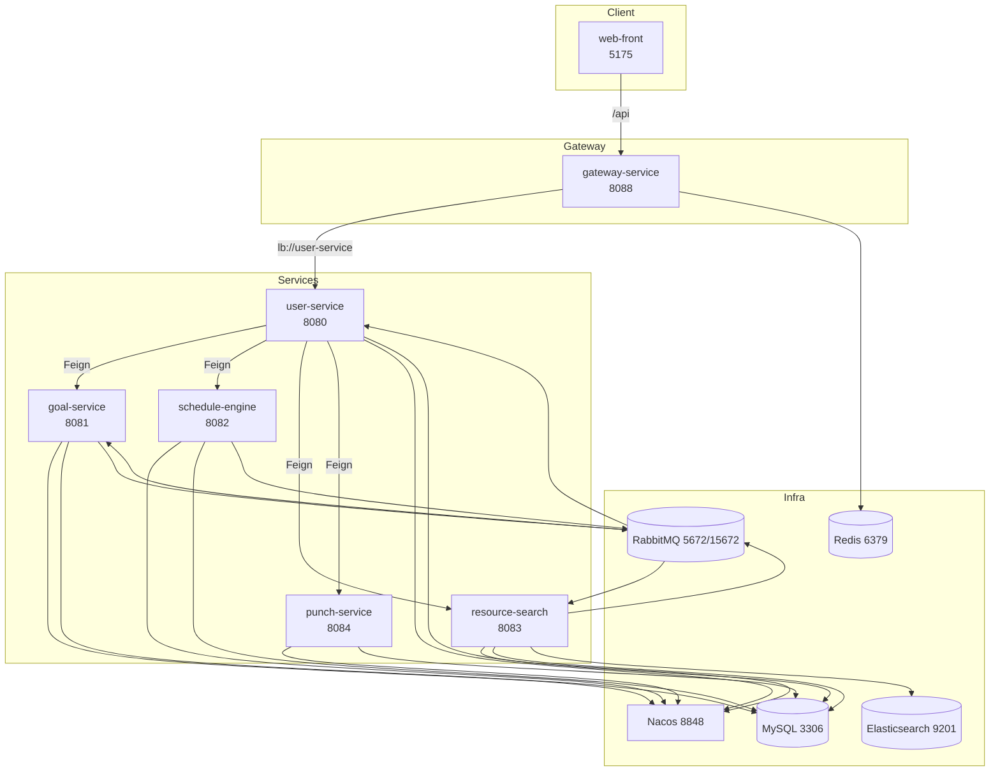

# SmartPlanner（智慧学习助手）

SmartPlanner 是一个面向个人学习场景的微服务应用：从“目标 → 任务拆解 → 排进日程 → 打卡反馈 → 画像建议”，形成闭环。项目包含两个层面：

- **原理篇**：系统架构、模块职责、数据流与关键算法/约束（排程、RAG、去重、鉴权、异步任务）
- **使用说明书**：如何启动、如何配置、如何调用接口、如何排障、如何二次开发

---

## 目录

- 1. 总览（你能用它做什么）
- 2. 架构与依赖（服务拓扑、端口、组件）
- 3. 统一约定（接口前缀、Result<T>、鉴权、用户上下文）
- 4. 核心数据流（同步请求、异步任务、通知推送）
- 5. LLM 接入原理（DashScope/Spring AI Alibaba、超时与重试）
- 6. 目标拆解（goal-service：AI 拆解、幂等、降级任务）
- 7. 智能排程（schedule-engine：空闲时间、排程、候选方案、日计划 job）
- 8. 资源检索与 RAG（resource-search：ES 检索、候选过滤、RAG 约束、去重、异步 job）
- 9. 打卡与画像（punch-service + user-service：习惯/洞察/画像）
- 10. 通知系统（RabbitMQ + SSE)
- 11. 运行与部署（Docker Compose / 本地开发 / Nginx）
- 12. API 使用手册（curl 示例）
- 13. 常见问题与排障（401/timeout/ES/重复/构建）
- 14. 安全与生产注意事项

---

## 1. 总览（你能用它做什么）

**面向用户的能力**

- 创建目标并由 AI 拆解为可执行任务（异步，不阻塞请求）
- 导入课表并自动计算空闲时间
- 将待办任务自动排进空闲时段（支持候选方案、确认/拒绝）
- 资源库检索：ES + 规则过滤 + RAG 增强，并对常见平台（如 B 站 BV）做去重
- 打卡记录与习惯画像：近 7 天准时率、完成率、平均延迟、连续打卡等
- 通知推送：排程完成/资源推荐完成等，通过 SSE 实时推送

---

## 2. 架构与依赖（服务拓扑、端口、组件）

### 2.1 服务与端口

| 服务 | 端口 | 说明 |
|---|---:|---|
| web-front | 5175 | Vue3 + Vite + Vuetify，Nginx 静态托管 |
| gateway-service | 8088 | Spring Cloud Gateway，统一入口 `/api/**` |
| user-service | 8080 | 认证 + 用户域接口聚合（对其它服务 OpenFeign 调用入口） |
| goal-service | 8081 | 目标/任务、AI 拆解（MQ 异步） |
| schedule-engine | 8082 | 排程与日计划（支持 job 形式异步执行） |
| resource-search | 8083 | 资源库管理、ES 检索、RAG 增强、去重、资源推荐 job |
| punch-service | 8084 | 打卡记录、习惯数据 |

### 2.2 基础设施

| 组件 | 端口 | 说明 |
|---|---:|---|
| Nacos | 8848 | 服务注册/发现 |
| MySQL | 3306 | 多库（`vibe_user/vibe_goal/vibe_schedule/vibe_resource/vibe_punch`） |
| Redis | 6379 | 缓存/限流 |
| RabbitMQ | 5672 / 15672 | 异步任务与通知 |
| Elasticsearch | 9201 | 资源检索索引（容器内 9200 映射到宿主 9201） |
| Seata Server | 8091 | compose 已包含（当前业务是否使用依赖于服务内部实现） |

### 2.3 架构拓扑图



---

## 3. 统一约定（接口前缀、Result<T>、鉴权、用户上下文）

### 3.1 接口前缀与路由

前端默认通过网关访问：

`/api/** -> gateway-service:8088 -> (Nacos) user-service -> (Feign) 其它服务`

### 3.2 统一响应体 Result<T>

后端接口统一使用 `Result<T>` 包装，常见字段为：

- `code`：200 表示成功
- `message`：错误信息/提示
- `data`：业务数据

### 3.3 鉴权模型（JWT + 网关透传用户上下文）

认证由 `user-service` 提供 `/api/auth/*`。登录后前端保存：

- `accessToken`：用于请求 `Authorization: Bearer ...`
- `refreshToken`：用于刷新 token

网关会在用户携带 JWT 时，把 `userId/username/roles` 透传为请求头（见 [UserContextForwardFilter.java](file:///c:/Users/%E5%88%98%E8%B6%85/Documents/SmartPlanner/gateway-service/src/main/java/com/chao/gateway/filter/UserContextForwardFilter.java)）：

- `X-User-Id`
- `X-Username`
- `X-Roles`

### 3.4 网关过滤链（可选 API Key、限流、用户上下文）

- `ApiKeyAuthFilter`：如果配置了 `gateway.auth.api-key`，要求请求头 `X-API-KEY`（见 [ApiKeyAuthFilter.java](file:///c:/Users/%E5%88%98%E8%B6%85/Documents/SmartPlanner/gateway-service/src/main/java/com/chao/gateway/filter/ApiKeyAuthFilter.java)）
- `UserContextForwardFilter`：从 JWT 解析并透传用户信息（见上）
- `RedisRateLimitFilter`：对 `/api/**`（排除 `/api/auth/**`）做 Redis 计数限流（见 [RedisRateLimitFilter.java](file:///c:/Users/%E5%88%98%E8%B6%85/Documents/SmartPlanner/gateway-service/src/main/java/com/chao/gateway/filter/RedisRateLimitFilter.java)）

---

## 4. 核心数据流（同步请求、异步任务、通知推送）

### 4.1 同步请求流（典型）

```text
web-front -> gateway-service (/api/**) -> user-service (/api/user/**)
  -> 通过 OpenFeign 调用 goal/schedule/resource/punch
  -> 返回 Result<T>
```

### 4.2 异步任务与通知（RabbitMQ）

公共交换机/队列定义在 [RabbitMqConfig.java](file:///c:/Users/%E5%88%98%E8%B6%85/Documents/SmartPlanner/common/src/main/java/com/chao/common/config/RabbitMqConfig.java)：

- 目标拆解：
  - exchange：`goal.exchange`
  - queue：`goal.ai.queue`
  - routingKey：`goal.ai.route`
- 通知：
  - exchange：`notification.exchange`
  - queue：`user.notification.queue`
  - routingKey：`notification.route`
- 资源推荐 job（为避免前端 15s 超时而新增）：
  - exchange：`resource.exchange`
  - queue：`resource.advice.queue`
  - routingKey：`resource.advice.route`

通知消费由 `user-service` 完成，并通过 SSE 推给前端（见 [NotificationService.java](file:///c:/Users/%E5%88%98%E8%B6%85/Documents/SmartPlanner/user-service/src/main/java/com/chao/user/service/NotificationService.java) 与 [NotificationController.java](file:///c:/Users/%E5%88%98%E8%B6%85/Documents/SmartPlanner/user-service/src/main/java/com/chao/user/controller/NotificationController.java)）。

---

## 5. LLM 接入原理（DashScope / Spring AI Alibaba）

### 5.1 统一实现：OpenAiCompatClient -> Spring AI Alibaba

项目统一通过 `common` 的 `OpenAiCompatClient.complete(prompt)` 发起模型调用，底层只保留 Spring AI Alibaba（DashScope/Qwen）实现，不再保留双实现/fallback。

### 5.2 关键配置（Docker Compose 已注入）

`.env`：

- `AI_DASHSCOPE_API_KEY`：DashScope API Key
- `MODEL`：模型名（默认 `qwen-max`）

服务侧（compose 环境变量）：

- `SPRING_AI_DASHSCOPE_READ_TIMEOUT=180`：HTTP read-timeout
- `SPRING_AI_RETRY_MAX_ATTEMPTS=1`：关闭重试放大等待
- `SMARTPLANNER_AI_SCHEDULE_TIMEOUT_SECONDS=170`：排程业务层 AI 超时（schedule-engine）
- `SMARTPLANNER_AI_ADVICE_TIMEOUT_SECONDS`：资源建议生成超时（resource-search，默认 90）

### 5.3 超时的分层（你排查 timeout 时要看哪一层）

- **HTTP 层 read-timeout**：DashScope 调用本身读超时
- **Spring AI retry**：重试会把等待放大（本项目默认关）
- **业务层 orTimeout**：对某些 AI 环节（排程、RAG/建议）进行业务超时封顶

---

## 6. 目标拆解（goal-service：AI 拆解、幂等、降级任务）

### 6.1 入口接口

用户侧（推荐经网关/聚合调用）：

- `POST /api/user/goals/ai`（user-service）→ 转发到 goal-service 的 `POST /api/goals`

goal-service 直接接口见 [GoalController.java](file:///c:/Users/%E5%88%98%E8%B6%85/Documents/SmartPlanner/goal-service/src/main/java/com/chao/goal/controller/GoalController.java)：

- `POST /api/goals?userId=...` + body 为目标描述：创建目标并触发 AI 拆解
- `GET /api/goals?userId=...`：目标列表
- `GET /api/goals/{goalId}/tasks?userId=...`：任务列表
- `GET /api/goals/pending-tasks?userId=...`：待办任务（已过滤降级任务）

### 6.2 原理：为什么要用 MQ 异步拆解

目标拆解是典型“慢任务”（模型调用 + JSON 解析 + 递归写库）。同步等待容易造成：

- 前端超时
- 线程占用
- 多次重试导致重复写入

因此创建目标后，拆解通过 MQ 异步执行，完成后发通知。

---

## 7. 智能排程（schedule-engine：空闲时间、排程、候选方案、日计划 job）

### 7.1 课表导入与空闲时间

schedule-engine 直接接口（见 [ScheduleController.java](file:///c:/Users/%E5%88%98%E8%B6%85/Documents/SmartPlanner/schedule-engine/src/main/java/com/chao/schedule/controller/ScheduleController.java)）：

- `POST /api/schedule/import?userId=...`：导入课表文件
- `GET /api/schedule/free-time?userId=...&date=YYYY-MM-DD`：计算当天空闲时段

用户侧聚合接口（user-service）：

- `POST /api/user/schedule/import`
- `GET /api/user/schedule/free-time`

### 7.2 智能排程

- `POST /api/user/schedule/auto`：触发智能排程（异步执行，完成后通知）
- `GET /api/user/schedule/task-schedules?from=&to=`：查询排程结果

### 7.3 候选方案与确认（PlanCandidate）

排程模块支持生成“候选方案”，由用户确认/拒绝：

- `POST /api/user/schedule/plan-candidates`
- `POST /api/user/schedule/plan-candidates/{candidateId}/decision?accept=true|false`
- `GET /api/user/schedule/plan-candidates?date=YYYY-MM-DD`

### 7.4 日计划 job（避免同步等待）

日计划 commit 支持 job 形式（in-process 异步 + 状态轮询），见 [DailyPlanJobService.java](file:///c:/Users/%E5%88%98%E8%B6%85/Documents/SmartPlanner/schedule-engine/src/main/java/com/chao/schedule/service/DailyPlanJobService.java)：

- `POST /api/user/schedule/daily-plan/jobs`：返回 `jobId`
- `GET  /api/user/schedule/daily-plan/jobs/{jobId}`：轮询 `RUNNING/DONE/FAILED`

---

## 8. 资源检索与 RAG（resource-search：ES 检索、候选过滤、RAG 约束、去重、异步 job）

### 8.1 资源库表与 ES 索引

MySQL：`vibe_resource.course_resources`  
ES：用于 title/topic/summary 等字段检索（容器内 9200 对外映射 9201）

### 8.2 检索流程（从快到慢、逐级退化）

resource-search 的 `searchResourcesWithAdvice(topic)` 大致策略：

1) **ES 查询**：multiMatch + AND 语义，召回候选
2) **DB 候选**：按 topic/relatedTopics 查询
3) **快速结果（fast）**：规则过滤 + 多层去重，直接返回 6 条（无需 LLM）
4) **RAG 增强（rag）**：将候选组织成上下文，让 LLM 输出结构化建议与资源
5) 失败兜底：返回当前可用资源列表 + 兜底提示

对应实现集中在 [ResourceService.java](file:///c:/Users/%E5%88%98%E8%B6%85/Documents/SmartPlanner/resource-search/src/main/java/com/chao/resource/service/ResourceService.java)。

### 8.3 去重原理（重点解决 B 站 BV 分 P / 标题噪声）

为解决“同一 BV 多条、标题带时长/Chapter/Unit/购课等噪声导致重复”，resource-search 做了多层去重：

- URL canonicalize：尤其 bilibili，将 `?p=` 等 query 归一到主视频 URL
- URL 集合去重：相同 canonical URL 只保留一条
- 标题归一 key 去重：清理噪声后生成 key
- 近似重复 base 去重：防止同一系列标题微小差异刷屏

### 8.4 RAG 输出约束（防止模型胡编/不相关）

RAG 侧对候选有强过滤（`isRelevantCandidate`）并对模型输出做校验，目标是：

- 模型必须“结合候选平台/内容类型”
- 禁止输出固定模板化话术
- JSON 严格解析失败则视为失败

### 8.5 资源推荐改为异步 job（避免前端 15s 超时）

用户侧接口（经 user-service）：

- `POST /api/user/resources/search/advice/jobs`：启动推荐任务，返回 `jobId`
- `GET  /api/user/resources/search/advice/jobs/{jobId}`：轮询结果

resource-search 直接接口见 [ResourceController.java](file:///c:/Users/%E5%88%98%E8%B6%85/Documents/SmartPlanner/resource-search/src/main/java/com/chao/resource/controller/ResourceController.java)。

job 的执行由 MQ 驱动（listener 在 resource-search），状态存储为服务内存 Map，默认保留 6 小时（见 [ResourceAdviceJobService.java](file:///c:/Users/%E5%88%98%E8%B6%85/Documents/SmartPlanner/resource-search/src/main/java/com/chao/resource/service/ResourceAdviceJobService.java)）。

---

## 9. 打卡与画像（punch-service + user-service：习惯/洞察/画像）

### 9.1 打卡接口（punch-service）

直接接口见 [PunchController.java](file:///c:/Users/%E5%88%98%E8%B6%85/Documents/SmartPlanner/punch-service/src/main/java/com/chao/punch/controller/PunchController.java)：

- `POST /api/punch/submit`：提交打卡（可带 evidence 文件）
- `GET  /api/punch/records`：查询打卡记录
- `GET  /api/punch/streak`：连续打卡
- `GET/PUT /api/punch/habits`：读取/更新习惯画像字段

### 9.2 画像与洞察（user-service）

见 [InfoController.java](file:///c:/Users/%E5%88%98%E8%B6%85/Documents/SmartPlanner/user-service/src/main/java/com/chao/user/controller/InfoController.java)：

- `GET  /api/user/insights`：近 7 天洞察（准时率、平均延迟、完成率等）
- `GET  /api/user/portrait`：画像汇总（habits + insights + recommendation）
- `POST /api/user/portrait/recompute`：重新计算画像（包含 AI 分析的推荐文本）
- `GET  /api/user/weather`：天气（open-meteo，失败返回“天气服务不可用”）

---

## 10. 通知系统（RabbitMQ + SSE）

### 10.1 SSE 订阅

前端通过 SSE 订阅通知流：

- `GET /api/user/notifications/stream`

后端收到 MQ 通知后，通过 SSE emitter 推送给对应 userId（见 [NotificationController.java](file:///c:/Users/%E5%88%98%E8%B6%85/Documents/SmartPlanner/user-service/src/main/java/com/chao/user/controller/NotificationController.java)）。

### 10.2 常见通知类型

当前代码中常见：

- `SCHEDULE_DONE / SCHEDULE_FAILED`
- `RESOURCE_ADVICE_DONE / RESOURCE_ADVICE_FAILED`

---

## 11. 运行与部署（Docker Compose / 本地开发）

### 11.1 Docker Compose 一键启动

1) 配置 `.env`

- `AI_DASHSCOPE_API_KEY=REPLACE_WITH_YOUR_DASHSCOPE_API_KEY`
- `MODEL=qwen-max`

2) 启动

```bash
docker compose up -d --build
```

3) 访问

- 前端：http://localhost:5175
- 网关（API）：http://localhost:8088
- RabbitMQ 管理台：http://localhost:15672（默认账号 `vibe` / `vibe123`）
- Nacos：http://localhost:8848
- Elasticsearch：http://localhost:9201

### 11.2 本地开发（不走容器）

后端：JDK 17 + Maven

```bash
mvn -DskipTests package
```

前端：Node.js（以 web-front 的 package.json 为准）

```bash
cd web-front
npm install
npm run dev
```

### 11.3 web-front Nginx（容器部署版）

web-front 容器内使用 Nginx 提供两类能力：

- 静态资源托管：`/` 直接服务 `dist` 产物，并用 `try_files` 做 SPA 路由回落到 `index.html`
- 反向代理：将同域的 `/api/` 转发到网关 `gateway-service:8088`，从而避免浏览器跨域问题，同时让前端只关心一个 baseURL（`/api`）

相关文件：

- Nginx 配置：[nginx.conf](file:///c:/Users/%E5%88%98%E8%B6%85/Documents/SmartPlanner/web-front/nginx.conf)
- 构建镜像：[Dockerfile](file:///c:/Users/%E5%88%98%E8%B6%85/Documents/SmartPlanner/web-front/Dockerfile)

当前 Nginx 配置要点（节选）：

```nginx
server {
  listen 80;
  root /usr/share/nginx/html;
  index index.html;

  location /api/ {
    resolver 127.0.0.11 ipv6=off valid=10s;
    set $gateway_upstream "gateway-service:8088";
    proxy_pass http://$gateway_upstream$request_uri;
    proxy_http_version 1.1;
    proxy_set_header Host $host;
    proxy_set_header X-Real-IP $remote_addr;
    proxy_set_header X-Forwarded-For $proxy_add_x_forwarded_for;
    proxy_set_header X-Forwarded-Proto $scheme;
    proxy_connect_timeout 3s;
    proxy_read_timeout 60s;
    proxy_send_timeout 60s;
  }

  location / {
    try_files $uri $uri/ /index.html;
  }
}
```

说明：

- `resolver 127.0.0.11` 是 Docker 内置 DNS，用于在容器网络里解析 `gateway-service` 的地址；如果你改了 compose 里的服务名或网关端口，需要同步修改这里的 upstream
- `proxy_read_timeout 60s` 是 Nginx 对上游响应的读取超时：它不会解决后端 LLM 超时，但能避免网关/服务已经返回、前端却被 Nginx 过早断开的情况
- `try_files ... /index.html` 是 SPA 必备，否则刷新非根路径（例如 `/resources`）会 404

### 11.4 本地开发与 Nginx 的差异（Vite proxy）

本地 `npm run dev` 时不走 Nginx，而是由 Vite dev server 代理 `/api` 到网关（见 [vite.config.js](file:///c:/Users/%E5%88%98%E8%B6%85/Documents/SmartPlanner/web-front/vite.config.js)）：

- `target: http://localhost:8088`
- 前端代码仍统一请求 `/api/...`

---

## 12. API 使用手册（curl 示例）

### 12.1 注册/登录

```bash
curl -X POST http://localhost:8088/api/auth/register ^
  -H "Content-Type: application/json" ^
  -d "{\"username\":\"demo\",\"password\":\"demo123\"}"
```

```bash
curl -X POST http://localhost:8088/api/auth/login ^
  -H "Content-Type: application/json" ^
  -d "{\"username\":\"demo\",\"password\":\"demo123\"}"
```

返回 `data.accessToken` 后，用它调用后续接口：

```bash
curl -X GET http://localhost:8088/api/auth/me ^
  -H "Authorization: Bearer {accessToken}"
```

### 12.2 导入课表（必须先导入才能 AI 拆解目标）

```bash
curl -X POST "http://localhost:8088/api/user/schedule/import" ^
  -H "Authorization: Bearer {accessToken}" ^
  -F "file=@test-data/schedule.csv"
```

### 12.3 创建目标并触发 AI 拆解（异步）

```bash
curl -X POST http://localhost:8088/api/user/goals/ai ^
  -H "Authorization: Bearer {accessToken}" ^
  -H "Content-Type: text/plain" ^
  --data "我想系统学习计算机组成原理，目标是 4 周内完成一轮学习并能做题。"
```

### 12.4 触发智能排程（异步）

```bash
curl -X POST "http://localhost:8088/api/user/schedule/auto" ^
  -H "Authorization: Bearer {accessToken}"
```

### 12.5 资源推荐（异步 job，避免 15s 超时）

```bash
curl -X POST "http://localhost:8088/api/user/resources/search/advice/jobs" ^
  -H "Authorization: Bearer {accessToken}" ^
  -H "Content-Type: application/json" ^
  -d "{\"topic\":\"计算机组成原理\"}"
```

轮询：

```bash
curl -X GET "http://localhost:8088/api/user/resources/search/advice/jobs/{jobId}" ^
  -H "Authorization: Bearer {accessToken}"
```

---

## 13. 常见问题与排障

### 13.1 401（未授权）

- 原因：未登录/`accessToken` 过期/刷新失败
- 处理：重新登录；前端会尝试用 refreshToken 自动刷新

### 13.2 前端 `timeout of 15000ms exceeded`

- 原因：长耗时任务（尤其 RAG）被同步请求卡住
- 处理：资源推荐已改为 job 异步；如果你仍看到 15s 超时，优先确认前端是否加载到最新构建包（Ctrl+F5）

### 13.3 “建议生成超时或暂不可用…”

- 含义：模型调用失败/超时/输出不合规被丢弃，系统返回兜底文案
- 排查：
  - `AI_DASHSCOPE_API_KEY` 是否正确
  - `SPRING_AI_DASHSCOPE_READ_TIMEOUT` 是否足够
  - `SMARTPLANNER_AI_ADVICE_TIMEOUT_SECONDS` 是否需要增大

### 13.4 Docker 拉取镜像 401 / 网络问题

某些 Dockerfile 或 compose 镜像源可能受网络影响；如果遇到 401，可将基础镜像源替换为可用镜像源后重新 build。

---

## 14. 安全与生产注意事项

- 不要把真实的 `AI_DASHSCOPE_API_KEY`、JWT 密钥等敏感信息提交到仓库
- 生产环境务必替换 compose 中的 `JWT_SECRET`、演示账号密码等默认配置
- 生产环境建议启用网关 `gateway.auth.api-key` 并完善跨域/限流策略
