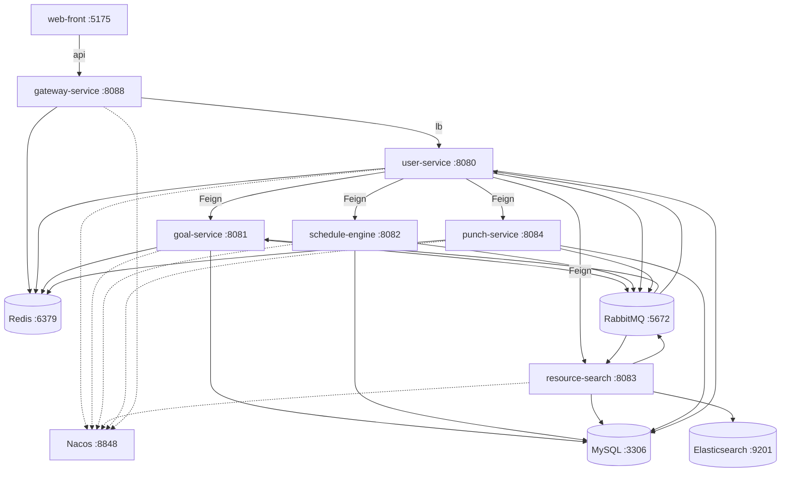

# SmartPlanner（智慧学习助手）

SmartPlanner 是一个面向个人学习场景的微服务应用：从“目标 → 任务拆解 → 排进日程 → 打卡反馈 → 画像建议”，形成闭环。项目包含两个层面：

- **原理篇**：系统架构、模块职责、数据流与关键算法/约束（排程、RAG、去重、鉴权、异步任务）
- **使用说明书**：如何启动、如何配置、如何调用接口、如何排障、如何二次开发

---

## 目录

- 1. 总览（你能用它做什么）
- 2. 架构与依赖（服务拓扑、端口、组件）
- 3. 统一约定（接口前缀、Result<T>、鉴权、用户上下文）
- 4. 核心数据流（同步请求、异步任务、通知推送）
- 5. LLM 接入原理（DashScope/Spring AI Alibaba、超时与重试）
- 6. 目标拆解（goal-service：AI 拆解、幂等、降级任务）
- 7. 智能排程（schedule-engine：空闲时间、排程、候选方案、日计划 job）
- 8. 资源检索与 RAG（resource-search + user-service：爬虫 + ES 候选检索 + 排程联动 + RedisStack 向量检索 + task 资源推荐 + Agent 复盘）
- 9. 打卡与画像（punch-service + user-service：习惯/洞察/画像）
- 10. 通知系统（RabbitMQ + SSE）
- 11. 运行与部署（Docker Compose / 本地开发）
- 12. API 使用手册（curl 示例）
- 13. 常见问题与排障（401/timeout/ES/重复/构建）
- 14. 安全与生产注意事项

---

## 1. 总览（你能用它做什么）

**面向用户的能力**

- 创建目标并由 AI 拆解为可执行任务（异步，不阻塞请求）
- 导入课表并自动计算空闲时间
- 将待办任务自动排进空闲时段（支持候选方案、确认/拒绝）
- 资源库检索：resource-search 提供 ES 候选检索 + 候选去重 +（可选）LLM 建议
- 任务→课程资源推荐：user-service 聚合（RedisStack 向量检索 + 缓存 + 在线检索兜底），并在排程结果处自动展示
- 打卡记录与习惯画像：近 7 天准时率、完成率、平均延迟、连续打卡等
- 通知推送：排程完成/资源推荐完成等，通过 SSE 实时推送

---

## 2. 架构与依赖（服务拓扑、端口、组件）

### 2.1 服务与端口

| 服务 | 端口 | 说明 |
|---|---:|---|
| web-front | 5175 | Vue3 + Vite + Vuetify，Nginx 静态托管 |
| gateway-service | 8088 | Spring Cloud Gateway，统一入口 `/api/**` |
| user-service | 8080 | 认证 + 用户域接口聚合（对其它服务 OpenFeign 调用入口） |
| goal-service | 8081 | 目标/任务、AI 拆解（MQ 异步） |
| schedule-engine | 8082 | 排程与日计划（支持 job 形式异步执行） |
| resource-search | 8083 | 资源库管理、ES 检索、RAG 增强、去重、资源推荐 job |
| punch-service | 8084 | 打卡记录、习惯数据 |

### 2.2 基础设施

| 组件 | 端口 | 说明 |
|---|---:|---|
| Nacos | 8848 | 服务注册/发现 |
| MySQL | 3306 | 多库（`vibe_user/vibe_goal/vibe_schedule/vibe_resource/vibe_punch`） |
| RedisStack | 6379 | 缓存/限流 + 向量检索（RedisVectorStore） |
| RabbitMQ | 5672 / 15672 | 异步任务与通知 |
| Elasticsearch | 9201 | 资源检索索引（容器内 9200 映射到宿主 9201） |
| Seata Server | 8091 | compose 已包含（当前业务是否使用依赖于服务内部实现） |

### 2.3 架构拓扑图



---

## 3. 统一约定（接口前缀、Result<T>、鉴权、用户上下文）

### 3.1 接口前缀与路由

前端默认通过网关访问：

`/api/** -> gateway-service:8088 -> (Nacos) user-service -> (Feign) 其它服务`

### 3.2 统一响应体 Result<T>

后端接口统一使用 `Result<T>` 包装，常见字段为：

- `code`：200 表示成功
- `message`：错误信息/提示
- `data`：业务数据

### 3.3 鉴权模型（JWT + 网关透传用户上下文）

认证由 `user-service` 提供 `/api/auth/*`。登录后前端保存：

- `accessToken`：用于请求 `Authorization: Bearer ...`
- `refreshToken`：用于刷新 token

网关会在用户携带 JWT 时，把 `userId/username/roles` 透传为请求头（见 [UserContextForwardFilter.java](file:///c:/Users/%E5%88%98%E8%B6%85/Documents/SmartPlanner/gateway-service/src/main/java/com/chao/gateway/filter/UserContextForwardFilter.java)）：

- `X-User-Id`
- `X-Username`
- `X-Roles`

### 3.4 网关过滤链（可选 API Key、限流、用户上下文）

- `ApiKeyAuthFilter`：如果配置了 `gateway.auth.api-key`，要求请求头 `X-API-KEY`（见 [ApiKeyAuthFilter.java](file:///c:/Users/%E5%88%98%E8%B6%85/Documents/SmartPlanner/gateway-service/src/main/java/com/chao/gateway/filter/ApiKeyAuthFilter.java)）
- `UserContextForwardFilter`：从 JWT 解析并透传用户信息（见上）
- `RedisRateLimitFilter`：对 `/api/**`（排除 `/api/auth/**`）做 Redis 计数限流（见 [RedisRateLimitFilter.java](file:///c:/Users/%E5%88%98%E8%B6%85/Documents/SmartPlanner/gateway-service/src/main/java/com/chao/gateway/filter/RedisRateLimitFilter.java)）
  - 说明：对流式接口（`/api/user/agent/chat/stream`）如果需要加禁缓冲响应头，必须通过 `beforeCommit` 设置，避免“响应已提交后再改 header”导致连接被关闭，从而出现断流/一次性返回的错觉。

---

## 4. 核心数据流（同步请求、异步任务、通知推送）

### 4.1 同步请求流（典型）

```text
web-front -> gateway-service (/api/**) -> user-service (/api/user/**)
  -> 通过 OpenFeign 调用 goal/schedule/resource/punch
  -> 返回 Result<T>
```

### 4.2 异步任务与通知（RabbitMQ）

公共交换机/队列定义在 [RabbitMqConfig.java](file:///c:/Users/%E5%88%98%E8%B6%85/Documents/SmartPlanner/common/src/main/java/com/chao/common/config/RabbitMqConfig.java)：

- 目标拆解：
  - exchange：`goal.exchange`
  - queue：`goal.ai.queue`
  - routingKey：`goal.ai.route`
- 通知：
  - exchange：`notification.exchange`
  - queue：`user.notification.queue`
  - routingKey：`notification.route`
- 资源推荐 job（为避免前端 15s 超时而新增）：
  - exchange：`resource.exchange`
  - queue：`resource.advice.queue`
  - routingKey：`resource.advice.route`

通知消费由 `user-service` 完成，并通过 SSE 推给前端（见 [NotificationService.java](file:///c:/Users/%E5%88%98%E8%B6%85/Documents/SmartPlanner/user-service/src/main/java/com/chao/user/service/NotificationService.java) 与 [NotificationController.java](file:///c:/Users/%E5%88%98%E8%B6%85/Documents/SmartPlanner/user-service/src/main/java/com/chao/user/controller/NotificationController.java)）。

---

## 5. LLM 接入原理（DashScope / Spring AI Alibaba）

### 5.1 统一实现：OpenAiCompatClient -> Spring AI Alibaba

项目统一通过 `common` 的 `OpenAiCompatClient.complete(prompt)` 发起模型调用，底层只保留 Spring AI Alibaba（DashScope/Qwen）实现，不再保留双实现/fallback。

### 5.2 关键配置（Docker Compose 已注入）

`.env`：

- `AI_DASHSCOPE_API_KEY`：DashScope API Key
- `MODEL`：模型名（默认 `qwen-max`）

服务侧（compose 环境变量）：

- `SPRING_AI_DASHSCOPE_READ_TIMEOUT=180`：HTTP read-timeout
- `SPRING_AI_RETRY_MAX_ATTEMPTS=1`：关闭重试放大等待
- `SMARTPLANNER_AI_SCHEDULE_TIMEOUT_SECONDS=170`：排程业务层 AI 超时（schedule-engine）
- `SMARTPLANNER_AI_ADVICE_TIMEOUT_SECONDS`：资源建议生成超时（resource-search，默认 90）

### 5.3 超时的分层（你排查 timeout 时要看哪一层）

- **HTTP 层 read-timeout**：DashScope 调用本身读超时
- **Spring AI retry**：重试会把等待放大（本项目默认关）
- **业务层 orTimeout**：对某些 AI 环节（排程、RAG/建议）进行业务超时封顶

---

## 6. 目标拆解（goal-service：AI 拆解、幂等、降级任务）

### 6.1 入口接口

用户侧（推荐经网关/聚合调用）：

- `POST /api/user/goals/ai`（user-service）→ 转发到 goal-service 的 `POST /api/goals`

goal-service 直接接口见 [GoalController.java](file:///c:/Users/%E5%88%98%E8%B6%85/Documents/SmartPlanner/goal-service/src/main/java/com/chao/goal/controller/GoalController.java)：

- `POST /api/goals?userId=...` + body 为目标描述：创建目标并触发 AI 拆解
- `GET /api/goals?userId=...`：目标列表
- `GET /api/goals/{goalId}/tasks?userId=...`：任务列表
- `GET /api/goals/pending-tasks?userId=...`：待办任务（已过滤降级任务）

### 6.2 原理：为什么要用 MQ 异步拆解

目标拆解是典型“慢任务”（模型调用 + JSON 解析 + 递归写库）。同步等待容易造成：

- 前端超时
- 线程占用
- 多次重试导致重复写入

因此创建目标后，拆解通过 MQ 异步执行，完成后发通知。

---

## 7. 智能排程（schedule-engine：空闲时间、排程、候选方案、日计划 job）

### 7.1 课表导入与空闲时间

schedule-engine 直接接口（见 [ScheduleController.java](file:///c:/Users/%E5%88%98%E8%B6%85/Documents/SmartPlanner/schedule-engine/src/main/java/com/chao/schedule/controller/ScheduleController.java)）：

- `POST /api/schedule/import?userId=...`：导入课表文件
- `GET /api/schedule/free-time?userId=...&date=YYYY-MM-DD`：计算当天空闲时段

用户侧聚合接口（user-service）：

- `POST /api/user/schedule/import`
- `GET /api/user/schedule/free-time`

### 7.2 智能排程（统一在「目标」页发起）

- 推荐：`POST /api/user/schedule/daily-plan/jobs`：以 job 形式启动排程（支持指定 goalId/taskIds），完成后通过 SSE 通知
- 结果：`GET /api/user/schedule/task-schedules?from=&to=`：查询排程结果
- 兼容：`POST /api/user/schedule/auto`：历史接口（不再作为前端主流程）

### 7.3 候选方案与确认（PlanCandidate）

排程模块支持生成“候选方案”，由用户确认/拒绝：

- `POST /api/user/schedule/plan-candidates`
- `POST /api/user/schedule/plan-candidates/{candidateId}/decision?accept=true|false`
- `GET /api/user/schedule/plan-candidates?date=YYYY-MM-DD`

### 7.4 日计划 job（避免同步等待）

日计划 commit 支持 job 形式（in-process 异步），见 [DailyPlanJobService.java](file:///c:/Users/%E5%88%98%E8%B6%85/Documents/SmartPlanner/schedule-engine/src/main/java/com/chao/schedule/service/DailyPlanJobService.java)：

- `POST /api/user/schedule/daily-plan/jobs`：返回 `jobId`
- `GET  /api/user/schedule/daily-plan/jobs/{jobId}`：查询 `RUNNING/DONE/FAILED`（主要用于排障）

前端主流程不轮询 job 状态：启动后页面静止，等待 SSE 通知 `SCHEDULE_DONE / SCHEDULE_FAILED` 后自动刷新。

---

## 8. 资源检索与 RAG（resource-search + user-service：候选检索 + 向量检索 + 任务资源推荐 + 随笔复盘）

### 8.1 resource-search：资源库 + ES 候选检索

MySQL：`vibe_resource.course_resources`
Elasticsearch：用于 title/topic/summary 等字段候选检索（容器内 9200 对外映射 9201）

补充：resource-search 内置 Bilibili 定时爬虫（HTTP 抓取 + 重试 + 去重），用于持续补全 `course_resources`：

- 开关：`smartplanner.crawler.bilibili.enabled`（默认 true）
- 种子主题：18 个（Java/Spring Boot/Python/Vue/数据结构/算法/计算机网络/操作系统/数据库/机器学习/前端/Linux/Go/Rust/分布式/微服务/设计模式/计算机组成原理）
- 动态主题：从已有资源和用户目标中自动扩展
- 每主题抓取：8 条结果，含 UP主、播放量、时长、简介摘要
- 去重：URL 归一化 + DB 已有判断
- 实现入口：`ResourceService.scheduledBilibiliCrawl()`

### 8.2 resource-search：排程 × RAG 自动联动

排程完成后（DailyPlanJobService），系统自动提取已排程任务标题作为检索主题，调用 ResourceAdviceJobService 异步触发 RAG 资源推荐：

- 触发链路：排程完成 → 提取 taskTitle（去重限 5 个）→ Feign 调用 resource-search → RabbitMQ 异步 job
- 用户收到 SCHEDULE_DONE 通知时，资源推荐已并行启动，无需额外操作
- 去重：同一标题只触发一次推荐任务，避免重复

### 8.3 resource-search：检索流程（从快到慢、逐级退化）

resource-search 的 `searchResourcesWithAdvice(topic)` 大致策略：

1) ES 查询：multiMatch + BestFields + OR（title^3, topic^2, contentSummary），召回候选
2) DB 候选：按 topic/relatedTopics 查询
3) 快速结果：规则过滤 + 去重（无需 LLM）
4) 候选增强：将候选组织成上下文，让 LLM 输出建议与资源
5) 写库补全：LLM 生成的资源会做归一与去重后 upsert 到 DB/ES，降低下次请求成本
6) 失败兜底：返回当前可用资源列表 + 兜底提示

对应实现集中在 [ResourceService.java](file:///c:/Users/%E5%88%98%E8%B6%85/Documents/SmartPlanner/resource-search/src/main/java/com/chao/resource/service/ResourceService.java)。

另外一个更快的接口 `searchResources(topic)` 用于“只要资源列表，不要建议文本”的场景：

- 先 ES（全文 multiMatch）-> 再 AI 推荐（可选写库补全）-> 再 DB like -> 最后 defaultResources
- 注意：当前 ES 查询主要是全文检索（multiMatch），如需真正向量检索（kNN），建议在 ES 或 RedisStack 侧单独建设向量索引后再接入。

### 8.3 resource-search：去重原理（重点解决 B 站 BV 分 P / 标题噪声）

- URL canonicalize：尤其 bilibili，将 `?p=` 等 query 归一到主视频 URL
- URL 集合去重：相同 canonical URL 只保留一条
- 标题归一 key 去重：清理噪声后生成 key
- 近似重复 base 去重：防止同一系列标题微小差异刷屏

### 8.4 resource-search：异步资源建议 job（避免前端 15s 超时）

用户侧接口（经 user-service）：

- `POST /api/user/resources/search/advice/jobs`：启动推荐任务，返回 `jobId`
- `GET  /api/user/resources/search/advice/jobs/{jobId}`：轮询结果

resource-search 直接接口见 [ResourceController.java](file:///c:/Users/%E5%88%98%E8%B6%85/Documents/SmartPlanner/resource-search/src/main/java/com/chao/resource/controller/ResourceController.java)。

### 8.5 user-service：向量库（RedisStack）与索引策略

user-service 使用 Spring AI 的 `RedisVectorStore`（DashScope embedding）作为向量检索底座，既用于课程资源推荐，也用于 Agent 的“随笔 + 课程”混合检索。

- 向量库配置：[RedissonConfig.java](file:///c:/Users/%E5%88%98%E8%B6%85/Documents/SmartPlanner/user-service/src/main/java/com/chao/user/config/RedissonConfig.java)
- 课程索引：从 `resource-search` 拉取资源列表写入向量库，并用 Redis 标记避免重复构建（建索引按批写入，避免 embedding 单次输入条数限制）

### 8.6 user-service：任务 → 课程资源推荐（RAG + 缓存 + 兜底）

- 批量接口：`POST /api/user/tasks/resources`（入参 taskIds，返回 taskId -> resources[]）
- 核心策略：
  - 优先：向量相似度检索（metadata 过滤 `type=course`）
  - 不足：调用 `resource-search` 在线检索兜底补齐
  - 缓存：按 taskId 缓存推荐结果（TTL 14 天）

对应实现见 [UserController.java](file:///c:/Users/%E5%88%98%E8%B6%85/Documents/SmartPlanner/user-service/src/main/java/com/chao/user/controller/UserController.java)。

### 8.7 web-front：Agent 窗口关怀推送（登录即显示）

Agent 浮窗不再展示“学习建议/关怀文案”，只保留对话能力；关怀消息以“通知推送”的形式出现（右上角 toast + 铃铛列表）。

- 触发：用户登录后，前端会建立 SSE：`GET /api/user/notifications/stream`，后端在连接建立时立即推送 2 条 `AGENT_REMINDER`（`trigger=login_care` + `trigger=login_care_follow`）
- 文案：由 user-service 使用 spring-ai-alibaba（DashScope）基于用户的连续打卡/今日计划/最近心情生成（倾向约 50 字、含人文关怀与“最小动作”建议）；失败自动降级为带数据点的兜底文案，并对两条消息做去重
- 前端展示：见 [DefaultLayout.vue](file:///c:/Users/%E5%88%98%E8%B6%85/Documents/SmartPlanner/web-front/src/layouts/DefaultLayout.vue) 与 [notify.js](file:///c:/Users/%E5%88%98%E8%B6%85/Documents/SmartPlanner/web-front/src/stores/notify.js)


### 8.8 Agent：11 个 ToolCallback 驱动的智能对话

Agent 基于 Spring AI Alibaba ReactAgent + RedisSaver 实现多轮对话，通过 11 个 @Tool 方法获取真实数据，不走硬编码短路：

**数据查询工具（7 个）**

- listGoals() — 查询用户的目标列表
- listPendingTasks() — 查询目标级待办任务定义（goal tasks，不含排程时间）。注意：此工具不返回排程信息，问【今天有什么任务】时必须用 listTaskSchedules
- listGoalTasks(goalId) — 查询某个目标下的任务列表
- listTaskSchedules(from, to) — 查询已排程任务列表（task_schedule，含具体开始/结束时间）。用户问【今天有什么任务/我的日程/排程/今天做什么】时使用
- listPunchRecords(taskId, from, to) — 查询打卡记录（含 createdAt、taskTitle、durationText），用于本周/最近打卡总结、判断任务是否完成
- listJournals(days, goalId, limit) — 查询最近 N 天随笔列表（含心情 mood），用于复盘/总结/情绪分析
- getDailyPlanJobStatus(jobId) — 查询排程 job 状态

**写入与操作工具（3 个）**

- createJournal(content, goalId, mood) — 创建随笔/日记记录
- ddTask(goalId, title, description, priority, estimatedMinutes) — 为目标添加任务（模糊去重）
- startDailyPlanJob(date, mode, goalId, taskIds) — 触发日计划排程 job（异步）

**检索工具（1 个）**

- searchPersonalData(query, topK) — 混合检索（RedisStack 向量检索 + 关键词兜底），从用户随笔、打卡记录、课程资源中检索最相关内容

**Agent 行为约束（防止编造/跑偏）**

- 涉及【我有哪些任务/排程/是否完成】等事实类问题，必须先调工具确认，严禁编造
- 输出使用基本 Markdown 格式（## 标题、- 列表、**加粗**），前端用 marked.js 渲染。每次只能调用 1 个工具，需要多个数据时分步调用（如先调 listPunchRecords 再调 listJournals）。回复使用 taskTitle（任务名）而非 taskId（任务编号）
- 用户问【你是谁/你叫什么】时，返回固定自我介绍，不走模型生成
- 列出任务时必须同时关注用户问到的其他方面（如心情），不能只答任务列表
- 建议用户操作时在末尾追加跳转链接（跳转: /path），白名单：/、/plan、/goals、/journals、/schedule、/resources、/punch、/profile、/games/2048
- 随笔复盘/总结必须基于随笔数据：优先用检索工具或随笔列表工具拿到原文片段作为依据

### 8.9 Agent：真流式输出（端到端不缓冲）

Agent 流式接口走 `text/plain` 分块输出，链路上任何一层缓冲/压缩/连接提前关闭都会让前端“看起来像一次性返回”。

- 后端：`user-service` 使用 `StreamingResponseBody` 边写边 flush（接口：`POST /api/user/agent/chat/stream`）
- 网关：如需补充禁缓冲 header，必须在 `beforeCommit` 阶段设置（见 3.4 说明）
- 前端：`fetch + ReadableStream.getReader()` 持续读取并更新消息文本（见 [assistant.js](file:///c:/Users/%E5%88%98%E8%B6%85/Documents/SmartPlanner/web-front/src/stores/assistant.js)）
- 反代：Nginx 需对该路径关闭 buffering，并建议禁用上游压缩（见 [nginx.conf](file:///c:/Users/%E5%88%98%E8%B6%85/Documents/SmartPlanner/web-front/nginx.conf)）
- 兼容跳转锚点：流式输出的末尾也可能追加 `跳转: /path`，前端会在该条消息下方渲染按钮。

---

## 9. 打卡与画像（punch-service + user-service：习惯/洞察/画像）

### 9.1 打卡接口（punch-service）

直接接口见 [PunchController.java](file:///c:/Users/%E5%88%98%E8%B6%85/Documents/SmartPlanner/punch-service/src/main/java/com/chao/punch/controller/PunchController.java)：

- `POST /api/punch/submit`：提交打卡（可带 evidence 文件）
- `GET  /api/punch/records`：查询打卡记录
- `GET  /api/punch/streak`：连续打卡
- `GET/PUT /api/punch/habits`：读取/更新习惯画像字段

### 9.2 画像与洞察（user-service）

见 [InfoController.java](file:///c:/Users/%E5%88%98%E8%B6%85/Documents/SmartPlanner/user-service/src/main/java/com/chao/user/controller/InfoController.java)：

- `GET  /api/user/insights`：近 7 天洞察（准时率、平均延迟、完成率等）
- `GET  /api/user/portrait`：画像汇总（habits + insights + recommendation + tips）。当画像数据过期/为空时会自动触发一次 AI 分析来补齐建议与推荐参数。
- `POST /api/user/portrait/recompute`：重新计算画像（强制走 AI 分析，返回 recommendation + tips，并回写 habits 的画像字段）
- `GET  /api/user/weather`：天气（open-meteo，失败返回“天气服务不可用”）

---

## 10. 通知系统（RabbitMQ + SSE）

RabbitMQ 的 exchange/queue/binding 由 common 模块的 [RabbitMqConfig.java](file:///c:/Users/%E5%88%98%E8%B6%85/Documents/SmartPlanner/common/src/main/java/com/chao/common/config/RabbitMqConfig.java) 声明，相关服务需确保能扫描到 `com.chao.common.config`。

### 10.1 SSE 订阅

前端通过 SSE 订阅通知流：

- `GET /api/user/notifications/stream`

后端收到 MQ 通知后，通过 SSE emitter 推送给对应 userId（见 [NotificationController.java](file:///c:/Users/%E5%88%98%E8%B6%85/Documents/SmartPlanner/user-service/src/main/java/com/chao/user/controller/NotificationController.java)）。

### 10.2 常见通知类型

当前代码中常见：

- `GOAL_TASK_READY`
- `SCHEDULE_DONE / SCHEDULE_FAILED`
- `RESOURCE_ADVICE_DONE / RESOURCE_ADVICE_FAILED`
- `AGENT_REMINDER / AGENT_BADGE`：Agent 感知提醒与成就（右上角通知）

`AGENT_REMINDER / AGENT_BADGE` 的 data 结构（SSE 的 JSON）：

- `content`：展示给用户的一句话提醒
- `payload.nav`：建议跳转页面（如 `/punch`、`/goals`、`/journals`）
- `payload.level`：提示级别（`info`/`warning`/`success`）
- `payload.data`：感知数据快照（如今日已完成/未完成、连续天数、完成时间分布等）

### 10.3 Agent 感知提醒（右上角）

该模块的目标是：基于真实业务数据做“提醒/鼓励/纠偏”，并通过 SSE 推到前端右上角（铃铛列表 + toast）。

- 文案生成方式：
  - 触发服务只负责计算“触发原因 + 感知数据”，并把 `payload.ai.userPrompt` 随通知一起发到 MQ；触发服务不内置关怀话术，`content` 只放触发/数据快照（用于极端情况下可观测）
  - user-service 在消费通知时，通过 spring-ai-alibaba（DashScope）生成最终提醒文案（SSE 下发给前端的是生成后的结果）
  - 质量保护：若模型输出过于泛化/未引用任何数据点/过短/缺少关怀语气/与数据明显矛盾（如把待完成说成已完成），会触发重试与纠偏；仍不达标时才降级为“基于数据的兜底结构”。登录关怀两条若内容过于相似，会优先重写第二条；若仍相似则直接丢弃第二条，避免重复刷屏
  - 防刷屏：定时感知提醒默认按 Redis 去重（每条规则每天最多 1 次）；当 Redis 异常时会自动降级为进程内去重，避免同一条提醒被一分钟一次“疯狂重复”推送。登录关怀按“同一登录会话（access token 签名）只推一次”去重，避免 SSE 自动重连导致重复欢迎
  - 二次去重：user-service 在消费 MQ 后、推送 SSE 前，会对 `AGENT_REMINDER/AGENT_BADGE` 做短窗口去重（同一用户同一内容 2 分钟内只推一次），用于抵御上游重复投递/重试造成的刷屏；前端铃铛列表也会做短窗口去重防线，避免 UI 被相同内容淹没

- 数据来源（实时拉取，避免编造）：
  - 打卡：`/api/user/punch/records`、`/api/user/punch/streak`
  - 今日计划：`/api/user/schedule/task-schedules`
  - 随笔：`/api/user/journals`（通过 goal-service 聚合）
- 触发策略（示例规则）：
  - 用户登录建立 SSE：推送 2 条“登录关怀”（主欢迎 + 跟进最小动作）；若第二条与第一条语义高度相似会自动合并（最终只保留 1 条）；文案由模型基于连续天数/待完成数/下一项任务/心情生成（跳转 `/schedule` 或 `/goals`）
  - 用户新增任务后：欢迎提醒（文案由模型基于任务/计划数据生成，避免固定模板）（跳转 `/goals`）
  - 随笔/心情命中消极词：安慰提醒（文案由模型基于触发原因与数据生成，避免固定模板）（跳转 `/journals`）
  - 晚上 9 点未完成 ≥ 2 个：提醒用户剩余未完成项（尽量带任务名）（跳转 `/punch`）
  - 连续 7 天且当天计划全部完成：发放成就类提醒（跳转 `/punch`）
  - 同一任务在近 7 天出现“结束时间已过但仍未完成”≥ 3 次：提示用户是否需要拆分/降低门槛（跳转 `/goals`）
  - 同一任务连续 3 天未完成：关怀式纠偏，询问“难度/状态/时间是否需要调整”（跳转 `/goals`）
  - 连续 3 天任务完成率 < 30%：同上（跳转 `/goals`）
  - 连续 2 天游打卡：同上（跳转 `/goals`）
  - 3 天没写随笔：引导记录近况/心情（跳转 `/journals`）
  - 随笔/心情出现“焦虑/压力”等关键词：轻量安慰 + 给一个最小动作建议（跳转 `/journals`）
  - 连续一周随笔都很短：引导写更具体的一件事/一个情绪（跳转 `/journals`）

实现位置：

- 后端：user-service 的 [AgentReminderService.java](file:///c:/Users/%E5%88%98%E8%B6%85/Documents/SmartPlanner/user-service/src/main/java/com/chao/user/service/AgentReminderService.java)（定时评估 + 去重推送）
- 后端：goal-service 的 [GoalService.java](file:///c:/Users/%E5%88%98%E8%B6%85/Documents/SmartPlanner/goal-service/src/main/java/com/chao/goal/service/GoalService.java)（新增任务/新增随笔时即时推送提醒）
- 前端：web-front 的 [DefaultLayout.vue](file:///c:/Users/%E5%88%98%E8%B6%85/Documents/SmartPlanner/web-front/src/layouts/DefaultLayout.vue) 与 [notify.js](file:///c:/Users/%E5%88%98%E8%B6%85/Documents/SmartPlanner/web-front/src/stores/notify.js)（铃铛列表 + 未读数 + 点击跳转）

验证方式（推荐）：

1) 前端登录后保持页面在线（会建立 `GET /api/user/notifications/stream` 的 SSE 连接）
   - 登录建立 SSE 后应收到 1-2 条 `AGENT_REMINDER`（登录关怀；若两条相似会自动合并成 1 条）
2) 在「目标」页手动新增一个任务：应立刻收到欢迎提醒（右上角铃铛 + toast）
3) 在「随笔」页写一条包含“崩溃/压力/焦虑/没动力”等词的随笔：应立刻收到安慰提醒
4) 排障：
   - RabbitMQ：确认 `notification.exchange` 存在，且 `user.notification.queue` 有 consumer
   - user-service：日志中会出现 NotificationService “收到通知并推送”记录

---

## 11. 运行与部署（Docker Compose / 本地开发）

### 11.1 Docker Compose 一键启动

1) 配置 `.env`

- `AI_DASHSCOPE_API_KEY=REPLACE_WITH_YOUR_DASHSCOPE_API_KEY`
- `MODEL=qwen-max`

2) 启动

```bash
docker compose up -d --build
```

3) 访问

- 前端：http://localhost:5175
- 网关（API）：http://localhost:8088
- RabbitMQ 管理台：http://localhost:15672（默认账号 `vibe` / `vibe123`）
- Nacos：http://localhost:8848
- Elasticsearch：http://localhost:9201

### 11.2 本地开发（不走容器）

后端：JDK 17 + Maven

```bash
mvn -DskipTests package
```

前端：Node.js（以 web-front 的 package.json 为准）

```bash
cd web-front
npm install
npm run dev
```

---

## 12. API 使用手册（curl 示例）

### 12.1 注册/登录

```bash
curl -X POST http://localhost:8088/api/auth/register ^
  -H "Content-Type: application/json" ^
  -d "{\"username\":\"demo\",\"password\":\"demo123\"}"
```

```bash
curl -X POST http://localhost:8088/api/auth/login ^
  -H "Content-Type: application/json" ^
  -d "{\"username\":\"demo\",\"password\":\"demo123\"}"
```

返回 `data.accessToken` 后，用它调用后续接口：

```bash
curl -X GET http://localhost:8088/api/auth/me ^
  -H "Authorization: Bearer {accessToken}"
```

### 12.2 导入课表（建议先导入，以便空闲时间/排程）

说明：新用户会在前端「学习计划（/plan）」页完成课表提交；目标拆解本身不强依赖课表，但后续排程/空闲时间计算需要课表数据。

```bash
curl -X POST "http://localhost:8088/api/user/schedule/import" ^
  -H "Authorization: Bearer {accessToken}" ^
  -F "file=@test-data/schedule.csv"
```

### 12.3 创建目标并触发 AI 拆解（异步）

```bash
curl -X POST http://localhost:8088/api/user/goals/ai ^
  -H "Authorization: Bearer {accessToken}" ^
  -H "Content-Type: text/plain" ^
  --data "我想系统学习计算机组成原理，目标是 4 周内完成一轮学习并能做题。"
```

### 12.4 启动目标排程（异步 job）

说明：排程统一在「目标（/goals）」页发起。接口返回 `jobId` 后，前端会等待 SSE 通知 `SCHEDULE_DONE / SCHEDULE_FAILED` 自动刷新。

```bash
curl -X POST "http://localhost:8088/api/user/schedule/daily-plan/jobs" ^
  -H "Authorization: Bearer {accessToken}" ^
  -H "Content-Type: application/json" ^
  -d "{\"date\":\"2026-05-23\",\"mode\":\"merge\",\"goalId\":1,\"taskIds\":null}"
```

（历史接口，不推荐作为主流程）

```bash
curl -X POST "http://localhost:8088/api/user/schedule/auto" ^
  -H "Authorization: Bearer {accessToken}"
```

### 12.5 资源推荐（异步 job，避免 15s 超时）

> 排程完成后系统自动为已排程任务触发 RAG 资源推荐，无需手动调用。以下接口用于手动触发或查看状态。

```bash
curl -X POST "http://localhost:8088/api/user/resources/search/advice/jobs" ^
  -H "Authorization: Bearer {accessToken}" ^
  -H "Content-Type: application/json" ^
  -d "{\"topic\":\"计算机组成原理\"}"
```

轮询：

```bash
curl -X GET "http://localhost:8088/api/user/resources/search/advice/jobs/{jobId}" ^
  -H "Authorization: Bearer {accessToken}"
```

### 12.6 任务 → 课程资源推荐（RAG + 缓存，批量）

```bash
curl -X POST "http://localhost:8088/api/user/tasks/resources" ^
  -H "Authorization: Bearer {accessToken}" ^
  -H "Content-Type: application/json" ^
  -d "{\"taskIds\":[1,2,3],\"topK\":3}"
```

### 12.7 Agent 窗口关怀推送（登录即显示）

说明：无需主动调用接口。用户登录后建立 SSE 连接，后端会立即推送一条 `AGENT_REMINDER`（`trigger=login_care`），前端在 Agent 窗口顶部展示该关怀消息。

### 12.8 Agent 对话（流式输出）

```bash
curl -N -X POST "http://localhost:8088/api/user/agent/chat/stream" ^
  -H "Authorization: Bearer {accessToken}" ^
  -H "Content-Type: text/plain" ^
  --data "帮我总结最近一周随笔里反复出现的学习问题，并给我一个今天能做的改进动作"
```

跳转按钮用法：

- 你可以直接对 Agent 说：打开画像/去日程/进入2048。回答末尾出现 `跳转: /path` 时，前端会展示可点击的“跳转按钮”。

流式排查建议（当你体感“不是流式/中途断流”时）：

- 先在对话框发送：`流式测试`（服务端会按固定节奏持续输出，便于判断是链路缓冲还是模型本身不产出增量）
- 如果“流式测试”能增量显示，但正常问答不能：说明模型事件未产出有效增量，需要继续适配流式事件类型/抽取字段
- 如果“流式测试”也不增量：优先排查 Nginx 缓冲、gzip、浏览器缓存、以及网关是否有异常导致连接关闭

---

## 13. 常见问题与排障

### 13.1 401（未授权）

- 原因：未登录/`accessToken` 过期/刷新失败
- 处理：重新登录；前端会尝试用 refreshToken 自动刷新

### 13.2 前端 `timeout of 15000ms exceeded`

- 原因：长耗时任务（尤其 RAG）被同步请求卡住
- 处理：资源推荐已改为 job 异步；如果你仍看到 15s 超时，优先确认前端是否加载到最新构建包（Ctrl+F5）

### 13.3 “建议生成超时或暂不可用…”

- 含义：模型调用失败/超时/输出不合规被丢弃，系统返回兜底文案
- 排查：
  - `AI_DASHSCOPE_API_KEY` 是否正确
  - `SPRING_AI_DASHSCOPE_READ_TIMEOUT` 是否足够
  - `SMARTPLANNER_AI_ADVICE_TIMEOUT_SECONDS` 是否需要增大

### 13.4 Docker 拉取镜像 401 / 网络问题

某些 Dockerfile 或 compose 镜像源可能受网络影响；如果遇到 401，可将基础镜像源替换为可用镜像源后重新 build。

### 13.5 Agent 流式不生效 / 一次性显示 / 断流

按优先级从高到低排查：

1) 前端是否真的在增量更新：硬刷新（Ctrl+F5）确保加载到最新 web-front 构建；Pinia 的消息对象必须是响应式引用（见 [assistant.js](file:///c:/Users/%E5%88%98%E8%B6%85/Documents/SmartPlanner/web-front/src/stores/assistant.js)）
2) 反向代理是否缓冲：Nginx 对 `location = /api/user/agent/chat/stream` 关闭 `proxy_buffering` / `proxy_request_buffering`，并建议禁用 `Accept-Encoding`（见 [nginx.conf](file:///c:/Users/%E5%88%98%E8%B6%85/Documents/SmartPlanner/web-front/nginx.conf)）
3) 网关是否在响应已提交后改 header：会触发 reactor 异常并关闭连接（见 3.4 说明与 [RedisRateLimitFilter.java](file:///c:/Users/%E5%88%98%E8%B6%85/Documents/SmartPlanner/gateway-service/src/main/java/com/chao/gateway/filter/RedisRateLimitFilter.java)）
4) 用 `curl -N` 直连验证：分别打到 `http://localhost:8088/...`（网关）与 `http://localhost:5175/...`（前端 Nginx）对比，确认是哪一层聚合/断流

---

## 14. 安全与生产注意事项

- 不要把真实的 `AI_DASHSCOPE_API_KEY`、JWT 密钥等敏感信息提交到仓库
- 生产环境务必替换 compose 中的 `JWT_SECRET`、演示账号密码等默认配置
- 生产环境建议启用网关 `gateway.auth.api-key` 并完善跨域/限流策略
