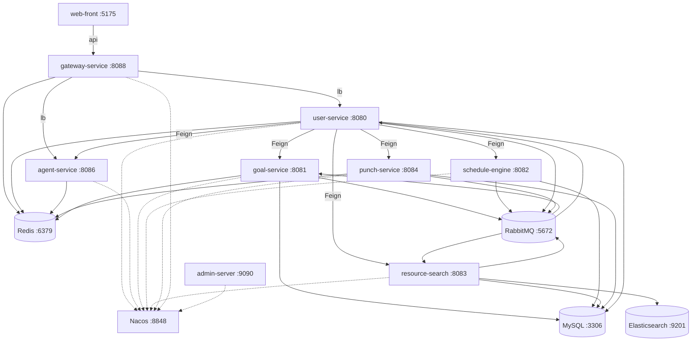

# SmartPlanner（智慧学习助手）

SmartPlanner 是一个面向个人学习场景的微服务应用：从“目标 → 任务拆解 → 排进日程 → 打卡反馈 → 画像建议”，形成闭环。项目包含两个层面：

- **原理篇**：系统架构、模块职责、数据流与关键算法/约束（排程、RAG、去重、鉴权、异步任务）
- **使用说明书**：如何启动、如何配置、如何调用接口、如何排障、如何二次开发

---

## 目录

- 1. 总览（你能用它做什么）
- 2. 架构与依赖（服务拓扑、端口、组件）
- 3. 统一约定（接口前缀、Result<T>、鉴权、用户上下文）
- 4. 核心数据流（同步请求、异步任务、通知推送）
- 5. LLM 接入原理（DashScope/Spring AI Alibaba、超时与重试）
- 6. 目标拆解（goal-service：AI 拆解、幂等、降级任务）
- 7. 智能排程（schedule-engine：空闲时间、排程、候选方案、日计划 job）
- 8. 资源检索与 RAG（resource-search：ES 检索 + LLM 建议 + 爬虫；agent-service：RedisStack 向量检索 + Agent 复盘 + 用户画像分析）
- 9. 打卡与画像（punch-service + user-service + agent-service：习惯/洞察/画像/AI分析）
- 10. 通知系统（RabbitMQ + SSE）
- 11. 运行与部署（Docker Compose / 本地开发）
- 12. API 使用手册（curl 示例）
- 13. 常见问题与排障（401/timeout/ES/重复/构建）
- 14. 安全与生产注意事项

---

## 1. 总览（你能用它做什么）

**面向用户的能力**

- 创建目标并由 AI 拆解为可执行任务（异步，不阻塞请求）
- 导入课表并自动计算空闲时间
- 将待办任务自动排进空闲时段（支持候选方案、确认/拒绝）
- 资源库检索：resource-search 提供 ES 候选检索 + 候选去重 +（可选）LLM 建议
- 任务→课程资源推荐：user-service 聚合（RedisStack 向量检索 + 缓存 + 在线检索兜底），并在排程结果处自动展示
- 打卡记录与习惯画像：近 7 天准时率、完成率、平均延迟、连续打卡等
- 通知推送：排程完成/资源推荐完成等，通过 SSE 实时推送

---

## 2. 架构与依赖（服务拓扑、端口、组件）

### 2.1 服务与端口

| 服务 | 端口 | 说明 |
|---|---:|---|
| web-front | 5175 | Vue3 + Vite + Vuetify，Nginx 静态托管 |
| gateway-service | 8088 | Spring Cloud Gateway，统一入口 `/api/**` |
| user-service | 8080 | 认证 + 用户域接口聚合（对其它服务 OpenFeign 调用入口） |
| agent-service | 8086 | AI Agent 对话、RAG 索引、智能提醒、用户画像分析 |
| goal-service | 8081 | 目标/任务、AI 拆解（MQ 异步） |
| schedule-engine | 8082 | 排程与日计划（支持 job 形式异步执行） |
| resource-search | 8083 | 资源库管理、ES 检索、RAG 增强、去重、资源推荐 job |
| punch-service | 8084 | 打卡记录、习惯数据 |
| admin-server | 9090 | Spring Boot Admin 监控面板（健康、指标、日志、线程、环境变量） |

### 2.2 基础设施

| 组件 | 端口 | 说明 |
|---|---:|---|
| Nacos | 8848 | 服务注册/发现 |
| MySQL | 3306 | 多库（`sp_user/sp_goal/sp_schedule/sp_resource/sp_punch`） |
| RedisStack | 6379 | 缓存/限流 + 向量检索（RedisVectorStore） |
| RabbitMQ | 5672 / 15672 | 异步任务与通知 |
| Elasticsearch | 9201 | 资源检索索引（容器内 9200 映射到宿主 9201） |
| Adminer | 8085 | 轻量数据库管理（~500KB 单文件，类 phpMyAdmin） |
| B站代理 | 18888 | `bilibili_proxy.py`，宿主机运行，转发 B站 API 请求绕过 Docker IP 限制 |
### 2.3 架构拓扑图


```mermaid
graph TB
  Web["web-front :5175"]
  GW["gateway-service :8088"]
  US["user-service :8080"]
  AG["agent-service :8086"]
  GS["goal-service :8081"]
  SE["schedule-engine :8082"]
  RS["resource-search :8083"]
  PS["punch-service :8084"]
  Admin["admin-server :9090"]
  Nacos["Nacos :8848"]
  MySQL[("MySQL :3306")]
  Redis[("Redis :6379")]
  MQ[("RabbitMQ :5672")]
  ES[("Elasticsearch :9201")]

  Web -->|api| GW
  GW -->|lb| US
  GW -->|lb| AG
  US -->|Feign| AG
  US -->|Feign| GS
  US -->|Feign| SE
  US -->|Feign| RS
  US -->|Feign| PS

  GW --> Redis
  US --> Redis
  AG --> Redis
  GS --> Redis
  PS --> Redis

  US -.-> Nacos
  AG -.-> Nacos
  GS -.-> Nacos
  SE -.-> Nacos
  RS -.-> Nacos
  PS -.-> Nacos
  GW -.-> Nacos
  Admin -.-> Nacos

  GS --> MySQL
  SE --> MySQL
  RS --> MySQL
  PS --> MySQL
  US --> MySQL

  GS --> MQ
  SE --> MQ
  RS --> MQ
  US --> MQ
  PS --> MQ
  MQ --> GS
  MQ --> US
  MQ --> RS

  RS --> ES
```

---

## 3. 统一约定（接口前缀、Result<T>、鉴权、用户上下文）

### 3.1 接口前缀与路由

前端默认通过网关访问：

`/api/** -> gateway-service:8088 -> (Nacos) user-service（或 agent-service，匹配 /api/agent/**）-> (Feign) 其它服务`

### 3.2 统一响应体 Result<T>

后端接口统一使用 `Result<T>` 包装，常见字段为：

- `code`：200 表示成功
- `message`：错误信息/提示
- `data`：业务数据

### 3.3 鉴权模型（JWT + 网关透传用户上下文）

认证由 `user-service` 提供 `/api/auth/*`。登录后前端保存：

- `accessToken`：用于请求 `Authorization: Bearer ...`
- `refreshToken`：用于刷新 token

**JWT 令牌结构（HS256 签名）**

访问令牌和刷新令牌均包含以下 claims：

| Claim | 类型 | 说明 |
|-------|------|------|
| `sub` | String | 用户名 |
| `iss` | String | 签发者（`security.jwt.issuer`，默认 `http://sp`） |
| `iat` | Instant | 签发时间 |
| `exp` | Instant | 过期时间 |
| `typ` | String | `"access"` 或 `"refresh"` |
| `userId` | Number | 用户数据库 ID |
| `roles` | List\<String\> | 用户角色列表 |

令牌签发由 `JwtTokenService` 通过 Spring Security 的 `JwtEncoder` + `JwsHeader.with(MacAlgorithm.HS256)` 完成，验证由 `JwtDecoder` 处理。user-service 中提供了 `JwtUtils` 工具类（`getUserId` / `getUsername` / `getRoles` / `getStringClaim`），供各 Controller 统一获取 claims，避免手动类型转换。

网关会在用户携带 JWT 时，把 `userId/username/roles` 透传为请求头（见 [UserContextForwardFilter.java](file:///c:/Users/%E5%88%98%E8%B6%85/Documents/SmartPlanner/gateway-service/src/main/java/com/chao/gateway/filter/UserContextForwardFilter.java)）：

- `X-User-Id`
- `X-Username`
- `X-Roles`

**安全过滤链架构（双重链，防止过期 token 阻塞登录）**

gateway、user-service、agent-service 均采用双 `SecurityFilterChain` 设计：
- **链 0（高优先级）**：匹配公开路径（`/api/auth/**`、`/actuator/**` 等，agent-service 额外包含 `/api/agent/portrait/**`、`/api/agent/tasks/**`、`/api/agent/schedule/**` 供内部 Feign 调用），不配置 OAuth2 Resource Server，直接放行
- **链 1（低优先级）**：匹配其余所有路径，进行 JWT 校验

这样即使用户浏览器缓存了过期 token 后访问登录页，也不会被 `BearerTokenAuthenticationFilter` 拦截。agent-service 的 JWT 解码依赖 `spring.security.oauth2.resourceserver.jwt.secret-key=${JWT_SECRET:}`，与 user-service 保持一致。统一异常处理器 `GlobalExceptionHandler`（位于 common 模块，通过 `scanBasePackages = "com.chao"` 被所有服务共享）提供分层异常处理：`AuthenticationException` → 401 "用户名或密码错误"，`IllegalArgumentException` 等 → 400，其余 → 500 "服务异常"。

### 3.4 网关过滤链（可选 API Key、限流、用户上下文）

- `ApiKeyAuthFilter`：如果配置了 `gateway.auth.api-key`，要求请求头 `X-API-KEY`（见 [ApiKeyAuthFilter.java](file:///c:/Users/%E5%88%98%E8%B6%85/Documents/SmartPlanner/gateway-service/src/main/java/com/chao/gateway/filter/ApiKeyAuthFilter.java)）
- `UserContextForwardFilter`：从 JWT 解析并透传用户信息（见上）
- `RedisRateLimitFilter`：对 `/api/**`（排除 `/api/auth/**`）做 Redis 计数限流（见 [RedisRateLimitFilter.java](file:///c:/Users/%E5%88%98%E8%B6%85/Documents/SmartPlanner/gateway-service/src/main/java/com/chao/gateway/filter/RedisRateLimitFilter.java)）
  - 说明：对流式接口（`/api/agent/chat/stream`）如果需要加禁缓冲响应头，必须通过 `beforeCommit` 设置，避免“响应已提交后再改 header”导致连接被关闭，从而出现断流/一次性返回的错觉。

---

## 4. 核心数据流（同步请求、异步任务、通知推送）

### 4.1 同步请求流（典型）

```text
web-front -> gateway-service (/api/**) -> user-service (/api/user/**)
  -> 通过 OpenFeign 调用 goal/schedule/resource/punch
  -> 返回 Result<T>
```

### 4.2 异步任务与通知（RabbitMQ）

公共交换机/队列定义在 [RabbitMqConfig.java](file:///c:/Users/%E5%88%98%E8%B6%85/Documents/SmartPlanner/common/src/main/java/com/chao/common/config/RabbitMqConfig.java)：

- 目标拆解：
  - exchange：`goal.exchange`
  - queue：`goal.ai.queue`
  - routingKey：`goal.ai.route`
- 通知：
  - exchange：`notification.exchange`
  - queue：`user.notification.queue`
  - routingKey：`notification.route`
- 资源推荐 job（为避免前端 15s 超时而新增）：
  - exchange：`resource.exchange`
  - queue：`resource.advice.queue`
  - routingKey：`resource.advice.route`

通知消费由 `user-service` 完成，并通过 SSE 推给前端（见 [NotificationService.java](file:///c:/Users/%E5%88%98%E8%B6%85/Documents/SmartPlanner/user-service/src/main/java/com/chao/user/service/NotificationService.java) 与 [NotificationController.java](file:///c:/Users/%E5%88%98%E8%B6%85/Documents/SmartPlanner/user-service/src/main/java/com/chao/user/controller/NotificationController.java)）。

---

## 5. LLM 接入原理（DashScope / Spring AI Alibaba）

### 5.1 统一实现：OpenAiCompatClient -> Spring AI Alibaba

项目统一通过 `common` 的 `OpenAiCompatClient.complete(prompt)` 发起模型调用，底层只保留 Spring AI Alibaba（DashScope/Qwen）实现，不再保留双实现/fallback。

### 5.2 关键配置（Docker Compose 已注入）

`.env`：

- `AI_DASHSCOPE_API_KEY`：DashScope API Key
- `MODEL`：模型名（默认 `qwen-max`）

服务侧（compose 环境变量）：

- `SPRING_AI_DASHSCOPE_READ_TIMEOUT=180`：HTTP read-timeout
- `SPRING_AI_RETRY_MAX_ATTEMPTS=1`：关闭重试放大等待
- `SMARTPLANNER_AI_SCHEDULE_TIMEOUT_SECONDS=170`：排程业务层 AI 超时（schedule-engine）
- `SMARTPLANNER_AI_ADVICE_TIMEOUT_SECONDS`：资源建议生成超时（resource-search，默认 120）

### 5.3 超时的分层（你排查 timeout 时要看哪一层）

- **HTTP 层 read-timeout**：DashScope 调用本身读超时
- **Spring AI retry**：重试会把等待放大（本项目默认关）
- **业务层 orTimeout**：对某些 AI 环节（排程、RAG/建议）进行业务超时封顶

---

## 6. 目标拆解（goal-service：AI 拆解、幂等、降级任务）

### 6.1 入口接口

用户侧（推荐经网关/聚合调用）：

- `POST /api/user/goals/ai`（user-service）→ 转发到 goal-service 的 `POST /api/goals`

goal-service 直接接口见 [GoalController.java](file:///c:/Users/%E5%88%98%E8%B6%85/Documents/SmartPlanner/goal-service/src/main/java/com/chao/goal/controller/GoalController.java)：

- `POST /api/goals?userId=...` + body 为目标描述：创建目标并触发 AI 拆解
- `GET /api/goals?userId=...`：目标列表
- `GET /api/goals/{goalId}/tasks?userId=...`：任务列表
- `GET /api/goals/pending-tasks?userId=...`：待办任务（已过滤降级任务）

### 6.2 原理：为什么要用 MQ 异步拆解

目标拆解是典型“慢任务”（模型调用 + JSON 解析 + 递归写库）。同步等待容易造成：

- 前端超时
- 线程占用
- 多次重试导致重复写入

因此创建目标后，拆解通过 MQ 异步执行，完成后发通知。

---

## 7. 智能排程（schedule-engine：空闲时间、排程、候选方案、日计划 job）

### 7.1 课表导入与空闲时间

schedule-engine 直接接口（见 [ScheduleController.java](file:///c:/Users/%E5%88%98%E8%B6%85/Documents/SmartPlanner/schedule-engine/src/main/java/com/chao/schedule/controller/ScheduleController.java)）：

- `POST /api/schedule/import?userId=...&firstWeekMonday=YYYY-MM-DD`：导入课表文件（支持 iCalendar `.ics`、CSV、Excel `.xlsx/.xls`，自动识别中英文表头、节数/时间格式、周数范围，解析 RRULE/BYDAY 循环规则）
- `GET /api/schedule/free-time?userId=...&date=YYYY-MM-DD&firstWeekMonday=YYYY-MM-DD`：计算当天空闲时段（按周数过滤课程，识别课程间碎片时间，填补时间空窗；若周过滤清空全天课程则自动回退为不过滤）
- `PUT /api/schedule/first-week-monday?userId=...&firstWeekMonday=YYYY-MM-DD`：同步第一周周一配置（与 user-service 的 AppUser 保持一致）

用户侧聚合接口（user-service）：

- `POST /api/user/schedule/import`
- `GET /api/user/schedule/free-time`
- `PUT /api/user/schedule/first-week-monday`：设置/清除第一周周一，用于计算当前教学周数，按周范围过滤课程

### 7.1.1 周过滤原理

CSV/Excel 课表支持「周数」列（如 `1-16`、`12-14`、`1-16双`、`17`），导入后课程携带 `weekStart`/`weekEnd`/`weekType` 字段。闲置时间计算时，系统根据「第一周周一」(`firstWeekMonday`) 计算当前日期所属周数：

```
weekNumber = floor(daysBetween / 7) + 1
```

然后只保留 `weekNumber` 在课程周数范围内的课程。若用户未设置 `firstWeekMonday`，则不进行周过滤（全部课程生效）。若周过滤后当天课程为空但课表非空，系统自动回退为不过滤，防止配置错误导致全天误判为空闲。

### 7.2 智能排程（统一在「目标」页发起）

排程算法由 AI 驱动（DashScope），结合任务优先级（priority）、预估耗时（estimatedMinutes）以及用户画像数据（userProfile）。默认节奏为 45 分钟学习 + 10 分钟休息、每天深度任务（≥60min）不超过 3 个、总学习时长不超过 240 分钟。当用户有足够打卡数据后，系统会根据 `procrastinationIndex`、`focusDurationAvg`、`completionRate` 等指标动态调整这些参数（详见 9.5 节）。AI 不可用时自动降级为规则排程（优先级降序 + 耗时降序贪心填充，规则排程同样感知用户画像偏好）。

- 推荐：`POST /api/user/schedule/daily-plan/jobs`：以 job 形式启动排程（支持指定 goalId/taskIds），完成后通过 SSE 通知
- 结果：`GET /api/user/schedule/task-schedules?from=&to=`：查询排程结果
- 兼容：`POST /api/user/schedule/auto`：历史接口（不再作为前端主流程）

### 7.3 候选方案与确认（PlanCandidate）

排程模块支持生成“候选方案”，由用户确认/拒绝：

- `POST /api/user/schedule/plan-candidates`
- `POST /api/user/schedule/plan-candidates/{candidateId}/decision?accept=true|false`
- `GET /api/user/schedule/plan-candidates?date=YYYY-MM-DD`

### 7.4 日计划 job（避免同步等待）

日计划 commit 支持 job 形式（in-process 异步），见 [DailyPlanJobService.java](file:///c:/Users/%E5%88%98%E8%B6%85/Documents/SmartPlanner/schedule-engine/src/main/java/com/chao/schedule/service/DailyPlanJobService.java)：

- `POST /api/user/schedule/daily-plan/jobs`：返回 `jobId`
- `GET  /api/user/schedule/daily-plan/jobs/{jobId}`：查询 `RUNNING/DONE/FAILED`（主要用于排障）

前端主流程不轮询 job 状态：启动后页面静止，等待 SSE 通知 `SCHEDULE_DONE / SCHEDULE_FAILED` 后自动刷新。

---

## 8. 资源检索与 RAG（resource-search：ES 检索 + LLM 建议 + 爬虫；agent-service：RedisStack 向量检索 + Agent 复盘）

### 8.1 resource-search：资源库 + ES 向量语义检索

MySQL：`sp_resource.course_resources`
Elasticsearch：kNN 向量检索（`text-embedding-v2`，1536维）+ multiMatch 文本检索降级，容器内 9200 对外映射 9201

补充：resource-search 内置多平台爬虫系统（B站 + GitHub + 掘金 + 慕课网 + CSDN + 博客园），通过 `CrawlerOrchestratorService` 统一编排，HTTP 抓取/API 调用 + 重试 + 去重 + 多层质量过滤，用于持续补全 `course_resources`。以下参数以 B站爬虫为例：

- 开关：`smartplanner.crawler.bilibili.enabled`（默认 true）
- 种子主题：18 个（Java/Spring Boot/Python/Vue/数据结构/算法/计算机网络/操作系统/数据库/机器学习/前端/Linux/Go/Rust/分布式/微服务/设计模式/计算机组成原理）
- 动态主题：从已有资源和用户目标中自动扩展
- 每主题抓取：8 条结果（可配 `per-topic-limit`），含 UP主、播放量、时长、简介摘要
- 多查询词扩展：CJK 主题自动拼接后缀（`教程`/`入门`/`基础`/`实战`/`考试`/`备考`/`面试`/`项目`），多个查询词独立请求 B站 API（间隔 400ms），扩充候选池后统一质量过滤
- 主题间延迟：800ms（可配 `topic-delay-ms`），避免被 B 站限流
- 去重：URL 归一化 + DB 已有判断
- 三层质量过滤：
  - **标题门禁**（`isValidTitle`）：过滤纯哈希值（`HEX_HASH` 32位+）、哈希后缀（`_16位hex`）、纯数字、% 开头、无 CJK 的过长英文标题
  - **内容相关性**（`isContentRelevantToTopic`）：bigram 相似度 + CJK 字符匹配，中文阈值 0.04、非中文阈值 0.10；短 CJK 主题（≤4字）字符重叠 ≥50% 也放行
  - **入库写 embedding**：仅通过质量过滤的资源才写入 DB 并生成 1536 维向量存入 ES
- 统计追踪：lastRunTime / lastRunTopicsCount / lastRunNewCount / totalCrawled / consecutiveFailures / consecutiveZeroNew
- 实现入口：`ResourceService.scheduledBilibiliCrawl()`
- **HTTP 代理**：B站 API 限制 Docker 容器 IP，通过宿主机 `bilibili_proxy.py`（`ThreadingTCPServer`，端口 18888）转发请求。`resource-search` 通过 `SMARTPLANNER_HTTP_PROXY_HOST`/`SMARTPLANNER_HTTP_PROXY_PORT` 环境变量配置代理地址（默认 `host.docker.internal:18888`），`RestTemplate.exchange(URI.create(url))` 使用 `URI.create()` 避免 `UriTemplate` 对已编码 URL 的二次编码
- **已知限制**：
  - 英文主题（Java/Python/Go 等）无后缀扩展，仅 1 个基础 query，候选量远低于中文主题
  - `scrapeBilibiliWebSearch()` 网页搜索降级抓取始终返回 0（B站搜索页需要 cookie）
  - 热门主题增量收益递减：多次爬取后重复率 90%+，B站热门排行变化缓慢

**SBA 爬虫管理（Actuator 端点）**：

通过 Spring Boot Admin 或直接调用 Actuator 接口管理爬虫：

| 操作 | 方法 | 路径 | 说明 |
|------|------|------|------|
| 查看状态 | GET | `/actuator/crawler` | 返回 enabled/running/paused/totalCrawled/lastRunTime 等统计 |
| 手动触发 | POST | `/actuator/crawler` `{"action":"trigger"}` | 立即触发一次爬取（不等待定时器） |
| 暂停爬虫 | POST | `/actuator/crawler/pause` | 暂停后续定时爬取，不影响正在运行的任务 |
| 恢复爬虫 | POST | `/actuator/crawler/resume` | 恢复定时爬取 |

**健康指示器**（显示在 SBA 面板 Wallboard）：

| 状态 | 条件 |
|------|------|
| 🟢 UP | 正常运行 |
| 🟡 OUT_OF_SERVICE | 连续 2 次爬取零新增（可能主题已覆盖全面） |
| 🔴 DOWN | 连续 3 次爬取失败（网络/API 异常） |
| ⚪ UNKNOWN | 爬虫已禁用 |

**目标驱动的即时爬取**：

用户提交 Goal 后，系统自动触发**所有平台**的爬虫（通过 `CrawlerOrchestratorService`），无需等待 6 小时定时器：

- 触发链路：提交 Goal → MQ `goal.ai.queue` → `GoalAiWorker` 拆解任务 → Feign `POST /api/resources/crawl` → `CrawlerOrchestratorService.crawlTopicAsync()` 并行触发 B站/GitHub/掘金/慕课网/CSDN/博客园
- 每个平台独立异步爬取，结果即时写入 DB/ES
- 失败不影响主流程（独立 try-catch + CompletableFuture）
- 各平台独立并发控制：`running` AtomicBoolean 防止并发

**健康检查准确性**：

| 场景 | 判定逻辑 | 健康状态 |
|------|----------|----------|
| 新增 > 0 | 正常 | 🟢 UP |
| 新增 = 0，无主题报错 | 可能资源已覆盖 | 🟡 OUT_OF_SERVICE |
| 新增 = 0，部分/全部主题报错 | 实际失败 | 🔴 DOWN（consecutiveFailures++） |
| 顶层异常 | 严重失败 | 🔴 DOWN |

### 8.2 resource-search：排程 × RAG 自动联动

排程完成后（DailyPlanJobService），系统自动提取已排程任务标题作为检索主题，调用 ResourceAdviceJobService 异步触发 RAG 资源推荐：

- 触发链路：排程完成 → 提取 taskTitle（去重限 5 个）→ Feign 调用 resource-search → RabbitMQ 异步 job
- 用户收到 SCHEDULE_DONE 通知时，资源推荐已并行启动，无需额外操作
- 去重：同一标题只触发一次推荐任务，避免重复

### 8.3 resource-search：检索流程（从快到慢、逐级退化）

resource-search 的 `searchResourcesWithAdvice(topic)` 大致策略：

1) ES kNN 向量语义检索：DashScope `text-embedding-v2`（1536 维）生成查询向量 → ES `dense_vector` cosine 相似度匹配，通过 `RestClient` 发送原生 kNN 查询并手动解析 JSON 响应（避免 ES Java Client 版本兼容问题），响应排除了 embedding 字段减少传输体积
2) ES 文本检索降级：kNN 失败时自动 fallback 到 `NativeQuery` multiMatch + BestFields + OR（title^3, topic^2, contentSummary）
3) DB 候选：按 topic/relatedTopics 查询
4) 快速结果：规则过滤 + 去重（无需 LLM）
5) 候选增强：将候选组织成上下文，让 LLM 输出建议与资源
6) 终极兜底（`defaultResources`）：以上全失败时返回国内平台搜索链接（B站/慕课网/知乎/GitHub）

对应实现集中在 [ResourceService.java](file:///c:/Users/%E5%88%98%E8%B6%85/Documents/SmartPlanner/resource-search/src/main/java/com/chao/resource/service/ResourceService.java)。

另外一个更快的接口 `searchResources(topic)` 用于”只要资源列表，不要建议文本”的场景：

- 先 ES kNN 向量语义检索（优先）→ 失败时降级 multiMatch 文本检索 → 返回匹配结果
- 嵌入生成：`buildEmbeddingText(topic, title, summary)` 拼接文本 → `embeddingModel.embed()` 生成 1536 维向量
- 写入路径：爬虫入库时 `generateAndSetEmbedding(doc)` 自动生成向量，失败不阻塞写入
- 兜底平台仅限国内：B站、慕课网、知乎、GitHub（不含 Google/Coursera/edX/Medium）

### 8.4 resource-search：去重原理（重点解决 B 站 BV 分 P / 标题噪声）

- URL canonicalize：尤其 bilibili，将 `?p=` 等 query 归一到主视频 URL
- URL 集合去重：相同 canonical URL 只保留一条
- 标题归一 key 去重：清理噪声后生成 key
- 近似重复 base 去重：防止同一系列标题微小差异刷屏

### 8.5 resource-search：异步资源建议 job（避免前端 15s 超时）

用户侧接口（经 user-service）：

- `POST /api/user/resources/search/advice/jobs`：启动推荐任务，返回 `jobId`
- `GET  /api/user/resources/search/advice/jobs/{jobId}`：轮询结果

resource-search 直接接口见 [ResourceController.java](file:///c:/Users/%E5%88%98%E8%B6%85/Documents/SmartPlanner/resource-search/src/main/java/com/chao/resource/controller/ResourceController.java)。

### 8.6 agent-service：向量库（RedisStack）与索引策略

agent-service 使用 Spring AI 的 `RedisVectorStore`（DashScope embedding）作为向量检索底座，存储两类数据：

**课程索引**（全局共享，`type=course`，无 `userId` 字段）

- 管理方：`AgentRagIndexer`（由每日凌晨 3 点定时任务触发）
- 懒初始化：首次向量检索时从 resource-search 拉取资源列表（最多 800 条），分批写入（每批 20 条，`VectorStoreUtils.addDocsInBatches`）
- 刷新周期：Redis 标记 `sp:rag:indexed:courses`，TTL 1 天，过期后下次查询自动重建
- 向量检索时通过 `filterExpression(type=course)` 命中

**用户索引**（按用户隔离，`type=goal/task/journal/punch`，含 `userId` 字段）

- 管理方：`AgentRagIndexer.ensureUserRagIndexed(userId)`
- 数据源：用户的目标、待办任务、随笔、打卡记录
- 触发时机：Agent 调用 `searchPersonalData` 时懒初始化；每日凌晨 3 点全量预索引
- 去重：Redis 标记 `sp:rag:indexed:u:{userId}`（TTL 3 天）+ 进程内 `ConcurrentHashMap`
- 索引重建前先调用 `VectorStoreUtils.deleteByUserId(vs, userId)` 清理该用户旧文档，防止已删除数据残留

**Agent 混合检索（searchPersonalData）**

- 过滤条件：`userId == X OR type == course`，确保私人数据按用户隔离，课程资源全局共享
- 向量检索不足时降级为关键词兜底（`goalClient.listJournals` 字符串匹配 + `resourceClient.searchOnlineCourses`）

**公共工具**

- `VectorStoreUtils`（`agent-service/.../util/VectorStoreUtils.java`）：`addDocsInBatches(vs, docs, batchSize)` 分批写入 + `deleteByUserId(vs, userId)` 按 userId 清理
- `AgentAiConfig`（`agent-service/.../config/AgentAiConfig.java`）：启动时通过 Jedis `ftCreate()` 手动创建 Redis FT 索引完整 Schema——1 个 TEXT（`$.content`）+ 6 个 TAG（`userId`、`type`、`goalId`、`taskId`、`journalId`、`punchId`）+ 1 个 VECTOR（`$.embedding`，HNSW/1536维/FLOAT32/COSINE）。`RedisVectorStore` 设置 `initializeSchema(false)` 避免覆盖已有索引。所有元数据 ID 字段统一 `String.valueOf()` 转换，确保 TAG 字段兼容（Redis TAG 仅接受字符串，Long/Integer 数字类型会导致 "Invalid JSON type" 错误）

### 8.7 user-service：任务 → 课程资源推荐（在线检索 + 缓存 + 兜底）

- 批量接口：`POST /api/user/tasks/resources`（入参 taskIds，返回 taskId -> resources[]）
- 核心策略：
  - 调用 `resource-search` 在线检索获取课程资源
  - 缓存：按 taskId 缓存推荐结果（TTL 2 天）
  - 强制刷新：传 `{ "refresh": true }` 可跳过缓存重新检索

对应实现见 [UserController.java](file:///c:/Users/%E5%88%98%E8%B6%85/Documents/SmartPlanner/user-service/src/main/java/com/chao/user/controller/UserController.java)。

### 8.8 web-front：Agent 窗口关怀推送（登录即显示）

Agent 浮窗不再展示“学习建议/关怀文案”，只保留对话能力；关怀消息以“通知推送”的形式出现（右上角 toast + 铃铛列表）。

- 触发：用户登录后，前端会建立 SSE：`GET /api/user/notifications/stream`，后端在连接建立时推送 1 条 `AGENT_REMINDER`（`trigger=login_care`，含天气上下文）。通过 sessionKey 去重防止 SSE 重连导致重复推送；SSE 保活心跳每 30s 一次防止 nginx 空闲超时断开
- 文案：由 user-service 使用 spring-ai-alibaba（DashScope）基于用户的连续打卡/今日计划/最近心情/天气生成（倾向约 50 字、含人文关怀与”最小动作”建议）；失败自动降级为带数据点的兜底文案
- 前端展示：见 [DefaultLayout.vue](file:///c:/Users/%E5%88%98%E8%B6%85/Documents/SmartPlanner/web-front/src/layouts/DefaultLayout.vue) 与 [notify.js](file:///c:/Users/%E5%88%98%E8%B6%85/Documents/SmartPlanner/web-front/src/stores/notify.js)


### 8.9 Agent：9 个激活 + 4 个禁用的 ToolCallback 驱动的智能对话（agent-service）

Agent 基于 Spring AI Alibaba ReactAgent + RedisSaver 实现多轮对话，通过 @Tool 方法获取真实数据，不走硬编码短路。当前共 13 个方法定义，其中 9 个激活、4 个写操作已禁用（仅保留方法供内部使用）：

Agent 逻辑位于独立的 `agent-service`（端口 8086），通过网关路由 `/api/agent/**` 访问。user-service 通过 `AgentAdviceClient` 和 `AgentPortraitClient`（Feign）调用 agent-service 的任务建议和画像分析能力。

**数据查询工具（8 个激活 + 1 个禁用）**

- listGoals() — 查询用户的目标列表
- listPendingTasks() — 查询目标级待办任务定义（goal tasks，不含排程时间）。注意：此工具不返回排程信息，问【今天有什么任务】时必须用 listTaskSchedules
- listGoalTasks(goalId) — 查询某个目标下的任务列表
- listTodaySchedules() — 查询今天排程（自动查今天，禁止用结果编造）
- listTaskSchedules(from, to) — 查询已排程任务列表（task_schedule，含具体开始/结束时间）。用户问【今天有什么任务/我的日程/排程/今天做什么】时使用
- listPunchRecords(taskId, from, to) — 查询打卡记录（含 createdAt、taskTitle、durationText），用于本周/最近打卡总结、判断任务是否完成。taskTitle 优先取打卡时快照，其次查 goal_tasks，再查排程表
- listRecentJournals(days, goalId, limit) — 查询最近 N 天随笔列表（含心情 mood），用于复盘/总结/情绪分析
- getWeather(location?) — 查询指定城市实时天气（温度、天气状况、体感温度、湿度、风速风向、能见度、气压、最高/最低气温）。若不指定城市，自动使用用户在仪表盘选择的城市
- ~~getDailyPlanJobStatus(jobId)~~ — 已禁用

**写入与操作工具（3 个已禁用）**

- ~~createJournal(content, goalId, mood)~~ — 创建随笔/日记记录（已禁用）
- ~~addTask(goalId, title, description, priority, estimatedMinutes)~~ — 为目标添加任务，模糊去重（已禁用）
- ~~startDailyPlanJob(date, mode, goalId, taskIds)~~ — 触发日计划排程 job（已禁用）

**检索工具（1 个）**

- searchPersonalData(query, topK) — 混合检索（RedisStack 向量检索 + 关键词兜底），用 `userId == X OR type == course` 过滤向量库，确保私人数据隔离的同时保留全局课程资源可检索；不足时降级为关键词匹配 + 在线检索；课程结果自动匹配用户目标关键词，标注 `matchesYourGoal` 和 `matchingGoalKeyword` 辅助 LLM 优先推荐相关资源

**Agent 行为约束（防止编造/跑偏）**

- 涉及【我有哪些任务/排程/是否完成/天气】等事实类问题，必须先调工具确认，严禁编造
- 输出使用基本 Markdown 格式（## 标题、- 列表、**加粗**），前端用 marked.js 渲染。支持多步工具调用（如先调 listPunchRecords 再调 listRecentJournals 后汇总输出），系统提示词内置 5 个工具使用示例（今日日程/周总结/课表查询/资料搜索/目标任务）引导模型行为。回复使用 taskTitle（任务名）而非 taskId（任务编号）
- 用户问【你是谁/你叫什么】时，返回固定自我介绍，不走模型生成
- 列出任务时必须同时关注用户问到的其他方面（如心情），不能只答任务列表
- 建议用户操作时在末尾追加跳转链接（跳转: /path），白名单：/、/plan、/goals、/journals、/schedule、/resources、/punch、/profile、/games/2048
- 随笔复盘/总结必须基于随笔数据：优先用检索工具或随笔列表工具拿到原文片段作为依据

### 8.10 Agent：真流式输出（端到端不缓冲）

Agent 流式接口走 `text/plain` 分块输出，链路上任何一层缓冲/压缩/连接提前关闭都会让前端“看起来像一次性返回”。

- 后端：`agent-service` 使用 `StreamingResponseBody` 边写边 flush（接口：`POST /api/agent/chat/stream`）
- 网关：如需补充禁缓冲 header，必须在 `beforeCommit` 阶段设置（见 3.4 说明）
- 前端：`fetch + ReadableStream.getReader()` 持续读取并更新消息文本（见 [assistant.js](file:///c:/Users/%E5%88%98%E8%B6%85/Documents/SmartPlanner/web-front/src/stores/assistant.js)）
- 反代：Nginx 需对该路径关闭 buffering，并建议禁用上游压缩（见 [nginx.conf](file:///c:/Users/%E5%88%98%E8%B6%85/Documents/SmartPlanner/web-front/nginx.conf)）
- 前端渲染：AI 消息通过 marked.js 转 HTML 后用 v-html 渲染，支持 Markdown 链接 `[页面名](/路径)` 的 SPA 内跳转。末尾 `跳转: /path` 会被提取为导航 chip 按钮。

### 8.11 Agent 内部架构

**组件关系**

```
AgentChatService (chat / chatStream / buildAgent)
  ├── AgentUserContext (ThreadLocal<Long> — 请求级用户上下文)
  ├── SmartPlannerTools (@Component 单例，9 个激活 @Tool + 4 个禁用写操作)
  │     └── safeList() — 统一 Feign Result.code 校验
  ├── MessageTrimmingHook (BEFORE_MODEL，MAX_MESSAGES=24，工具消息对齐)
  ├── ReactAgent (per-user ConcurrentHashMap 缓存，RedisSaver 持久化)
  └── AgentRagIndexer (每日凌晨 3 点全量索引 + searchPersonalData 懒索引)
```

**用户上下文传递**：`AgentUserContext` 基于 `ThreadLocal<Long>` 实现，但 `ReactAgent` 内部通过 graph executor 执行工具调用，可能与主调线程不在同一线程。为此，`buildAgent()` 使用 `UserContextToolCallback` 包裹每个 `ToolCallback`——包裹器在构造时捕获 userId，每次 `call()` 前重新设置 `AgentUserContext`、执行后清理，确保无论工具在哪个线程执行，都能获取正确的用户上下文。

**Agent 构建**：`buildAgent(userId)` 共享单例 `SmartPlannerTools`，通过 `MethodToolCallbackProvider` 生成原始回调后，逐条包装为 `UserContextToolCallback`（捕获 userId），再传入 `ReactAgent.builder()`。Agent 实例按 userId 缓存（`ConcurrentHashMap`），超过 1000 条目时清除半数。

---

## 9. 打卡与画像（punch-service + user-service：习惯/洞察/画像）

### 9.1 打卡接口（punch-service）

直接接口见 [PunchController.java](file:///c:/Users/%E5%88%98%E8%B6%85/Documents/SmartPlanner/punch-service/src/main/java/com/chao/punch/controller/PunchController.java)：

- `POST /api/punch/submit`：提交打卡（可带 evidence 截图文件、taskTitle 任务名快照、durationSeconds 学习时长、startedAt/endedAt 时间戳）。提交后自动更新连续打卡天数（Redis 缓存）和习惯指标
- `GET  /api/punch/records`：查询打卡记录（含 taskTitle 字段，支持按 taskId 和日期范围过滤）
- `DELETE /api/punch/records/{recordId}`：删除打卡记录
- `GET  /api/punch/streak`：连续打卡天数（基于数据库日历去重计算，最长回溯 60 天）
- `GET /api/punch/habits`：读取习惯画像（morningPersonScore、focusDurationAvg、procrastinationIndex）
- `PUT /api/punch/habits`：更新习惯画像字段（由画像分析流程调用）

### 9.2 画像与洞察（user-service → agent-service）

user-service 的 `InfoController` 负责习惯指标计算与接口聚合，AI 画像分析（tips + recommendation 生成）委托给 agent-service 的 `UserPortraitAiService`，通过 Feign（`AgentPortraitClient`）调用。agent-service 的画像分析在原有打卡/排程数据基础上，增加了 **RAG 向量检索随笔片段**：从 Redis 向量库中检索用户近期随笔（过滤 `userId == X AND type == journal`），提取情绪（mood）和创建时间（createdAt），作为 AI 分析的上下文，使生成的学习建议更加个性化。

见 [InfoController.java](file:///c:/Users/%E5%88%98%E8%B6%85/Documents/SmartPlanner/user-service/src/main/java/com/chao/user/controller/InfoController.java) 与 [UserPortraitAiService.java](file:///c:/Users/%E5%88%98%E8%B6%85/Documents/SmartPlanner/agent-service/src/main/java/com/chao/agent/service/UserPortraitAiService.java)：

- `GET  /api/user/insights`：近 7 天洞察（准时率、平均延迟、完成率等）
- `GET  /api/user/portrait`：画像汇总（habits + insights + recommendation + tips）。当画像数据过期/为空时会自动触发一次 AI 分析来补齐建议与推荐参数。
- `POST /api/user/portrait/recompute`：重新计算画像（强制走 AI 分析，返回 recommendation + tips，并回写 habits 的画像字段）。响应新增 `computation` 字段（Map），包含 8 项指标的计算明细（公式、输入值、结果），前端"计算明细"面板可直接渲染，便于用户理解每项指标如何得出
- `GET  /api/user/weather?location=城市名&lat=纬度&lon=经度`：天气查询（wttr.in，支持中文/英文城市名；若不传任何参数则使用用户保存在 Redis 中的坐标/城市偏好）。优先使用经纬度查询（精度更高），无坐标时回退城市名查询。响应提取温度/体感温度/风速/湿度/天气描述，英文天气描述自动翻译为中文。前端仪表盘城市选择器通过 `PUT /api/user/weather-location?location=城市名&lat=纬度&lon=经度` 保存城市+坐标到 Redis（JSON 格式 `{"lat":xx,"lon":yy,"name":"城市名"}`，TTL 365 天），Agent 天气 Tool 和仪表盘天气卡片均自动读取。**天气数据缓存**：查询结果以 `sp:weather:coord:{lat},{lon}` 或 `sp:weather:data:{location}` 为 key 缓存到 Redis（TTL 30 分钟），同一天内命中缓存直接返回；跨天后穿透到 wttr.in 拉取最新数据。前端天气卡片标题栏提供刷新按钮，可手动触发重新查询。经纬度首次浏览器 GPS 定位时自动缓存，后续不覆盖（除非用户手动切换城市）

### 9.3 习惯指标计算原理（user-service）

系统维护三个量化指标，存储在 `punch-service` 的 `user_habits` 表中（[UserHabit.java](file:///c:/Users/%E5%88%98%E8%B6%85/Documents/SmartPlanner/punch-service/src/main/java/com/chao/punch/entity/UserHabit.java)），由 `user-service` 的 `InfoController` 负责计算并通过 Feign 回写：

**晨间偏好分（morningPersonScore，0-100）**

```
score = punchRatio × 60 + scheduleRatio × 40
```
- 统计 10:00 前打卡的比例（权重 60%）和 10:00 前排程的比例（权重 40%），映射到 0-100 分

**平均专注时长（focusDurationAvg，0-180 分钟）**

- 从打卡记录中提取实际学习时长（`durationSeconds`），取均值
- 无打卡数据时，以降级方式用已完成排程的 `endTime - startTime` 估算
- 上限 180 分钟

**拖延指数（procrastinationIndex，0-1，越高越拖延）**

```
当 matchedPunchCount < 3（冷启动）:
  P = 0.3 + (1 - completionRate) × 0.7   （上限 0.85）

当 matchedPunchCount ≥ 3（数据充足）:
  P = delayScore × 0.45 + (1 - onTimeRate) × 0.35 + (1 - completionRate) × 0.20
  其中 delayScore = min(1.0, avgDelayMinutes / 180)
```

三个维度权重：延迟程度 45%、不准时率 35%、未完成率 20%。冷启动时用完成率估算，避免数据不足导致的极端值。

### 9.4 习惯数据的双向更新

**方式一：画像计算触发（全量分析）**

调用 `/api/user/portrait` 或 `/api/user/portrait/recompute` 时，`InfoController` 拉取近 7 天打卡记录 + 排程数据，完整计算三项指标，通过 `PunchClient.updateHabits()` 写回 `user_habits`。同时通过 Feign 调用 agent-service 的 `UserPortraitAiService`，让 AI 基于打卡/排程数据 + **RAG 向量检索的随笔片段**（从 Redis 向量库按 `userId + type=journal` 过滤检索，topK=10）生成个性化建议（`recommendation` + `tips`）。随笔片段附带头像 mood 和 createdAt，使 AI 能感知用户的情绪状态与学习节奏。

**方式二：打卡自动增量更新（轻量微调）**

每次提交打卡时，`PunchService.autoUpdateHabit()` 进行指数移动平均微调：
- morningPersonScore：上午打卡 +2，深夜打卡 -2
- focusDurationAvg：`newFocus = oldFocus × 0.8 + sample × 0.2`
- procrastinationIndex：深夜打卡 +0.02，上午打卡 -0.01

### 9.5 画像反馈排程（闭环已实现）

画像系统生成的 `SchedulePreferenceDto`（`focusMinutes`、`breakMinutes`、`maxDailyMinutes`、`procrastinationIndex`）会自动注入到排程请求中，形成"分析 → 反馈排程 → 调整权重"的闭环。

**推荐参数模型（`PortraitComputeService.recommend()`）**

排程推荐采用连续映射 + 多因子决策，替代早期三档硬切模型：

**① 专注时长（focusMinutes）—— 连续映射 + 拖延罚分**

```
focusBase = clamp(round(focusAvg × 0.8 ÷ 5) × 5, 25, 90)

拖延罚分：
  procrastination > 0.6  →  −10 min
  procrastination > 0.4  →  −5 min
  procrastination ≤ 0.4  →  无调整

focus = max(25, focusBase − penalty)
```

不再使用三档硬切（<40→30 / 40~69→45 / ≥70→60），而是根据实际平均专注时长按 0.8 比例连续映射到 25~90 分钟，边界值不再因 1 分钟之差跳变。高拖延用户自动获得更短的推荐会话。

**② 休息时长（breakMinutes）—— 比例缩放**

```
break = clamp(round(focus × 0.25 ÷ 5) × 5, 5, 25)
```

休息时长随专注时长动态调整（约 25%），不再固定 10 分钟。长专注获得长休息，短专注获得短休息。

**③ 每日上限（maxDailyMinutes）—— 三维决策**

```
完成率分档：
  completionRate < 30%   →  120 min
  completionRate < 60%   →  180 min
  completionRate ≥ 60%   →  240 min

拖延罚分（procPenalty）：
  procrastination > 0.7  →  −60 min
  procrastination > 0.5  →  −30 min
  procrastination ≤ 0.5  →  无调整

maxDaily = max(120, baseTier − procPenalty)

新手保护：
  streak < 2  →  cap at 150 min
  streak ≥ 2  →  无封顶
```

上限决策综合考虑三个维度：完成率反映执行能力、拖延指数反映行为倾向、连续打卡天数提供新手保护。比早期单一的 `streak<3 || onTimeRate<0.5 → 180` 判断更细腻，不再有 streak 从 2 到 3 时上限陡增 60 分钟的悬崖效应。

**数据通路**

```
user_habits → user-service (buildSchedulePreference) → request.preference → schedule-engine
```

`UserController` 在以下三个排程端点中自动注入偏好数据：
- `POST /api/user/schedule/daily-plan/commit`
- `POST /api/user/schedule/daily-plan/jobs`
- `POST /api/user/schedule/plan-candidates`

**排程策略适配（AI 模式）**

`SchedulePreferenceDto` 以 `userProfile` JSON 字段注入 AI 提示词，模型根据画像调整策略：

- `procrastinationIndex > 0.6`：用户容易拖延 → 减少任务数、多留缓冲、优先排短任务建立成就感
- `procrastinationIndex < 0.3`：用户自律性强 → 可适度紧凑安排
- `focusMinutes`：控制单次学习会话时长
- `breakMinutes`：任务间隔休息时间
- `maxDailyMinutes`：当日学习总时长上限

**排程策略适配（规则降级模式）**

AI 不可用时，规则排程同样感知画像：

- `focusMinutes` 替代硬编码的 45 分钟会话
- `breakMinutes` 替代硬编码的 10 分钟休息间隔
- `maxDailyMinutes` 替代硬编码的 240 分钟日上限
- `procrastinationIndex > 0.6`：深度任务上限从 3 降为 1，最小可排时段放宽到 20 分钟
- `procrastinationIndex < 0.3`：保持正常的深度任务上限 3

**默认值（新用户 / 无数据时的兜底）**

所有偏好参数均可为 null，`schedule-engine` 的 `resolvePreference()` 会自动填充默认值：focusMinutes=45, breakMinutes=10, maxDailyMinutes=240, procrastinationIndex=0.3。行为与改动前完全兼容。

---

## 10. 通知系统（RabbitMQ + SSE）

RabbitMQ 的 exchange/queue/binding 由 common 模块的 [RabbitMqConfig.java](file:///c:/Users/%E5%88%98%E8%B6%85/Documents/SmartPlanner/common/src/main/java/com/chao/common/config/RabbitMqConfig.java) 声明，相关服务需确保能扫描到 `com.chao.common.config`。

### 10.1 SSE 订阅

前端通过 SSE 订阅通知流：

- `GET /api/user/notifications/stream`

后端收到 MQ 通知后，通过 SSE emitter 推送给对应 userId（见 [NotificationController.java](file:///c:/Users/%E5%88%98%E8%B6%85/Documents/SmartPlanner/user-service/src/main/java/com/chao/user/controller/NotificationController.java)）。

SSE 连接维护：后端每 30s 发送一次 heartbeat ping 保持连接活跃；Nginx 为该端点单独配置 `proxy_read_timeout 600s`（见 [nginx.conf](file:///c:/Users/%E5%88%98%E8%B6%85/Documents/SmartPlanner/web-front/nginx.conf)）。

### 10.2 常见通知类型

当前代码中常见：

- `GOAL_TASK_READY`
- `SCHEDULE_DONE / SCHEDULE_FAILED`
- `RESOURCE_ADVICE_DONE / RESOURCE_ADVICE_FAILED`
- `AGENT_REMINDER / AGENT_BADGE`：Agent 感知提醒与成就（右上角通知）

`AGENT_REMINDER / AGENT_BADGE` 的 data 结构（SSE 的 JSON）：

- `content`：展示给用户的一句话提醒
- `payload.nav`：建议跳转页面（如 `/punch`、`/goals`、`/journals`）
- `payload.level`：提示级别（`info`/`warning`/`success`）
- `payload.data`：感知数据快照（如今日已完成/未完成、连续天数、完成时间分布等）

### 10.3 Agent 感知提醒（右上角）

该模块的目标是：基于真实业务数据做“提醒/鼓励/纠偏”，并通过 SSE 推到前端右上角（铃铛列表 + toast）。

- 文案生成方式：
  - 触发服务只负责计算“触发原因 + 感知数据”，并把 `payload.ai.userPrompt` 随通知一起发到 MQ；触发服务不内置关怀话术，`content` 只放触发/数据快照（用于极端情况下可观测）
  - user-service 在消费通知时，通过 spring-ai-alibaba（DashScope）生成最终提醒文案（SSE 下发给前端的是生成后的结果）
  - 质量保护：若模型输出过于泛化/未引用任何数据点/过短/缺少关怀语气/与数据明显矛盾（如把待完成说成已完成），会触发重试与纠偏；仍不达标时才降级为”基于数据的兜底结构”。登录关怀只发送单条消息，避免重复刷屏
  - 防刷屏：定时感知提醒默认按 Redis 去重（每条规则每天最多 1 次）；当 Redis 异常时会自动降级为进程内去重，避免同一条提醒被一分钟一次”疯狂重复”推送。登录关怀按 sessionKey（JWT 签名）去重，通过 Set 追踪每个用户所有已发送过的 sessionKey，避免 SSE 重连或 JWT 刷新导致重复欢迎
  - 二次去重：user-service 在消费 MQ 后、推送 SSE 前，会对 `AGENT_REMINDER/AGENT_BADGE` 做短窗口去重（同一用户同一内容 2 分钟内只推一次），用于抵御上游重复投递/重试造成的刷屏；前端铃铛列表也会做短窗口去重防线，避免 UI 被相同内容淹没

- 数据来源（实时拉取，避免编造）：
  - 打卡：`/api/user/punch/records`、`/api/user/punch/streak`
  - 今日计划：`/api/user/schedule/task-schedules`
  - 随笔：`/api/user/journals`（通过 goal-service 聚合）
- 触发策略（示例规则）：
  - 用户登录建立 SSE：推送 1 条”登录关怀”；文案由模型基于连续天数/待完成数/下一项任务/心情/天气生成，含人文关怀与最小动作建议（跳转 `/schedule` 或 `/goals`）。通过 sessionKey 去重防止 SSE 重连导致重复推送
  - 用户新增任务后：欢迎提醒（文案由模型基于任务/计划数据生成，避免固定模板）（跳转 `/goals`）
  - 随笔/心情命中消极词：安慰提醒（文案由模型基于触发原因与数据生成，避免固定模板）（跳转 `/journals`）
  - 晚上 9 点未完成 ≥ 2 个：提醒用户剩余未完成项（尽量带任务名）（跳转 `/punch`）
  - 连续 7 天且当天计划全部完成：发放成就类提醒（跳转 `/punch`）
  - 同一任务在近 7 天出现“结束时间已过但仍未完成”≥ 3 次：提示用户是否需要拆分/降低门槛（跳转 `/goals`）
  - 同一任务连续 3 天未完成：关怀式纠偏，询问“难度/状态/时间是否需要调整”（跳转 `/goals`）
  - 连续 3 天任务完成率 < 30%：同上（跳转 `/goals`）
  - 连续 2 天游打卡：同上（跳转 `/goals`）
  - 3 天没写随笔：引导记录近况/心情（跳转 `/journals`）
  - 随笔/心情出现“焦虑/压力”等关键词：轻量安慰 + 给一个最小动作建议（跳转 `/journals`）
  - 连续一周随笔都很短：引导写更具体的一件事/一个情绪（跳转 `/journals`）

实现位置：

- 后端：agent-service 的 [AgentReminderService.java](file:///c:/Users/%E5%88%98%E8%B6%85/Documents/SmartPlanner/agent-service/src/main/java/com/chao/agent/service/AgentReminderService.java)（定时评估 + 去重推送）
- 后端：goal-service 的 [GoalService.java](file:///c:/Users/%E5%88%98%E8%B6%85/Documents/SmartPlanner/goal-service/src/main/java/com/chao/goal/service/GoalService.java)（新增任务/新增随笔时即时推送提醒）
- 前端：web-front 的 [DefaultLayout.vue](file:///c:/Users/%E5%88%98%E8%B6%85/Documents/SmartPlanner/web-front/src/layouts/DefaultLayout.vue) 与 [notify.js](file:///c:/Users/%E5%88%98%E8%B6%85/Documents/SmartPlanner/web-front/src/stores/notify.js)（铃铛列表 + 未读数 + 点击跳转）

验证方式（推荐）：

1) 前端登录后保持页面在线（会建立 `GET /api/user/notifications/stream` 的 SSE 连接）
   - 登录建立 SSE 后应收到 1 条 `AGENT_REMINDER`（登录关怀，含天气上下文）
2) 在「目标」页手动新增一个任务：应立刻收到欢迎提醒（右上角铃铛 + toast）
3) 在「随笔」页写一条包含“崩溃/压力/焦虑/没动力”等词的随笔：应立刻收到安慰提醒
4) 排障：
   - RabbitMQ：确认 `notification.exchange` 存在，且 `user.notification.queue` 有 consumer
   - user-service：日志中会出现 NotificationService “收到通知并推送”记录

---

## 11. 运行与部署（Docker Compose / 本地开发）

### 11.1 Docker Compose 一键启动

1) 配置 `.env`

- `AI_DASHSCOPE_API_KEY=REPLACE_WITH_YOUR_DASHSCOPE_API_KEY`
- `MODEL=qwen-max`

2) 启动

```bash
# 先启动 B站代理（宿主机上运行，容器内 resource-search 通过它转发 B站 API 请求）
python3 bilibili_proxy.py &

# 启动所有服务
docker compose up -d --build
```

3) 访问

- 前端：http://localhost:5175
- 网关（API）：http://localhost:8088
- RabbitMQ 管理台：http://localhost:15672（默认账号 `sp` / `sp123`）
- Nacos：http://localhost:8848
- Elasticsearch：http://localhost:9201
- Spring Boot Admin：http://localhost:9090
- Adminer：http://localhost:8085（系统 MySQL，账号 root / 密码 root）

### 11.2 本地开发（不走容器）

后端：JDK 17 + Maven

```bash
mvn -DskipTests package
```

前端：Node.js（以 web-front 的 package.json 为准）

```bash
cd web-front
npm install
npm run dev
```

---

## 12. API 使用手册（curl 示例）

### 12.1 注册/登录

```bash
curl -X POST http://localhost:8088/api/auth/register ^
  -H "Content-Type: application/json" ^
  -d "{\"username\":\"demo\",\"password\":\"demo123\"}"
```

```bash
curl -X POST http://localhost:8088/api/auth/login ^
  -H "Content-Type: application/json" ^
  -d "{\"username\":\"demo\",\"password\":\"demo123\"}"
```

返回 `data.accessToken` 后，用它调用后续接口：

```bash
curl -X GET http://localhost:8088/api/auth/me ^
  -H "Authorization: Bearer {accessToken}"
```

### 12.2 导入课表（建议先导入，以便空闲时间/排程）

说明：新用户会在前端「学习计划（/plan）」页完成课表提交；目标拆解本身不强依赖课表，但后续排程/空闲时间计算需要课表数据。

```bash
curl -X POST "http://localhost:8088/api/user/schedule/import" ^
  -H "Authorization: Bearer {accessToken}" ^
  -F "file=@test-data/schedule.csv"
```

### 12.3 创建目标并触发 AI 拆解（异步）

```bash
curl -X POST http://localhost:8088/api/user/goals/ai ^
  -H "Authorization: Bearer {accessToken}" ^
  -H "Content-Type: text/plain" ^
  --data "我想系统学习计算机组成原理，目标是 4 周内完成一轮学习并能做题。"
```

### 12.4 启动目标排程（异步 job）

说明：排程统一在「目标（/goals）」页发起。接口返回 `jobId` 后，前端会等待 SSE 通知 `SCHEDULE_DONE / SCHEDULE_FAILED` 自动刷新。

```bash
curl -X POST "http://localhost:8088/api/user/schedule/daily-plan/jobs" ^
  -H "Authorization: Bearer {accessToken}" ^
  -H "Content-Type: application/json" ^
  -d "{\"date\":\"2026-05-23\",\"mode\":\"merge\",\"goalId\":1,\"taskIds\":null}"
```

（历史接口，不推荐作为主流程）

```bash
curl -X POST "http://localhost:8088/api/user/schedule/auto" ^
  -H "Authorization: Bearer {accessToken}"
```

### 12.5 资源推荐（异步 job，避免 15s 超时）

> 排程完成后系统自动为已排程任务触发 RAG 资源推荐，无需手动调用。以下接口用于手动触发或查看状态。
>
> **Windows curl 注意**：CMD/PowerShell 中 curl 对中文字符的编码处理可能不一致，导致 JSON 解析失败（`Invalid UTF-8`）。推荐使用 Git Bash 的 curl，或通过 `printf` + `--data-binary` 管道方式发送中文 JSON body：
>
> ```bash
> printf '{"topic":"计算机组成原理"}' | curl -X POST "http://localhost:8088/api/user/resources/search/advice/jobs" \
>   -H "Authorization: Bearer {accessToken}" \
>   -H "Content-Type: application/json; charset=UTF-8" \
>   --data-binary @-
> ```

```bash
curl -X POST "http://localhost:8088/api/user/resources/search/advice/jobs" ^
  -H "Authorization: Bearer {accessToken}" ^
  -H "Content-Type: application/json" ^
  -d "{\"topic\":\"计算机组成原理\"}"
```

轮询：

```bash
curl -X GET "http://localhost:8088/api/user/resources/search/advice/jobs/{jobId}" ^
  -H "Authorization: Bearer {accessToken}"
```

### 12.6 任务 → 课程资源推荐（RAG + 缓存，批量）

```bash
curl -X POST "http://localhost:8088/api/user/tasks/resources" ^
  -H "Authorization: Bearer {accessToken}" ^
  -H "Content-Type: application/json" ^
  -d "{\"taskIds\":[1,2,3],\"topK\":3}"
```

### 12.7 Agent 窗口关怀推送（登录即显示）

说明：无需主动调用接口。用户登录后建立 SSE 连接，后端会立即推送一条 `AGENT_REMINDER`（`trigger=login_care`），前端在 Agent 窗口顶部展示该关怀消息。

### 12.8 Agent 对话（流式输出）

```bash
curl -N -X POST "http://localhost:8088/api/agent/chat/stream" ^
  -H "Authorization: Bearer {accessToken}" ^
  -H "Content-Type: text/plain" ^
  --data "帮我总结最近一周随笔里反复出现的学习问题，并给我一个今天能做的改进动作"
```

跳转按钮用法：

- 你可以直接对 Agent 说：打开画像/去日程/进入2048/查询天气。回答末尾出现 `跳转: /path` 时，前端会展示可点击的”跳转按钮”。

流式排查建议（当你体感“不是流式/中途断流”时）：

- 先在对话框发送：`流式测试`（服务端会按固定节奏持续输出，便于判断是链路缓冲还是模型本身不产出增量）
- 如果“流式测试”能增量显示，但正常问答不能：说明模型事件未产出有效增量，需要继续适配流式事件类型/抽取字段
- 如果“流式测试”也不增量：优先排查 Nginx 缓冲、gzip、浏览器缓存、以及网关是否有异常导致连接关闭

---

## 13. 常见问题与排障

### 13.1 401（未授权）

- 原因：未登录/`accessToken` 过期/刷新失败
- 处理：重新登录；前端会尝试用 refreshToken 自动刷新

### 13.2 前端 `timeout of 15000ms exceeded`

- 原因：长耗时任务（尤其 RAG）被同步请求卡住
- 处理：资源推荐已改为 job 异步；如果你仍看到 15s 超时，优先确认前端是否加载到最新构建包（Ctrl+F5）

### 13.3 “建议生成超时或暂不可用…”

- 含义：模型调用失败/超时/输出不合规被丢弃，系统返回兜底文案
- 排查：
  - `AI_DASHSCOPE_API_KEY` 是否正确
  - `SPRING_AI_DASHSCOPE_READ_TIMEOUT` 是否足够
  - `SMARTPLANNER_AI_ADVICE_TIMEOUT_SECONDS` 是否需要增大

### 13.4 Docker 拉取镜像 401 / 网络问题

某些 Dockerfile 或 compose 镜像源可能受网络影响；如果遇到 401，可将基础镜像源替换为可用镜像源后重新 build。

### 13.5 ES 端口被 Cpolar 隧道占用（Windows）

**症状**：`curl http://localhost:9200` 返回 Cpolar 登录页（而非 ES 集群信息），`/_cat/indices` 返回 404。

**原因**：Cpolar 内网穿透工具默认占用 9200 端口，与 ES 的 WSL 端口转发冲突。

**处理**：
- 方法一：关闭 Cpolar 或修改其监听端口
- 方法二：通过 Docker Compose 映射的 9201 端口访问 ES（`http://localhost:9201`）
- 方法三：服务内部通过 Docker 网络（`http://elasticsearch:9200`）访问 ES，不受宿主机端口冲突影响。直接使用 resource-search 的 API（`http://localhost:8083/api/resources/search`）即可正常检索

### 13.6 旧爬虫垃圾数据清理

**症状**：kNN 向量搜索返回不相关内容（如"机器学习"搜出 CPU 评测、汽车评测、电竞桌）。

**原因**：入库质量过滤（`isContentRelevantToTopic`）仅对 `saveIfNew()` 的新数据生效，MySQL 中已存在的旧垃圾数据未被清理。

**处理步骤**：
1. 通过 Adminer（http://localhost:8085）或 MySQL 客户端连接 `sp_resource` 库
2. 查看问题主题的数据：`SELECT id, title, content_summary FROM course_resources WHERE topic = '机器学习';`
3. 删除明显不相关的记录：`DELETE FROM course_resources WHERE topic = '机器学习' AND (title LIKE '%E5%' OR title LIKE '%CPU%' OR title LIKE '%奥迪%');`（根据实际情况调整条件）
4. 重启 resource-search 服务，触发 `reindex-on-startup` 自动重建 ES 索引
5. 验证：`curl "http://localhost:8083/api/resources/search?topic=机器学习"` 确认结果质量

**预防**：确保 `smartplanner.crawler.quality-filter.enabled=true`（默认开启），新爬取数据入库前会经过 bigram 相似度 + 中文字符匹配过滤。

### 13.7 Agent 流式不生效 / 一次性显示 / 断流

按优先级从高到低排查：

1) 前端是否真的在增量更新：硬刷新（Ctrl+F5）确保加载到最新 web-front 构建；Pinia 的消息对象必须是响应式引用（见 [assistant.js](file:///c:/Users/%E5%88%98%E8%B6%85/Documents/SmartPlanner/web-front/src/stores/assistant.js)）
2) 反向代理是否缓冲：Nginx 对 `location = /api/agent/chat/stream` 关闭 `proxy_buffering` / `proxy_request_buffering`，并建议禁用 `Accept-Encoding`（见 [nginx.conf](file:///c:/Users/%E5%88%98%E8%B6%85/Documents/SmartPlanner/web-front/nginx.conf)）
3) 网关是否在响应已提交后改 header：会触发 reactor 异常并关闭连接（见 3.4 说明与 [RedisRateLimitFilter.java](file:///c:/Users/%E5%88%98%E8%B6%85/Documents/SmartPlanner/gateway-service/src/main/java/com/chao/gateway/filter/RedisRateLimitFilter.java)）
4) 用 `curl -N` 直连验证：分别打到 `http://localhost:8088/...`（网关）与 `http://localhost:5175/...`（前端 Nginx）对比，确认是哪一层聚合/断流

---

## 14. 安全与生产注意事项

- 不要把真实的 `AI_DASHSCOPE_API_KEY`、JWT 密钥等敏感信息提交到仓库
- 生产环境务必替换 compose 中的 `JWT_SECRET`、演示账号密码等默认配置
- 生产环境建议启用网关 `gateway.auth.api-key` 并完善跨域/限流策略

---

## 15. 性能优化与功能增强记录（2026-06-08 ~ 2026-06-09）

### 15.1 统一 HTTP 客户端

**问题**：3 处天气查询（InfoController、NotificationController、AgentChatService）各自用 `HttpURLConnection` 发起 HTTP 请求，无连接池、无超时配置，阻塞时可能无限等待。

**修改**：
- 新增 `WeatherClient`（`common/src/main/java/com/chao/common/util/WeatherClient.java`），统一封装 wttr.in 天气查询，含中英文天气映射
- 新增 `WeatherData` DTO（`common/src/main/java/com/chao/common/dto/WeatherData.java`），统一天气响应字段
- 新增 `HttpClientConfig`（`common/src/main/java/com/chao/common/config/HttpClientConfig.java`），提供 `externalRestTemplate` Bean（连接超时 5s，读超时 15s）
- `ResourceService.httpGetTextWithUA()` 改用 `RestTemplate.exchange()` 替代 `HttpURLConnection`

### 15.2 修复 @Async 自调用

**问题**：`ScheduleService.smartScheduleAsync()` 标注 `@Async` 但通过 `this.smartScheduleAsync()` 自调用，Spring AOP 代理不拦截内部调用，导致异步注解失效，排程任务阻塞调用线程。

**修改**：改用 `CompletableFuture.runAsync(() -> smartSchedule(userId))`，确保异步执行。（`schedule-engine/.../service/ScheduleService.java`）

### 15.3 Agent 用户上下文重构

**初始问题**：`AgentChatService` 使用 `ThreadLocal<Long>` 存储当前 userId，但 Spring Boot 默认使用线程池处理请求，ThreadLocal 未及时清理会导致后续请求读到错误 userId、且无法被 GC。

**修改**：移除未受管理的 `ThreadLocal`，改为方法参数显式传递 userId。（`user-service/.../service/AgentChatService.java`）

**2026-06-08 重构**：随 agent-service 独立拆分，`SmartPlannerTools` 需感知当前用户才能调用各 Feign 客户端。引入受管理的 `AgentUserContext`（`agent-service/.../util/AgentUserContext.java`）：
- 基于 `ThreadLocal<Long>` 实现，在 `chat()` 方法中通过 `try/finally` 设置与清理，在 `chatStream()` 中通过 `doFinally` 保证 Reactive 流结束后清理
- `AgentChatService` 不再为每个用户 `new SmartPlannerTools(...)`，改为注入单例 `@Component`
- 消除了每次 agent 构建时重复创建工具实例的开销，同时保证用户隔离正确性

### 15.5 重构 Docker 构建

**问题**：7 个 Java 服务各有独立 Dockerfile（共 ~196 行），内容 95% 相同（仅服务名、端口、Maven/JVM 参数不同），维护成本高。

**修改**：
- 7 个 `{service}/Dockerfile` 合并为根目录 1 个参数化 `Dockerfile`（36 行），通过 ARG（`SERVICE_NAME`、`SERVICE_PORT`、`MAVEN_OPTS`、`JVM_OPTS`）区分服务
- `docker-compose.yml` 用 YAML anchors（`*env-nacos`、`*env-rabbitmq`、`*env-ai`）去重环境变量

### 15.6 统一 TaskExecutor Bean 与启动修复

**问题**：`DailyPlanJobService` 和 `ResourceAdviceJobService` 注入 `@Qualifier("applicationTaskExecutor")`，但 `TaskExecutorConfig` 只定义了 `aiTaskExecutor`，导致 Spring 启动失败。

**修改**：
- `TaskExecutorConfig` 提取 `createExecutor(threadNamePrefix)` 工厂方法，新增 `applicationTaskExecutor` bean（线程前缀 `app-job-`）
- 两个 Bean 各一行，消除重复代码

### 15.7 Agent 修复——修复 userId 错串

**问题**：`AgentChatService.ensureAgent()` 将 Agent 存为单例 `volatile ReactAgent agent`，`userIdSupplier` 永远返回第一个登录用户的 ID，后续用户调用所有 Tool 都查到别人的数据。

**修改**：改为 `ConcurrentHashMap<Long, ReactAgent> agents`，每个用户独立 Agent 实例。

### 15.8 Agent 修复——LLM 日期幻觉

**问题**：LLM 不知道当前日期，调用 `listClasses` 时传入 `date=2023-10-05`（随机编造），导致课表查询返回错误结果或空。

**修改**：每次 `chat/chatStream` 请求自动在用户消息前注入 `[今天是2026-06-08，星期一]`（`todayPrefix()` 方法），LLM 据此传入正确 date 参数。

### 15.9 Agent 新增——课表查询 Tool

**问题**：Agent 缺少课表查询能力，用户问"今天有什么课"时无法回答。

**修改**：
- `SmartPlannerTools` 新增 `listClasses(dayOfWeek?, date?, firstWeekMonday?)` Tool，调用 `scheduleClient.listClasses`
- Tool 返回格式化字符串（`"共3门课：\n1. 课程名 周一 08:00-09:40 地点\n..."`），LLM 直接呈现不解释
- `ScheduleService.listClassSchedules` 优化：`date` 传入时自动推导 `dayOfWeek`，`firstWeekMonday` 为空时自动从 `UserScheduleConfig` 查询
- 系统提示词明确区分"排程任务"（`listTodaySchedules`）与"学校课程"（`listClasses`）

### 15.10 修复 punch_records 缺列

**问题**：`PunchRecord` 实体映射 `task_title` 列，但 `init.sql` 建表时未包含此列，导致 punch-service 查询抛出 `Unknown column 'task_title'`。

**修改**：`sql/init.sql` 新增 `task_title VARCHAR(500)` 列。

### 15.12 修复 agent-service 启动失败与 502

**问题 1 — FeignClient Bean 冲突**：`AgentAdviceClient` 和 `AgentPortraitClient` 均使用 `@FeignClient(name = "agent-service")` 且无 `contextId`，导致 `FeignClientSpecification` Bean 同名注册失败。

**修改**：两个 Feign 客户端分别添加 `contextId = "agent-advice"` 和 `contextId = "agent-portrait"`（`common/.../client/AgentAdviceClient.java`、`AgentPortraitClient.java`）。

**问题 2 — agent-service 缺少安全配置**：agent-service 依赖 `spring-boot-starter-oauth2-resource-server` 但无 `SecurityConfig`，Spring Security 默认要求所有请求认证（浏览器弹密码框），且缺少 `spring.security.oauth2.resourceserver.jwt.secret-key` 配置导致 JWT 解码器无法创建。

**修改**：
- 新增 `SecurityConfig`（`agent-service/.../config/SecurityConfig.java`）：双链设计，内部 Feign 调用路径（`/api/agent/portrait/**`、`/api/agent/tasks/**`、`/api/agent/schedule/**`）放行，其余路径 JWT 认证；显式定义 `JwtDecoder` Bean（`NimbusJwtDecoder.withSecretKey`）避免自动配置在 secret 为空时跳过创建
- `application.yml` 新增 `spring.security.oauth2.resourceserver.jwt.secret-key: ${JWT_SECRET:}`

**问题**：LLM 调用（最长 180s 超时）与用户 CRUD 请求共享 Tomcat 线程池，高并发 Agent 对话可能阻塞登录/注册等轻量请求。

**修改**：
- 新增 `agent-service`（端口 8086），独立部署 AI Agent 对话、RAG 索引、智能提醒、用户画像分析
- user-service 通过 `AgentPortraitClient`、`AgentAdviceClient`（Feign）调用 agent-service
- Agent 流式接口路径改为 `/api/agent/chat/stream`（网关 `Path=/api/agent/**` 路由到 agent-service）
- user-service 移除 VectorStore、DashScope API、EmbeddingModel 等 AI 基础设施依赖，专注用户认证与接口聚合

### 15.13 Agent 构建质量全面优化（2026-06-08）

**系统提示词重写（P0）**：移除「每次只能调用 1 个工具」的矛盾约束（与「先调 A 再调 B」的多步指引冲突），新增 5 个工具使用示例（今日日程/周总结/课表查询/资料搜索/目标任务），引导模型在合适的场景下进行多步工具调用。

**流式输出优化（P0+P1）**：
- `sanitizeStreamChunk` 移除 `chunk.replace("```", "")`——不再删除所有反引号，保留代码块和行内代码的正确渲染
- 流式去重算法从基于 85% 模糊匹配的脆弱实现简化为纯 `startsWith` 检测，消除边界情况下的吞字/重复问题

**SmartPlannerTools 单例化（P1）**：`SmartPlannerTools` 从每次构建 Agent 时 `new` 创建改为 Spring `@Component` 单例 Bean，通过 `AgentUserContext`（受管理的 ThreadLocal）注入用户上下文。9 个构造函数参数通过标准 DI 注入，消除了 agent 重建时的对象分配开销，同时保证用户隔离正确性。

**Feign 调用结果校验（P1）**：新增 `safeList(Result<List<T>>)` 静态辅助方法统一检查 `res.code == 200`，所有 10+ 处工具方法的 Feign 调用结果均通过该方法获取数据，避免在远程调用失败时静默返回空列表。

**课程检索个性化（P2）**：`searchPersonalData` 的关键词兜底检索新增目标关键词匹配——拉取用户的目标标题并提取关键词，课程结果命中时标注 `matchesYourGoal: true` 和 `matchingGoalKeyword`，辅助 LLM 优先推荐与用户学习目标相关的课程资源。

**关键 Bug 修复（P0）**：
- `SecurityConfig`：JWT 密钥为空或长度不足 32 字节时启动即抛 `IllegalStateException`（明确错误信息），避免运行时静默失败
- `AgentAiConfig`：`JedisPooled` 构造函数补充 Redis 密码参数（与原 `RedissonClient` 配置对齐），修复有密码的 Redis 环境下向量库连接失败

**ThreadLocal 跨线程传播修复（P0）**：`AgentUserContext` 基于 `ThreadLocal` 存储 userId，但 `ReactAgent` 内部 graph executor 在不同线程上执行工具调用，导致 `requireUserId()` 抛出 `IllegalStateException`（LLM 回显"提示 userId not set"）。修复方案：`buildAgent()` 新增 `UserContextToolCallback` 包裹器类，在构造时捕获 userId，每次 `call()` / `call(toolInput, toolContext)` 前重新设置 ThreadLocal、执行后清理，确保工具调用无论在线程池中哪个线程运行都能获取正确的用户上下文。

### 15.14 前端 UI 优化（2026-06-09）

**排程天数选择移除**：`GoalsView.vue` 移除「排程天数」下拉选择器（1/3/7 天），排程请求固定 `days=1`。因后端 `commitDailyPlan()` 从未读取 `request.getDays()` 字段，多天排程功能实际无效。

**日期选择器统一为 Vuetify 风格**：三个页面（`GoalsView.vue`、`PlanView.vue`、`ScheduleView.vue`）中 `v-text-field type="date"` 替换为 `v-date-input`。`VDateInput` 是 Vuetify 3.7 Labs 组件，需从 `vuetify/labs/VDateInput` 单独导入并注册到 `createVuetify` 的 components 中，提供 Material Design 风格的日历面板（支持深/浅色主题）。全局设置 `locale: 'zhHans'` 使日历面板显示中文月份，`VDateInput` 添加 `rounded: 'lg'` 默认圆角。

**侧边栏收起模式重构**：`DefaultLayout.vue` 菜单收起（rail 76px）时不再使用 `v-list-item` 的 `prepend-icon`（受限于 `v-list-item__spacer` 和 `v-list-item__content` 内部弹性布局导致图标不居中），改用纯 `v-btn` 图标按钮 + `flexbox` 居中（`flex-direction: column; align-items: center`），展开/收起两种状态独立渲染。顶部增加 84px 灯泡品牌图标容器与展开模式 SmartPlanner 卡片等高对齐，菜单项切换时不再跳动。汉堡按钮收起时容器设为 76px 宽、图标居中，与下方菜单图标垂直对齐。

**画像计算明细**：`ProfileView.vue` 新增可折叠「计算明细」面板（默认收起），展示 8 项指标（准时率、平均延迟、完成率、连续打卡、晨型倾向、平均专注时长、拖延指数、排程推荐）的计算公式、原始输入值和最终结果。后端 `UserInsightDto` 新增 `onTimeCount`、`lateCount`、`totalSchedules` 中间字段，`UserPortraitDto` 新增 `computation` Map（`LinkedHashMap`），`InfoController.buildComputation()` 统一构建计算详情。点击「重新分析」后动态更新。

### 15.15 Agent 基础设施升级（2026-06-09）

#### 15.15.1 消息管理升级：Summarization Hook 替代硬截断

**问题**：`MessageTrimmingHook` 在消息超过 24 条时直接丢弃旧消息（仅保留第一条），导致长期对话中丢失上下文。

**修改**：引入 Spring AI Alibaba 1.1 内置 `SummarizationHook`（`com.alibaba.cloud.ai.graph.agent.hook.summarization`），当上下文 token 超限时自动将历史消息压缩为摘要，保留在 System Message 中，而非简单丢弃。

- 配置：`messagesToKeep(8)` 保留最近 8 条完整消息，其余压缩；`keepFirstUserMessage(true)` 始终保留用户最初的问题
- 新增 `ModelCallLimitHook`：`threadLimit(10)` 单次对话最多 10 轮模型调用，`runLimit(20)` 总计 20 次，防止 Agent 循环失控
- 删除自定义 `MessageTrimmingHook.java`（约 105 行），替换为框架标准组件

#### 15.15.2 LLM 调用可观测性（OpenTelemetry）

**问题**：所有 LLM 调用的延迟、token 消耗、调用频率完全不可见，排查问题只能看日志。

**修改**：Spring AI 1.1.2 已内置 `spring-ai-autoconfigure-model-chat-observation` 自动配置，仅需添加依赖即可。

- `agent-service/pom.xml` 新增 `micrometer-tracing-bridge-otel` + `opentelemetry-exporter-otlp`，通过 Micrometer Observation API 自动记录每次 ChatClient/ChatModel 调用
- 无需代码改动，Spring AI 自动为所有 LLM 调用创建 Observation（span），记录延迟、模型名、token 使用量
- 新增 `spring.ai.chat.client.observations.include-prompt=true` 配置项，可选记录完整 prompt 内容（仅限开发环境）

#### 15.15.3 Agent 系统提示词增强

**问题**：Agent 在多步工具调用场景下偶尔出现调用顺序错误（例如先查随笔再查打卡，而非先打卡后随笔）。

**修改**：系统提示词新增「工具调用规划」指引，要求 Agent 在调用多个工具前先在 `thought` 中列出执行计划（1→2→3），再按计划执行。利用 Spring AI Alibaba ReactAgent 内置的 ReAct 推理循环（Thought→Action→Observation），无需额外 Hook。

#### 15.15.4 画像计算明细准确性修复

**问题**：`buildComputation()` 返回给前端的计算明细存在数据不一致——
- 平均延迟：只显示 `lateCount`，缺少 `totalDelayMinutes`，无法验证 `总延迟÷迟到次数`
- 完成率：`doneCount` 由 `completionRate × totalSchedules` 反推，存在舍入误差
- 晨型/专注/拖延：输入显示本地公式参数，但结果可能已被 AI 微调，链条对不上

**修改**：
- `UserInsightDto` 新增 `totalDelayMinutes`、`doneCount` 字段，`computeInsights()` 直接记录原始值
- `buildComputation()` 补全输入数据；AI 微调过的指标在 formula 中标注 `→ AI微调`，并在 inputs 中附加 `localResult` 展示本地原始值
- 前端 `ProfileView.vue` 新增 `totalDelayMinutes`、`localResult` 的中文标签和提示

### 15.16 Agent 对话增强（2026-06-09）

四项增强覆盖预热、工具可视化、动态上下文、工具缓存，后端 agent-service 与前端的 SSE 流处理均已实现。

#### 15.16.1 Agent 预热

**问题**：首个用户首次打开对话时，`ReactAgent` 需完整构建（创建 RedisSaver、加载 Hook、初始化工具回调），耗时 2-5 秒，体感卡顿。

**修改**：
- `AgentChatService.warmup(userId)`：通过 `CompletableFuture.runAsync(..., aiTaskExecutor)` 异步预构建 Agent，完成后缓存至 `ConcurrentHashMap`
- `AgentController` 新增 `POST /api/agent/warmup` 端点（需要 JWT 认证）
- 前端 `assistant.js` 在 `openChat()` 首次调用时 fire-and-forget 触发 `/api/agent/warmup`，不阻塞 UI

#### 15.16.2 工具调用可视化

**问题**：Agent 调用工具（如查询今日排程、拉取打卡记录）期间前端无任何反馈，用户只能等待文本出现，不清楚系统在做什么。

**修改**——后端标记：
- `AgentChatService.chatStream()` 的 `raw.handle()` 中检测 `OutputType.AGENT_TOOL_STREAMING`，emit `__SP_TOOL:CALL:工具信息__`
- `OutputType.AGENT_TOOL_FINISHED` 时 emit `__SP_TOOL:DONE__`
- `extractToolInfo()` 从 `StreamingOutput.chunk()` / `.message().getText()` 提取工具名

**修改**——前端拦截：
- `assistant.js` 新增 `toolStatus` 状态字段
- SSE 处理循环 `processSSE()` 中检查 chunk 前缀：`__SP_TOOL:CALL:` 开头的设置 `toolStatus`，`__SP_TOOL:DONE__` 清除 `toolStatus`，均不拼入显示文本
- `TOOL_FRIENDLY_NAME` 映射表将 10 个工具名转为中文描述（如 `listTodaySchedules` → "正在查询今日排程"），`mapToolName()` 解析原始工具信息（取第一个词作为工具名）并查表返回友好文案
- `finally` 块中同时清理 `toolStatus` 和 `chatLoading`

**修改**——前端 UI：
- `DefaultLayout.vue` 消息列表底部新增工具进度指示器：`v-progress-circular`（14px 旋转动画）+ 中文提示文字，仅在 `toolStatus` 非空时显示，固定在 AI 气泡下方，透明度 0.75 保持低调

#### 15.16.3 动态系统提示词

**问题**：Agent 的系统提示词是写死的，不知道用户当前状态（连续打卡天数、今日待完成数、本周完成率），导致回答空洞、缺少针对性。

**修改**：
- `AgentChatService` 注入 `PunchClient` + `ScheduleClient`
- 新增 `buildStatusPrefix(userId)`：每次 chat/chatStream 调用前实时查询：
  - 连续打卡天数（`punchClient.getStreak`）
  - 今日待完成排程数（`scheduleClient.listTaskSchedules` 当天，status != 1 计数）
  - 本周完成率（近 7 天排程中已完成的比例）
- 格式：`[当前状态] 连续打卡5天 | 今日待完成3项 | 本周完成率60%\n\n`
- 拼接在用户问题之前，模型可据此给出个性化建议。异常静默忽略，不阻塞对话

#### 15.16.4 工具结果缓存

**问题**：单次 Agent 对话中工具可能被重复调用（如 LLM 先调 `listTodaySchedules` 获取上下文，回答追问时又调一次），导致不必要的 Feign 远程调用延迟。

**修改**：
- `AgentChatService` 新增 `ThreadLocal<Map<String, String>> toolCache`，请求级别缓存
- `UserContextToolCallback` 改为内部类（非静态），新增 `callWithCache(toolInput)` 方法：以 `工具名:输入参数` 为 key，优先读缓存、缓存未命中时执行并写入
- `chat()` 在 `finally` 中清理，`chatStream()` 在 `doFinally` 中清理，确保不跨请求泄漏
- 典型场景收益：周总结场景（先调打卡再调随笔），追问"再详细说说"时跳过 2 次 Feign 调用

### 15.17 Agent 流式输出优化（2026-06-09）

#### 15.17.1 Markdown 实时渲染

**问题**：流式输出过程中只更新纯文本 `aiMsg.text`，`aiMsg.html` 在流结束后才设置，导致 `**加粗**`、代码块等格式化标记在流式过程中以原始语法显示，体验割裂。

**修改**：
- `assistant.js` 的 `flush()` 同步更新 `aiMsg.html = renderAiHtml(buf)`，利用模板 `v-html="m.html || m.text"` 实时渲染
- 新增未闭合格式标记平衡逻辑：流式 chunk 边界可能导致 `**`（bold）、`*`（italic）、`` ` ``（行内代码）被截断，渲染前检测奇数个标记并移除末尾未闭合的那个，下一 chunk 到达后完整格式正常渲染

#### 15.17.2 工具调用内联显示

**问题**：工具调用进度指示器（带转圈的 `v-progress-circular`）显示在消息列表底部，不够直观且转圈动画多余。

**修改**：
- 移除 `DefaultLayout.vue` 中底部独立进度条
- `processSSE()` 检测到 `__SP_TOOL:CALL:` 时，向 `buf` 插入带样式的 HTML 行：蓝色左边框 + 脉冲圆点 + 中文工具名
- 检测到 `__SP_TOOL:DONE__` 时直接移除该行，不留残留
- CSS 新增 `.sp-tool-call` 样式（左侧 3px 主色边框 + 浅色背景 + `sp-pulse` 圆点动画）
- `TOOL_FRIENDLY_NAME` 映射 10 个工具名到中文描述（如 `listTodaySchedules` → "正在查询今日排程"）

#### 15.17.3 原始 JSON 工具调用过滤

**问题**：qwen-max 模型在 ReAct 框架下偶发将工具调用以原始 JSON 文本输出（如 `{"name": "listTodaySchedules", "arguments": {}}`），而非通过框架正常调用，导致用户看到乱码。

**修改**：
- **后端**：`AgentChatService` 系统提示词新增 `严禁在回复文本中输出任何 JSON 格式的工具调用（如 {"name": "..."}），工具调用由系统内部处理`
- **前端兜底**：`processSSE()` 中 `chunk` 匹配正则 `/^\{"name"\s*:\s*"\w+"\s*,\s*"arguments"\s*:/` 时直接丢弃，不拼入显示文本

#### 15.17.4 代码块自动换行

**问题**：Agent 生成代码时 `<pre><code>` 默认 `white-space: pre`，长代码行产生水平滚动条。

**修改**：`DefaultLayout.vue` 新增 `<pre>` 和 `<code>` 样式：
- `white-space: pre-wrap` — 保留缩进同时允许自动换行
- `word-break: break-word` — 长单词/路径可断行
- `max-width: 100%` — 不超出气泡容器
- `overflow-x: auto` — 极窄屏兜底滚动条
- 添加内边距和圆角，深色/浅色主题下均可读

### 15.18 Agent 预热时机优化（2026-06-09）

**问题**：Agent 预热在 `openChat()`（用户点击打开聊天窗口时）触发，若用户快速发送第一条消息，Agent 可能尚未构建完成，首次对话仍需等待 2-5 秒。

**修改**：
- 预热调用从 `openChat()` 移至 `init()`（页面加载、用户登录后立即触发）
- 从登录到用户输入第一条消息通常有数秒到数十秒间隔，Agent 大概率已就绪
- `assistant.js` 中 `openChat()` 恢复为简单的状态切换，不再包含预热逻辑

### 15.19 目标拆解动画面板（2026-06-09）

**问题**：用户提交目标 AI 拆解后，仅有一条 toast 提示"AI任务拆解已完成"，等待过程无视觉反馈。

**修改**——后端：
- `GoalAiWorker.handleGoalAiTask()` 新增两个中间通知：LLM 调用前发送 `GOAL_DECOMPOSE_STARTED`，解析任务后发送 `GOAL_DECOMPOSE_PROGRESS`（含任务标题列表）
- 新增 `sendDecomposeProgress()` 辅助方法，通过现有 RabbitMQ → SSE 管道推送
- 通知 payload 包含 `goal`、`taskCount`、`taskTitles` 字段

**修改**——前端：
- 新建 `stores/decompose.js`（Pinia store）：管理五阶段流水线状态（intent → llm → saving → resources → done），任务列表自动逐条揭示（220ms 间隔），`onTasksGenerated()` 立即设任务数据 + 800ms/1600ms 分阶段推进动画，`onAllDone()` 取消未完成计时器并快速收尾（400ms × 2），5 秒自动消失
- 新建 `components/DecomposePanel.vue`：玻璃拟态浮动面板（右上角 top:80px），五阶段纵向步骤条 —— pending（灰色节点）、active（主色节点 + 发光脉冲动画 + "进行中"标签）、done（绿色对勾），节点间连接线随进度变色，任务列表在生成阶段逐条从右侧滑入（TransitionGroup），完成后显示任务总数 + 关闭按钮
- `DefaultLayout.vue`：新增 `GOAL_DECOMPOSE_STARTED`、`GOAL_DECOMPOSE_PROGRESS`、`GOAL_DECOMPOSE_SAVING` SSE 监听器，`GOAL_TASK_READY` 调用 `decompose.onAllDone()`
- `PlanView.vue`：`createGoalByAi()` 成功后设置 `tasksLoading = true`，不自行调用 decompose store（SSE 事件由 DefaultLayout 统一驱动 DecomposePanel）
- `GoalsView.vue`：`regenerateTasksForGoal()` 调用前触发 `decompose.start(goalTitle)`

**Bug 修复**——后端：
- `GOAL_DECOMPOSE_PROGRESS` 的 `taskTitles` 计算挪到兜底逻辑之后，修复 AI 返回结果被 `sanitizeTasks` 全过滤后 PROGRESS 事件携带 `taskCount=0` 的问题

### 15.20 PlanView 向导加载性能优化（2026-06-09）

**问题**：PlanView 学习计划页 `initWizard()` 串行调用 `fetchMe` → `dashboard` → `goals` → `tasks`，其中 `/user/dashboard` 跨 5 个微服务（goal/schedule/punch/resource），且 `buildGoalProgress` 对每个 goal 串行查询 tasks（N 个 goal = N 次网络往返）。整个页面被 `initializing` loading 条阻塞直到所有 API 返回。

**修改**——前端：
- `initializing = false` 立即执行：wizard 页面秒开，不再等待任何数据
- 删除 `api.get('/user/dashboard')` 调用：该接口在 PlanView 中从未被读取（`dashboard.value` 仅赋值无消费）
- Wizard 步骤从 localStorage 直接恢复（零延迟）
- goals 列表用 `.then()` 异步加载，到达后自动填充当前 goal 和 tasks
- `pollTasksUntilReady` 已移除，任务加载改为 watch `GOAL_TASK_READY` SSE 信号驱动，不再轮询 API
- 跳过 `auth.fetchMe()`（`auth.me` 登录时已设置）

**修改**——后端：
- `UserService.buildGoalProgress()`：每个 goal 的任务查询从串行改为 `CompletableFuture.supplyAsync` 并行（N 个 goal = 1 次网络往返）

### 15.21 ES 向量语义检索 + 入库质量过滤（2026-06-09）

**问题**：`searchFromEs()` 使用 `multiMatch` 纯文本匹配（BM25），无法语义关联（"机器学习"搜不到"深度学习"）。B站爬虫无内容过滤，"机器学习"15条全是汽车评测。AI 生成资源写入 DB（`persistAiResources` / `upsertFromModel`）污染数据库。

**修改**（第一轮）：
- **新增 `ResourceAiConfig`**（`resource-search/.../config/ResourceAiConfig.java`）：创建 `DashScopeApi` + `EmbeddingModel`（`text-embedding-v2`，1536维）Bean
- **`CourseResourceDocument` 加 `dense_vector` 字段**：`float[] embedding`，1536维，`@JsonInclude(NON_NULL)`
- **`searchFromEs()` 重写为 kNN 向量检索优先**
- **写入路径自动生成 embedding**：`upsertToEs()` / `saveIfNew()` 写 ES 前生成向量
- **`ResourceSearchIndexInitializer` 索引迁移**：启动时检测并重建含 `dense_vector` 的索引
- **移除 AI→DB 写入**：`persistAiResources()` / `upsertFromModel()` 已删除
- **入库质量过滤**：bigram 相似度 + CJK 字符匹配，可配开关

**修改**（第二轮——kNN 修复 + 质量增强）：
- **kNN 反序列化修复**：ES Java Client 8.10 的 `SearchResponse<CourseResourceDocument>` 无法解码 kNN 响应（`Failed to decode response`，状态码 200）。改用 `org.elasticsearch.client.RestClient` 发送原生 kNN JSON 请求，通过 `ObjectMapper` 手动解析 `_source`，`_source` 过滤排除 embedding 字段减少传输体积
- **标题质量门禁**（`isValidTitle`）：正则匹配纯哈希值（`HEX_HASH` 32位+）、哈希后缀（`HEX_HASH_SUFFIX` `_16位hex`）、纯数字、%开头、CJK主题下无汉字的过长英文标题
- **多查询词扩展**（`buildSearchQueries`）：CJK 主题自动拼接后缀（`教程`/`入门`/`基础`，`bilibili.query-suffixes` 可配），多个查询词独立请求 B站 API（间隔 400ms），扩充候选池后统一质量过滤
- **相似度阈值调整**：CJK 0.04（经 0.06→0.04 两次调优），非 CJK 0.10，搭配短主题字符重叠兜底（≤4字、≥50% 重叠即放行），平衡精度与召回
- **兜底平台仅限国内**：`defaultResources()` 和 AI prompt 移除 Google/Coursera/edX/Medium，替换为 B站/慕课网/知乎/GitHub 搜索链接
- **每主题抓取量**：从 3 条提升至 8 条（`per-topic-limit`），配合多查询词扩展确保质量过滤后仍有足够候选

**测试结果**（2026-06-09）：
- kNN 语义搜索正常："深度学习" → "Python零基础教程…AI人工智能必备" ✅，"Java" → 19条 Java 相关资源 ✅
- 质量过滤器实战验证：
  - 标题门禁成功拦截：`8b549e65424853c005a4f0ce2a0eac38.H_40_3.mp4_20260609202856`（哈希后缀）、`a7452e0389cdb2c9a7ba1d8cdfe6047a`（纯哈希）、`%E5%82%B2%E9%A3%8E...`（URL编码垃圾）
  - 内容过滤成功拦截："B3 2 6.9"、"东哥Y2JB更新"、"Odyssey JAILBREAK RELEASED"、"奥迪a6l"
- 全链路通畅：B站 API → 多查询词 → 标题门禁 → 内容过滤 → MySQL → embedding → ES → kNN 检索 ✅
- **已知限制**：Docker 容器 IP 访问 B站时，部分中文主题（如"数据结构"）返回的 Top 8 结果中掺杂大量哈希文件名视频，质量过滤器正确拦截了这些垃圾，但也导致该主题 0 条入库。英文字母主题（Java/Python/Go/Rust 等）不受影响，正常入库

### 15.22 天气查询 Redis 缓存 + 前端刷新（2026-06-10）

**问题**：每次首页加载都实时调用 wttr.in 外部 API 获取天气数据，无缓存层，增加外部依赖调用量和响应延迟。

**修改**——后端（`InfoController.weather()`）：
- 查询前先以 `sp:weather:data:{location}` 为 key 查 Redis 缓存，命中且日期为今天则直接返回，跳过外部 API 调用
- 缓存未命中或跨天后调用 `weatherClient.fetch()` 获取实时数据，结果 JSON 序列化后写入 Redis，TTL 30 分钟
- 外部 API 不可用时仍返回"天气服务暂不可用"，不阻塞页面

**修改**——前端（`DashboardView.vue`）：
- 天气卡片标题栏新增刷新按钮（`mdi-refresh` 图标），点击调用 `loadWeather()` 手动重新查询
- 刷新时后端根据缓存是否过期决定走缓存还是穿透到 wttr.in

### 15.32 天气经纬度缓存与查询优化（2026-06-12）

**问题**：
1. 天气显示"经纬度天气"——浏览器 GPS 定位后，`WeatherClient.fetch(lat, lon)` 在 LLM 城市名翻译失败时回退显示原始坐标字符串（如 `22.5431,114.0579`）
2. "天气服务暂不可用"偶发——wttr.in 外部 API 网络不稳定
3. 经纬度坐标未持久化——浏览器 GPS 坐标每次页面刷新后丢失，只能回退到城市名字符串查询（精度低）。用户关怀消息（登录关怀/Agent 工具）也只能用城市名字符串查询天气，无法使用更精确的坐标

**修改**——Redis 存储格式升级：
- `sp:weather:loc:{userId}` 从纯文本城市名（如 `深圳`）升级为 JSON 对象：`{"lat":22.5431,"lon":114.0579,"name":"深圳"}`
- 向后兼容：读取时检测 `{` 前缀判断新旧格式，旧格式（纯文本）自动回退为 `name` 字段
- 经纬度仅首次浏览器 GPS 定位时写入 Redis，后续自动探测不覆盖已有坐标（`trySaveCoords` 中 `lat=null` 时保留已有值）
- TTL 365 天，用户手动选择城市时更新坐标

**修改**——`WeatherClient.java`（`common/.../util/WeatherClient.java`）：
- `fetch(double lat, double lon)`：不再预置坐标为 location 值；先尝试从 wttr.in `nearest_area` 解析地名并通过 LLM 翻译为中文；LLM 翻译失败时回退到英文原始地名（而非坐标字符串）；仅在完全无法解析时才使用坐标字符串作为兜底

**修改**——`InfoController.java`（`user-service/.../controller/InfoController.java`）：
- 新增 `WeatherLoc(Double lat, Double lon, String name)` 记录类
- `GET /api/user/weather`：浏览器传入 lat/lon 时自动调用 `trySaveCoords()` 缓存到 Redis；仅传城市名时检查 Redis 是否有缓存坐标，有则优先用坐标查询（精度更高）
- `PUT /api/user/weather-location`：新增可选参数 `lat`、`lon`，存储 JSON 格式到 Redis
- `trySaveCoords(userId, lat, lon, name)`：读取已有 Redis 数据，仅在显式传入新坐标时覆盖；name 以传入值为准，未传入时保留已有值
- `getUserWeatherLocation(userId)`：解析 Redis JSON，返回 `WeatherLoc`（含 lat/lon/name）；旧格式纯文本兼容

**修改**——`NotificationController.java`（`user-service/.../controller/NotificationController.java`）：
- 新增 `WeatherLoc` 记录类 + `ObjectMapper`
- `getUserWeatherLocation(userId)`：解析 Redis JSON，返回含坐标的 `WeatherLoc`
- `fetchWeatherBrief(WeatherLoc)`：有坐标时调用 `weatherClient.fetch(lat, lon)`（更精确），无坐标时回退城市名字符串查询
- `publishLoginCare()`：用户关怀消息的天气部分现在基于 Redis 缓存的经纬度查询

**修改**——`SmartPlannerTools.java`（`agent-service/.../tool/SmartPlannerTools.java`）：
- 新增 `WeatherLocInfo` 记录类 + `ObjectMapper`
- `getWeather()` 工具：用户未指定城市时，优先用 Redis 缓存的经纬度查询（`weatherClient.fetch(lat, lon)`），回退城市名查询
- `getUserSavedLocationInfo()`：解析 Redis JSON 获取坐标和城市名
- `getUserSavedLocation()`：保持返回城市名（兼容调用方），内部委托给 `getUserSavedLocationInfo().name`

**修改**——前端（`DashboardView.vue`）：
- 新增 `weatherLocationCoords` 映射表：8 个预设城市（深圳/北京/上海/广州/杭州/成都/武汉/南京）的经纬度坐标
- `loadWeather()`：浏览器 GPS 定位成功后，自动 `PUT /api/user/weather-location` 将城市名 + 坐标持久化到 Redis
- `selectWeatherLocation(loc)`：选择预设城市时，同时传入坐标参数（`lat`/`lon`）到天气查询和城市保存接口

**数据流**：
```
首次访问 → 浏览器 GPS → GET /api/user/weather?lat=22.54&lon=114.06
                      → 后端自动 PUT Redis: {"lat":22.54,"lon":114.06,"name":"深圳"}
再次访问 → 浏览器 GPS 失败 → GET /api/user/weather?location=深圳
                          → 后端检测 Redis 有坐标 → 用坐标查询 wttr.in（精度更高）
用户关怀 → NotificationController → 读 Redis 坐标 → weatherClient.fetch(lat, lon)
Agent 工具 → SmartPlannerTools → 用户未指定城市 → 读 Redis 坐标 → fetch(lat, lon)
```

### 15.23 Redis 向量库索引修复与用户隔离强化（2026-06-10）

#### 15.23.1 Redis FT 索引完整 Schema 创建

**问题**：agent-service 启动时 `RedisVectorStore` 的 `initializeSchema(true)` 仅创建 `content`（TEXT）和 `embedding`（VECTOR）两个字段，缺少用户隔离所需的 TAG 字段（`userId`、`type`、`goalId`、`taskId`、`journalId`、`punchId`），导致 `FilterExpressionBuilder` 按 userId/type 过滤时无对应索引字段，过滤失效。

**修改**：`AgentAiConfig.vectorStore()` 中关闭 `initializeSchema(false)`，改为手动调用 Jedis `ftCreate()` 创建完整索引：
- 索引名：`smartplanner-rag`，数据类型：`JSON`，前缀：`sp:emb:`
- Schema：1 个 TEXT（`$.content`）+ 6 个 TAG（`userId`、`type`、`goalId`、`taskId`、`journalId`、`punchId`）+ 1 个 VECTOR（`$.embedding`，HNSW 算法，1536 维 FLOAT32，COSINE 距离，M=16，EF_CONSTRUCTION=200）
- 索引已存在时跳过创建（幂等），避免重启覆盖已有数据

**关键代码位置**：`agent-service/.../config/AgentAiConfig.java`

**踩坑记录**：
- Jedis 5.1.2 中 `IndexDataType` 是独立类 `redis.clients.jedis.search.IndexDataType`，非 `FTCreateParams` 内部类
- `VectorAlgorithm.DistanceMetric` 和 `HNSW_Attributes` 内部类在 Jedis 5.1.2 中不存在，需用 `Map<String, Object>` 通过 `VectorField.Builder.attributes(Map)` 传入
- HNSW 索引必须显式指定 `TYPE: FLOAT32`，否则 Redis 报 "Missing mandatory parameter"

#### 15.23.2 TAG 字段兼容性修复（Numeric → String）

**问题**：`AgentRagIndexer` 构建文档时，元数据中的 ID 字段（`userId`、`goalId`、`taskId` 等）以 Java `Long`/`Integer` 类型存入 `Map<String, Object>`，Redis JSON 序列化后为数字类型。但 TAG 字段仅接受字符串，导致 56 条文档写入报 "Invalid JSON type: Numeric type can represent only NUMERIC field"。

**修改**：`AgentRagIndexer` 中所有元数据 put 调用统一转换为字符串：
- `meta.put("userId", String.valueOf(userId))`
- `meta.put("goalId", String.valueOf(g.getId()))`
- `meta.put("taskId", String.valueOf(t.getId()))`
- `meta.put("journalId", String.valueOf(j.getId()))`
- `meta.put("punchId", String.valueOf(r.getId()))`
- `onJournalCreated()` 中同样转换 journal 元数据

**验证**：修改后所有 56 条文档成功索引（`percent_indexed=1`，0 失败）。

#### 15.23.3 Agent Controller UTF-8 编码修复

**问题**：`AgentController` 的 `chat()` 和 `chatStream()` 方法使用 `@RequestBody(required = false) String rawBody` 接收请求体，Spring MVC 的 `StringHttpMessageConverter` 默认使用 ISO-8859-1 编码，导致中文字符被解析为 U+FFFD 替换字符（乱码）。

**修改**：
- 参数类型从 `String rawBody` 改为 `Map<String, Object> body`，Jackson 的反序列化器默认使用 UTF-8，中文正常解析
- 新增 `extractMessage(Map<String, Object> body)` 辅助方法，从 Map 中提取 `message` 字段
- `chatStream` 中变量名从 `body` 改为 `streamBody` 避免与 `Map<String, Object> body` 冲突

**代码位置**：`agent-service/.../controller/AgentController.java`

#### 15.23.4 用户画像 RAG 集成

**问题**：用户画像分析（`UserPortraitAiService`）仅基于打卡记录和排程数据生成建议，缺少用户随笔（journal）中反映的情绪和学习状态信息。

**修改**：
- `UserPortraitAiService` 注入 `AgentRagIndexer` 和 `ObjectProvider<VectorStore>`
- 新增 `fetchJournalSnippets()` 方法：从向量库中检索用户随笔片段（过滤条件 `userId == X AND type == journal`，查询文本 `"学习 情绪 反思 进度"`，topK=10），提取 mood 和 createdAt 元数据拼接为上下文字符串
- `analyze()` 方法在调用 AI 前先拉取随笔片段，注入 prompt 的"用户近期随笔片段"部分
- `PortraitRecomputeRequest` 新增 `userId` 字段，由 `user-service` 的 `PortraitComputeService` 在调用前设置

**用户隔离验证**：
- userId=1（有打卡/随笔数据）：`Portrait RAG: userId=1, journalSnippets=3`，画像分析包含个性化建议
- userId=2（无数据）：`Portrait RAG: userId=2, journalSnippets=0`，画像分析仅基于排程/打卡数据
- 内部 agent 端点（无 JWT）通过 `request.userId` 字段验证隔离，拒绝无 userId 的请求（401）

**代码位置**：`agent-service/.../service/UserPortraitAiService.java`

### 15.24 PlanView 向导 UX 全面重构（2026-06-11）

**问题**：向导页 Step 3（任务拆解）自己维护了一套 `pollTasksUntilReady`（每 2 秒轮询 REST API），和 SSE → DecomposePanel（右上角浮动进度面板）完全重复。用户看到浮层已显示进度，但 wizard 页面还在傻等轮询。Step 4 纯属信息页，无实际操作。Step 2 两个输入框间的关系不明确。

**修改**——前端（`PlanView.vue`）：

**移除冗余轮询，接入 SSE 事件驱动**：
- 删除 `pollTasksUntilReady()`、`stopTasksPolling()`、`isTasksReady()` 函数及相关 ref（`tasksPolling`、`tasksPollingMessage`、`tasksPollTimer`）
- 新增 `watch(notify.signalSeq.GOAL_TASK_READY)`：后端 SSE 推送 `GOAL_TASK_READY` 时自动调用 `loadGoalTasks()` 加载任务，检测到有效任务后解除 `tasksLoading`
- `createGoalByAi()` 不再自行轮询，仅设置 `tasksLoading = true` + `tasks = []`，进度展示完全交给 DecomposePanel（SSE → DefaultLayout → decompose store 自动驱动）

**Step 3 三重状态机**：
| 状态 | 条件 | 展示 |
|------|------|------|
| 加载中 | `tasksLoading && !hasRealTasks` | 旋转进度 + "AI 正在拆解任务，进度见右上角面板" + 快捷导航（去写随笔/去目标页/手动刷新） |
| 无任务 | `!hasRealTasks` 且不在加载 | 警告提示 + 刷新/改进目标/去目标页 |
| 任务就绪 | `hasRealTasks` | 完整任务列表 + 满意/不满意/刷新 + 底部"回到首页"/"去目标页排程" |

**Step 2 布局增强**：
- 新增引导文字："描述你想学习的内容，AI 将自动拆解为可执行的子任务"
- `goalText` 和 `topic` 字段各自新增 `persistent-hint` 说明推荐填写方式，区分两字段用途
- 新增 info alert 告知提交后进度在右上角浮层显示
- 新增"上一步"返回按钮
- 提交按钮添加 brain 图标，语义更强

**向导从 4 步缩减为 3 步**：
- Stepper header: `导入课表 → 添加新目标 → 确认任务`
- 原 Step 4（排程/完成）的导航合并到 Step 3 任务就绪后的操作按钮
- 所有导航按钮统一调用 `finishWizard()`（回首页）或 `finishWizardAndGo(to)`（去目标页/日程）
- `safeSaveWizardState` 的步数范围从 `1..4` 调整为 `1..3`

**架构流程**：
```
用户提交目标 → 后端 SSE 事件流 → DefaultLayout → decompose store → DecomposePanel（右上浮层）
                                                                    ↓
                              PlanView watch GOAL_TASK_READY → 自动加载任务刷新页面
```

### 15.25 Docker Compose 启动顺序修复（2026-06-11）

**问题**：`docker compose restart`（或 `up -d`）全部容器时，业务容器和基础设施容器同时启动。Redis/MySQL/RabbitMQ/Nacos 还在初始化，Spring Boot 的 Jedis/HikariCP/RabbitMQ 连接池就已经尝试建连，全部失败。之后健康检查一直复用到这些坏连接，持续报 `RedisConnectionFailureException` / `CommunicationsException`。`depends_on` 只等容器**启动**，不等服务**就绪**。

**修改**——`docker-compose.yml`：

**基础设施容器添加 healthcheck**：
| 服务 | healthcheck | interval | retries | start_period |
|------|------------|----------|---------|-------------|
| Redis | `redis-cli ping` | 5s | 10 | 10s |
| MySQL | `mysqladmin ping` | 5s | 15 | 20s |
| RabbitMQ | `rabbitmq-diagnostics check_port_connectivity` | 10s | 10 | 20s |
| Nacos | `curl /nacos/v1/console/health/readiness` | 10s | 15 | 30s |
| Elasticsearch | `curl /_cluster/health \| grep green\|yellow` | 10s | 20 | 30s |

**所有业务容器 `depends_on` 从列表式改为长语法 + `condition: service_healthy`**：
```yaml
# 之前（仅等容器启动）
depends_on:
  - nacos
  - redis
  - rabbitmq

# 之后（等服务就绪）
depends_on:
  nacos:
    condition: service_healthy
  redis:
    condition: service_healthy
  rabbitmq:
    condition: service_healthy
```
- goal-service: 等 nacos, mysql, redis, rabbitmq 全部 healthy
- schedule-engine: 同上
- resource-search: 等 nacos, mysql, elasticsearch, rabbitmq 全部 healthy
- punch-service: 等 nacos, mysql, redis, rabbitmq 全部 healthy
- user-service: 等 nacos, mysql, rabbitmq 全部 healthy
- agent-service: 等 nacos, redis, rabbitmq 全部 healthy
- admin-server: 等 nacos healthy
- gateway-service: 等 nacos, redis, rabbitmq healthy + user-service, agent-service 容器启动
- adminer: 等 mysql healthy

**启动顺序效果**：基础设施全部 healthy（30-60s）→ 业务容器并行启动 → Gateway 最后启动

**踩坑——Nacos healthcheck 大小写**：Nacos 的 `/nacos/v1/console/health/readiness` 返回 `OK`（大写），初始 healthcheck 使用 `grep -q 'ok'` 大小写敏感，导致永远匹配不上，Nacos 一直处于 `(unhealthy)`，所有服务死等。修复为 `grep -qi 'ok'`（`-i` 忽略大小写）。
**验证**：`docker exec nacos curl -s http://localhost:8848/nacos/v1/console/health/readiness` → `OK`

### 15.26 前端死代码清理 + 2048 入口调整（2026-06-11）

**死代码清理**——删除 7 类无引用代码：

| 分类 | 清理内容 |
|------|---------|
| 文件 | `components/HelloWorld.vue`（脚手架模板，全项目无引用）+ `assets/hero.png`、`vite.svg`、`vue.svg` |
| `stores/assistant.js` | `adviceText` / `chatOpen` / `toolStatus` 状态（写入后从未渲染或从未读写）；`openChat()`、`closeChat()` 方法（从未调用） |
| `stores/decompose.js` | `advancePhase()` 方法（从未调用，流水线由 `onTasksGenerated` / `onAllDone` 驱动） |
| `stores/notify.js` | `lastSignal` 状态（写入后从未读取） |
| `views/ScheduleView.vue` | `updateScheduleStatus()` 函数（定义后从未被模板引用） |
| `views/PlanView.vue` | 空 `onBeforeUnmount(() => {})` 回调及 import |
| `layouts/DefaultLayout.vue` | 5 个无用 CSS class：`sp-menu-item`、`sp-agent-chat`、`sp-chat-input`、`sp-chat-scroll`、`sp-agent-loading` |

**2048 入口调整**——从侧边栏主菜单移除，改为底部「休息一下」入口：
- 从 `menu` 数组移除 `{ to: '/games/2048', title: '2048', icon: 'mdi-grid' }`
- 在 `#append` 区域以分割线隔开，放置低透明度按钮（`opacity:0.55`），图标 `mdi-gamepad-variant-outline`，文字"休息一下"
- 视觉分层：上方工作区、下方小憩区，不喧宾夺主

### 15.27 排程逻辑三连修复（2026-06-11）

#### 15.27.1 filterOverlaps 相邻任务误丢弃

**问题**：`ScheduleService.filterOverlaps()` 使用 `!s.getStartTime().isAfter(lastEnd)` 判断重叠，将 `startTime == lastEnd`（前一个任务恰好结束后一个任务开始）的相邻任务也当作重叠丢弃。用户选择 2 个任务排程，结果只有 1 个被排入。

**修改**：条件改为 `s.getStartTime().isBefore(lastEnd)`，只有真正的时间重叠（后一个任务的开始时间早于前一个任务的结束时间）才过滤，相邻任务正常保留。（`schedule-engine/.../service/ScheduleService.java:1753`）

#### 15.27.2 进阶生成不应删除已有排程

**问题**：`GoalService.regenerateTasks()` 在删除旧任务后，通过 Feign 调用 `scheduleClient.deleteTaskSchedulesByTaskIds()` 清理关联排程。用户点击"进阶生成"后，今天已排程的任务全部消失。

**修改**：移除 `regenerateTasks()` 中的排程清理调用。排程只在删除目标时才清理，进阶生成只替换任务定义，不影响已有排程。`GoalAiWorker` 同样不执行排程清理。（`goal-service/.../service/GoalService.java`）

#### 15.27.3 listTaskSchedules 孤立排程防御性过滤

**问题**：`listTaskSchedules()` 在构建 `titleMap` 时，若 Feign 调用 `getTasksByIds` 失败（空指针/超时），`titleMap` 为空但后续 `.filter()` 仍然执行 `titleMap.containsKey(s.getTaskId())`，导致所有排程都被过滤掉，前端显示 `nodata`。

**修改**：`.filter()` 增加防御判断——`!titleMap.isEmpty() ? titleMap.containsKey(...) : true`，当 titleMap 为空时保留所有排程（标记为"未归属任务"），不再全部丢弃。（`schedule-engine/.../service/ScheduleService.java:2209`）

### 15.28 Redis 连接稳定性修复（2026-06-11）

**问题**：agent-service 启动时 Redis 尚未完全就绪，`RedissonClient` 和 `JedisPooled` 无重试机制，一次连接失败即永久不可用。Spring Boot 自动配置的 `JedisConnectionFactory` 使用 `spring.data.redis.*` 前缀，但 docker-compose 只配了 `SPRING_REDIS_HOST`（对应 `spring.redis.*`），导致容器内无法连接 Redis。

**修改**——`AgentAiConfig.java`：
- `RedissonClient`：新增 `setConnectTimeout(10000)`、`setRetryAttempts(10)`、`setRetryInterval(3000)`、`setTimeout(10000)`、`setConnectionMinimumIdleSize(1)`、`setConnectionPoolSize(4)`
- `JedisPooled`：从无配置的 `new JedisPooled(host, port)` 改为使用 `DefaultJedisClientConfig` 构建，设置 `connectionTimeoutMillis(10000)` 和 `socketTimeoutMillis(10000)`，支持密码
- `resolveRedisHost/resolveRedisPort/resolveRedisPassword`：优先读取 `spring.data.redis.*`（Spring Boot 标准前缀），兼容 `spring.redis.*`

**修改**——`docker-compose.yml`：
- agent-service 环境变量新增 `SPRING_DATA_REDIS_HOST: redis`，确保 Spring Boot 自动配置的 `JedisConnectionFactory` 能正确连接 Redis

### 15.29 Agent 随笔查询增强（2026-06-11）

**问题**：Agent 的 `buildJournalPrefix()` 在系统提示词中注入随笔上下文时，直接通过 Feign 调用 `goalClient.listJournals()` 获取全部随笔。这种方式无法语义筛选——用户问"最近学习状态怎么样"时，所有随笔（包括情绪宣泄、生活琐事）都被注入，LLM 难以聚焦相关内容。

**修改**——`AgentChatService.buildJournalPrefix()`：
- 改用 RAG 混合检索：调用 `smartPlannerTools.searchPersonalData(userQuery, topK=10)` 进行语义搜索
- 搜索结果按 `type` 分类：`journal`（随笔）和 `other`（目标/任务/课程等关联内容）
- 随笔段附带 `createdAt` 和 `mood` 元数据，让 LLM 感知时间线和情绪变化
- 无结果时兜底返回"用户暂无随笔记录"
- `AgentChatService` 新增 `AgentRagIndexer` 依赖注入

### 15.30 前端 SSE 信号驱动自动刷新（2026-06-11）

**问题**：GoalsView 进阶生成和 ScheduleView 排程完成后，用户需要手动点击刷新按钮才能看到新数据。虽然右上角通知已弹出，但页面数据未更新。

**修改**——`GoalsView.vue`：
- **进阶生成自动刷新**：`regenerateTasksForGoal()` 调用 API 成功后设置 `regenerateWaiting = true`，不再用 `setTimeout` 盲等
- 新增 `watch(signalSeq.GOAL_TASK_READY)`：SSE 推送任务生成完成 → 自动调用 `load()` 刷新页面 → 展开对应目标面板 → 显示"进阶任务生成完成"
- 新增 `watch(signalSeq.GOAL_DECOMPOSE_FAILED)`：生成失败时清除等待状态
- API 调用失败时调用 `decompose.dismiss()` 关闭动画面板

**修改**——`ScheduleView.vue`：
- 新增 `watch(signalSeq.SCHEDULE_DONE)`：SSE 推送排程完成 → 自动调用 `loadSchedules()` + `loadFree()` + `loadClasses()` 刷新全部数据

**修改**——`notify.js`：
- `signalSeq` 新增 `GOAL_DECOMPOSE_FAILED: 0` 信号键

**修改**——`DefaultLayout.vue`：
- `GOAL_DECOMPOSE_FAILED` SSE 事件处理中新增 `notify.signal('GOAL_DECOMPOSE_FAILED')`，使 GoalsView 能感知失败

### 15.31 删除目标增强 + GoalsView 重构（2026-06-11）

**删除目标增强**：
- 删除目标前先查询未完成任务数（`GET /api/user/goals/{goalId}/unfinished-count`）
- 有未完成任务时弹窗确认（显示任务数量），确认后删除；无未完成任务时直接删除
- 新增 `deletingGoalId` ref 用于按钮 loading 状态

**GoalsView 重构**：
- 移除 `adviceMap`、`taskResources`、`loadTaskResourcesForSchedules()`、`loadTaskAdvice()`、`resourcesForTask()`、`openUrl()` 等未使用/已废弃的资源推荐代码
- 页面组件支持 `KeepAlive` 缓存：`onActivated` 时自动刷新数据，`onDeactivated` 时清理轮询定时器
- 排程轮询超时保护：5 分钟后自动停止轮询并提示用户手动刷新
- 代码风格统一：单行 if/for 简化，减少不必要的花括号嵌套

### 15.33 排程推荐模型升级 —— 连续映射 + 多因子决策（2026-06-12）

**问题**：`PortraitComputeService.recommend()` 使用三档硬切模型：
- 专注时长：`focusAvg < 40 → 30 | 40~69 → 45 | ≥70 → 60`（边界值差 1 分钟跳一档，且上限 60 浪费了 90+ 用户的能力）
- 休息时长：固定 10 min，与用户实际专注能力无关
- 每日上限：`streak < 3 || onTimeRate < 0.5 → 180, else 240`（仅两个条件，悬崖跳变 60 min；streak 2→3 那天突然多 60 分钟；拖延指数、完成率等已有指标全部浪费）

**修改**——后端（`PortraitComputeService.java`）：

**① 专注时长 → 连续映射 + 拖延罚分**

```
focusBase = clamp(round(focusAvg × 0.8 ÷ 5) × 5, 25, 90)
procrastination > 0.6 → −10 min
procrastination > 0.4 → −5 min
focus = max(25, focusBase − penalty)
```

avg 30→25, 45→35, 60→50, 90→70, 120→90（连续过渡，无悬崖）。高拖延用户自动获得更短推荐。

**② 休息时长 → 比例缩放**

```
break = clamp(round(focus × 0.25 ÷ 5) × 5, 5, 25)
```

休息跟随专注动态调整（约 25% 比例），不再固定 10 min。

**③ 每日上限 → 三维决策**

```
完成率分档：<30%→120 | 30~60%→180 | ≥60%→240
拖延罚分：>0.7→−60 | >0.5→−30 | ≤0.5→0
新手保护：streak < 2 → 封顶 150
```

综合完成率（执行能力）、拖延指数（行为倾向）、连续打卡（新手保护）三个维度，比早期二条件判断更细腻。

**修改**——`buildComputation()` 推荐明细：
- 新增 9 个中间决策字段（`focusBase`、`focusPenalty`、`completionTier`、`procPenalty`、`streakCapped` 等），前端可直接渲染决策路径
- AI 微调检测改为比较本地计算值与存储值的三字段差异

**修改**——前端（`ProfileView.vue`）：
- 推荐决策流完全重写：三步骤分别展示连续映射公式、拖延罚分规则、完成率分档、新手保护
- 每步高亮当前命中的规则 chip，附带用户实际数据解释
- 旧缓存数据兜底显示通用模板
- 新增 6 个输入标签和帮助文本（`procrastinationInput`、`focusBase`、`focusPenalty`、`completionTier`、`procPenalty`、`streakCapped`）

**影响范围**：
- 接口不变（`SchedulePreferenceDto` 三字段不变，调用方无感知）
- 改动局限在 `PortraitComputeService.java` 一个文件的 `recommend()` + `buildComputation()`
- 前端仅影响计算明细中推荐卡片，推荐结果卡片（`推荐排程参数`）自动适配新值
- 新用户默认值不变（focus=45, break=10, max=240 所有字段 null 时由 `resolvePreference()` 兜底）

### 15.34 画像 RAG 查询动态化 + AI 约束对齐（2026-06-12）

**问题 1 — RAG 查询词固定**：`UserPortraitAiService.fetchJournalSnippets()` 使用硬编码查询词 `"学习 情绪 反思 进度"`、topK=10，四人概念拼在一起导致向量检索被稀释，任何随笔都沾边，拉回的噪声片段不聚焦用户实际问题。

**问题 2 — AI 输出约束未更新**：`clampPortraitResult()` 仍强制 focusMinutes 为 30/45/60、breakMinutes 固定 10，AI prompt 也要求 `focusMinutes 必须是 30/45/60 之一`。新本地模型可产生 25~90 连续值，但 AI 推荐会被 clamp 强制拍回旧三档，新模型形同虚设。

**修改——RAG 查询动态化**（`UserPortraitAiService.java`）：

新增 `buildRagQuery(request)` 方法，根据用户画像指标动态选择口语化查询词（模拟用户真实叙事风格），topK 从 10 降为 5，查询词末尾拼接对应 mood 值增强命中：

| 画像状态 | 查询词 | 意图 |
|----------|--------|------|
| 拖延 > 0.6 | `不想学 没状态 好累 坚持不下去了 烦躁 难过` | 找负面情绪诱因 |
| 完成率 < 50% | `做不完 来不及 总是被打断 想放弃 任务太多了` | 找执行障碍 |
| 连续 ≥ 5 天 | `坚持下来了 有进步 收获很大 突破了自己 开心 充实` | 找正向反馈 |
| 拖延低 + 完成率高 | `效率很高 很专注 很满意 找到了节奏 热血 兴奋` | 找成功模式 |
| 其他 | `今天学习怎么样 心情如何 有什么反思` | 通用兜底 |

设计考量：embedding 向量检索按语义相似度匹配，查询词越接近用户真实随笔措辞（口语叙事 + mood 标签），余弦距离越近。分析性术语（"拖延"）改为叙事表达（"不想学"），并混入前端 mood 选择器的情绪词（"烦躁"、"开心"），使查询向量同时匹配随笔 content 和 mood 两个字段。 |

**修改——AI 约束对齐新模型**（`UserPortraitAiService.java`）：

- `clampPortraitResult()`：
  - focusMinutes：`f ∈ {30,45,60} else 45` → `clamp(f, 25, 90)`，允许连续值
  - breakMinutes：无条件 `setBreakMinutes(10)` → `clamp(round(b/5)×5, 5, 25)`，保留 AI 推荐的比例值
- AI prompt：`focusMinutes 必须是 30/45/60 之一；breakMinutes 固定 10` → `focusMinutes: 25-90 连续值；breakMinutes: 5-25 比例缩放`

**影响范围**：
- 仅 `UserPortraitAiService.java` 一个文件，新增 1 个方法（10 行）、改 2 个 clamp 逻辑、改 1 行 prompt 约束
- 无接口变更、无 DTO 变更、前端无感知
- 旧用户下次 `recompute()` 或登录触发画像分析时自动生效

### 15.35 习惯趋势线与最佳时段分析（2026-06-12）

**问题**：画像页只展示近 7 天快照，用户看不到习惯在变好还是变差。排程无视时段效率差异，所有空闲时间一视同仁。

**修改——习惯趋势线**（`PortraitComputeService.java`）：

- `recompute()` 拉取 14 天数据（原 7 天），按周界切分为本周/上周
- 分别计算两周期 `computeInsights()`，对比生成趋势：
  - `onTimeRate`、`completionRate`、`streak` 三项的 `direction`（up/down/flat）+ `delta`
- 新增 `buildTrends()`、`putTrend()` 方法；`UserPortraitDto` 新增 `trends` Map 字段
- `load()` 缓存路径不计算趋势（无历史数据），下次 `recompute()` 自动填充

**修改——最佳时段分析**（`PortraitComputeService.java`）：

- `buildBestTimeSlots(records)`：按打卡开始时间的小时分桶
- 每桶计算平均专注分钟数 + 打卡次数（至少 2 次才纳入）
- 按平均专注降序排列，返回 Top 3
- `UserPortraitDto` 新增 `bestTimeSlots` 列表字段

**修改——前端**（`ProfileView.vue`）：

- 顶部指标卡片：当前值右侧新增趋势标记（↑/↓ + 变化量），绿底上升、红底下降
- 新增「最佳时段」卡片：金/银/铜排名徽章 + 时段标签 + 平均专注时长 + 打卡次数
- 卡片列宽自适应：有时段数据时 3 列（md="4"），无数据时 2 列（md="6"）

**影响范围**：
- 仅 `PortraitComputeService.java` + `UserPortraitDto.java` + `ProfileView.vue`
- 无接口变更、无数据库变更
- 旧缓存数据无趋势/时段字段，前端优雅降级不报错

### 15.36 目标拆解通知事务时机修复（2026-06-12）

**问题**：AI 任务拆解完成后，前端收到 `GOAL_TASK_READY` 通知立即加载任务列表，但此时 `GoalAiWorker.handleGoalAiTask()` 的 `@Transactional` 事务尚未提交，数据库查询不到刚写入的任务记录，表现为拆解动画结束但任务列表为空。

**修改——`GoalAiWorker.java`**：
- `handleGoalAiTask()` 中的 `GOAL_TASK_READY` 通知发送从方法体末尾移入 `TransactionSynchronizationManager.registerSynchronization().afterCommit()` 回调
- 通知体所需的 `finalTaskCount`、`finalTaskTitles`、`finalGoalDesc` 提前捕获为 `final` 局部变量供内部类引用
- 进度通知（`sendDecomposeProgress`）保持在事务内，不受影响

**修改——`GoalsView.vue`**：
- 移除 `GOAL_TASK_READY` 处理中的 `setTimeout 500ms` 延迟等待（不再需要）
- `regenAndReload` 新增防抖标志 `regenPending`，防止快速重复点击

**影响范围**：
- 仅 `GoalAiWorker.java` + `GoalsView.vue`
- 无接口变更、无 DTO 变更
- 旧逻辑下已触发的任务会丢失本次通知，下次操作时自动修复

### 15.37 资源搜索失败兜底 + 后台自动爬取（2026-06-12）

**问题**：资源搜索页快速检索失败时直接弹出报错对话框，用户体验差。同时搜索失败意味着资源库对该主题为空，但系统没有任何自动补全机制。

**修改——`ResourcesView.vue`**：

- **兜底链接**：新增 `buildDefaultResults(q)` 函数，对 B站/慕课网/知乎/GitHub 四个平台生成搜索链接，搜索失败时替代空列表展示
- **自动爬取**：新增 `triggerCrawl(topicText)` 火力全开函数，`crawled` Set 做防重，fire-and-forget 调用 `/user/resources/crawl`，成功弹出提示"后台正在抓取"、失败静默
- **覆盖所有失败路径**：
  - `searchFast()`：空结果 → 展示兜底 + 触发爬取；非 401 错误 → 展示兜底 + 触发爬取；超时从 15s 降为 10s
  - `searchRag()`：DONE 阶段空资源 → 追加兜底；job 失败/超时 → 展示兜底 + 触发爬取
- 追加的兜底结果标记 `_fallback: true`，点击时记录 `fallback_click` 埋点方便后续分析缺失主题

**影响范围**：
- 仅 `ResourcesView.vue`
- 无接口变更
- 兜底链接为纯前端生成，零后端依赖

### 15.38 学习计划页监听目标拆解完成事件（2026-06-12）

**问题**：用户在目标页触发 AI 任务拆解，拆解完成后切到学习计划页，排程数据不刷新。

**根因**：`ScheduleView.vue` 只有 `SCHEDULE_DONE` 的 watch，没有 `GOAL_TASK_READY` 的 watch。GoalsView 和 PlanView 都有，唯独 ScheduleView 缺失。

**修改——`ScheduleView.vue`**：
- 新增 `watch(() => notify.signalSeq?.GOAL_TASK_READY, ...)` ，触发后重新加载 `loadSchedules()` + `loadFree()` + `loadClasses()`

**影响范围**：
- 仅 `ScheduleView.vue` 一行 watcher，无接口变更

### 15.39 B站爬虫代理自动降级 + 直连兜底（2026-06-12）

**问题**：B站 API 对 Docker 容器 IP（172.17.x.x 网段）做反爬封锁，所有爬虫请求返回空。此前依赖宿主机手动运行 `bilibili_proxy.py`，每次启动都要额外操作。

**修改——`BilibiliCrawlerService.java`**：

- 诊断日志升级：`fetchBilibiliCandidates()` 和 `scrapeBilibiliWebSearch()` 中所有静默失败路径从 `log.debug` 改为 `log.warn`，包含异常类型和消息
- `httpGetTextWithUA()` 重构为代理优先 + 直连兜底：
  - 代理可用 → 走代理（Linux 服务器场景）
  - 代理不可用 → 自动 fallback 直连 B站（Windows Docker Desktop 场景，WSL2 NAT 出站 IP 为宿主机 IP，不会被封）
- 提取 `doHttpGet()` 方法消除重复的重试逻辑

**修改——`Dockerfile.proxy`**（新建）：
- Python 3.11 Alpine 镜像，启动 `bilibili_proxy.py`，供 Linux 服务器可选启用

**修改——`docker-compose.yml`**：
- 新增 `bilibili-proxy` 服务（默认注释），`network_mode: host` 走宿主机 IP 出站
- `resource-search` 服务：代理环境变量默认值改为空（Windows 零配置直连），新增 `extra_hosts: host.docker.internal:host-gateway` 兼容 Linux

**平台差异**：

| | Windows (Docker Desktop) | Linux 服务器 |
|---|---|---|
| 容器出站 IP | 宿主机 IP（WSL2 NAT） | Docker bridge IP（172.17.x.x） |
| B站封不封 | 不封 | 会封 |
| 配置 | 零配置 | `.env` 设代理变量 + 取消注释 `bilibili-proxy` |

**影响范围**：
- `BilibiliCrawlerService.java` + `docker-compose.yml` + `Dockerfile.proxy`（新建）
- 无接口变更，Windows 用户无感知
- Linux 部署时按 README 注释操作即可

### 15.40 仪表盘任务日程与排程页一致性修复（2026-06-13）

**问题**：仪表盘（DashboardView）显示的任务日程与 /schedule 排程页不一致——排程页是准确的，仪表盘出现两类错误：
1. 部分已排程的任务在仪表盘不显示（后端过滤逻辑误丢弃）
2. 仪表盘课程卡片显示了非本周的课程，与任务时间重叠造成视觉冲突

**根因分析**：

**Bug 1 — 后端孤立排程过滤过于激进**：`ScheduleService.listTaskSchedules()` 中 `.filter(s -> !titleMap.isEmpty() ? titleMap.containsKey(s.getTaskId()) : true)` 在 titleMap 为空时保留所有排程，但 titleMap 不为空时只保留能找到 taskId 对应标题的排程。当 Feign 调用 goal-service 获取任务标题失败时未触发此分支，但更隐蔽的问题是：titleMap 非空但缺少某些 taskId 的条目（goal-service 返回的任务列表不完整），导致这些排程被静默过滤掉。

**修复**：移除该 filter，所有排程无论是否能解析任务标题都返回给前端。（`schedule-engine/.../service/ScheduleService.java:2216`）

**Bug 2 — 前端课程周过滤 fallback 过于宽松**：`DashboardView.vue` 的 `dayClasses` computed 在按周数过滤课程后，若过滤结果为空但当天有课程（`dowClasses.length > 0`），会回退返回未过滤的全量课程。导致非本周的课程被显示在仪表盘，与本周任务时间重叠。

**修复**：移除 fallback 逻辑，周过滤始终生效——过滤后为空就是空，不回溯全量。（`web-front/src/views/DashboardView.vue:51-62`）

**影响范围**：
- `ScheduleService.java`（移除 1 行 filter）
- `DashboardView.vue`（移除 fallback 分支，简化 computed）
- 无接口变更，前端/后端各自独立修复，互不依赖

### 15.41 目标任务资源预绑定（Prefetch）—— 打卡页零等待（2026-06-13）

**问题**：打卡页加载任务关联资源时需要实时走 RAG 检索链路（ES kNN 向量检索 → LLM 候选过滤/建议），耗时 5-15 秒。用户在打卡时才能看到推荐资源，等待时间长。

**方案**：在 AI 拆解目标的最后阶段（任务写入 DB + 爬虫抓取资源完成后），异步为每个任务调用 RAG 筛选最佳资源，将结果缓存到 Redis，打卡页直接读缓存（毫秒级）。

**修改——后端（`GoalAiWorker.java`）**：

**`saveTaskRecursive` 返回值改造**：
- 从 `void` 改为 `List<GoalTask>`，递归收集所有已保存的任务（含子任务）
- 上层调用处用 `savedTasks.addAll(saveTaskRecursive(...))` 收集

**事务提交后异步预绑定**：
- `afterCommit()` 回调中新增 `prefetchTaskResources(finalUserId, savedTasks)` 调用
- 通过 `CompletableFuture.runAsync()` 异步执行，不阻塞通知发送

**`prefetchTaskResources` 方法**：
- 遍历所有非降级任务，为每个任务并行发起 `resourceClient.searchOnlineCoursesWithAdvice(title)` 调用
- 将返回的 `ResourceAdviceResponse` 转为 `CourseResourceDto[]` JSON
- 写入 Redis：`RBucket<String> bucket = redissonClient.getBucket("sp:task:resources:v2:" + taskId)`
- TTL 2 天，与打卡页缓存策略一致
- 所有任务并行执行（`CompletableFuture.allOf`），总超时 120 秒

**数据流**：
```
GoalAiWorker.handleGoalAiTask()
  → AI 拆解 → 写入任务 → 爬虫抓取资源
  → TransactionSynchronization.afterCommit()
    → 发送 GOAL_TASK_READY 通知
    → CompletableFuture.runAsync(prefetchTaskResources)
      → 并行: searchOnlineCoursesWithAdvice(taskTitle) × N
      → ES kNN 检索 → LLM 候选过滤 → 写入 Redis
      → Redis Key: sp:task:resources:v2:{taskId}, TTL 2d
```

**打卡页读取（无需改动）**：
- 打卡页资源加载接口原有逻辑：先查 Redis 缓存 `sp:task:resources:v2:{taskId}`，命中直接返回
- prefetch 写入后，打卡页首次请求即可命中缓存，无需等待 RAG

**新增依赖**：
- `goal-service/pom.xml` 新增 `redisson` 依赖（版本与父 POM 统一）
- 新增 `RedissonConfig.java`（`goal-service/.../config/RedissonConfig.java`）：创建 `RedissonClient` Bean，连接同一 Redis 实例，支持 `spring.redis.*` / `spring.data.redis.*` / `SPRING_REDIS_*` 三种配置前缀

**降级策略**：
- 降级任务（`[AI降级]` 前缀）跳过 prefetch
- 单个任务 prefetch 失败不影响其他任务（独立 try-catch）
- 批量超时 120s 后取消剩余未完成的任务
- Redis 不可用时打卡页自动走实时 RAG 检索（已有兜底）

**影响范围**：
- `GoalAiWorker.java`（saveTaskRecursive 返回值改造 + 新增 prefetchTaskResources）
- `goal-service/pom.xml`（新增 redisson 依赖）
- `RedissonConfig.java`（新建，Redisson 客户端配置）
- 打卡页前端无改动，后端缓存命中逻辑无改动
- 用户无感知：目标拆解完成后，任务资源已在后台预绑定完毕
- **修复 (2026-06-13)**：`prefetchTaskResources` 中 `resourceClient.searchOnlineCoursesWithAdvice()` 返回 `Result<ResourceAdviceResponse>`，需 `.getData()` 解包后才能访问 `getResources()`。原代码直接赋值给 `ResourceAdviceResponse`，导致 goal-service Docker 构建失败。

### 15.42 多平台爬虫扩展 —— 5 个新爬虫 + 爬虫编排（2026-06-13）

**问题**：项目仅 B站（Bilibili）有自动爬虫，其他平台（慕课网、CSDN、博客园、掘金、GitHub）仅在前端作为兜底搜索链接出现，没有自动入库的资源。用户看到的资源几乎全部来自 B站，覆盖面窄。

**方案**：为每个在中国大陆可访问的主流学习平台实现独立爬虫，并创建 `CrawlerOrchestratorService` 统一编排。

**新增平台爬虫**：

| 爬虫 | 数据源 | 检索方式 | 平台 |
|------|--------|----------|------|
| `GitHubCrawlerService` | `api.github.com/search/repositories` | REST API | GitHub |
| `JuejinCrawlerService` | `api.juejin.cn/search_api/v1/search` | REST API | 掘金 |
| `ImoocCrawlerService` | `www.imooc.com/search` | HTML 抓取 | 慕课网 |
| `CsdnCrawlerService` | `so.csdn.net/so/search` | HTML 抓取 | CSDN |
| `CnblogsCrawlerService` | `www.cnblogs.com/search` | HTML 抓取 | 博客园 |

**共享工具类 `CrawlerUtils`**（`resource-search/.../service/CrawlerUtils.java`）：
- `isValidTitle(title, topic)` — 标题质量门禁（哈希值/纯数字/无 CJK 长英文过滤）
- `isContentRelevantToTopic(topic, title, summary)` — bigram 相似度 + CJK 字符匹配
- `saveIfNew(topic, resource, mapper, searchRepo, embeddingModel, qualityFilter)` — 去重 + 质量过滤 + DB 写入 + ES 索引
- `buildSearchQueries(topic, suffixList)` — 查询扩展（后缀拼接、词序重排、年度/最新标记）
- `httpGet(restTemplate, url, headers, maxRetries)` — 统一 HTTP GET 重试

**爬虫编排器 `CrawlerOrchestratorService`**：
- `crawlTopicAsync(topic)`：目标驱动即时爬取 → 并行触发所有 6 个平台爬虫
- `scheduledCrawlAll()`：定时爬取 → 从 DB + 用户目标收集主题 → 并行执行所有平台
- `getTotalCrawled()`：汇总所有平台的资源总数
- `platformNames()`：返回启用的平台名称列表

**平台规范化**（`ResourceService.normalizePlatform()` / `platformFromUrl()`）：
- 新增 慕课网（imooc.com）、掘金（juejin.cn）、CSDN（csdn.net）、博客园（cnblogs.com）识别

**搜索降级升级**（`ResourceService.fetchFromAllCrawlers()`）：
- ES + DB 检索无结果时，依次尝试所有平台爬虫实时抓取，结果合并后去重返回

**Actuator 端点升级**（`/actuator/crawler`）：
- 状态接口新增 `platforms` 列表和 `byPlatform` 按平台统计
- 手动触发改为触发所有平台（而非仅 B站）

**健康检查升级**（`CrawlerHealthIndicator`）：
- 聚合所有 6 个平台的失败/零新增计数
- 仅当所有启用平台都连续失败时报告 DOWN
- 多平台零新增累计 ≥6 时报告 OUT_OF_SERVICE

**配置**（`application.yml`）：
```yaml
smartplanner.crawler:
  github:
    enabled: true
    per-topic-limit: 5
    query-suffixes: "tutorial,guide,project,examples,course"
  juejin:
    enabled: true
    per-topic-limit: 5
    query-suffixes: "教程,入门,实战,面试,项目"
  imooc:
    enabled: true
    per-topic-limit: 5
    query-suffixes: "入门,实战,项目"
  csdn:
    enabled: true
    per-topic-limit: 5
    query-suffixes: "教程,入门,实战,面试"
  cnblogs:
    enabled: true
    per-topic-limit: 5
    query-suffixes: "教程,入门,实战,面试"
```

**被跳过的平台**（中国大陆不可用）：
- Coursera、edX、Medium、Google、YouTube —— 保留平台识别和兜底搜索链接，但不实现爬虫

**影响范围**：
- 新增 6 个文件：`CrawlerUtils.java`、`GitHubCrawlerService.java`、`JuejinCrawlerService.java`、`ImoocCrawlerService.java`、`CsdnCrawlerService.java`、`CnblogsCrawlerService.java`
- 新增 1 个文件：`CrawlerOrchestratorService.java`
- 修改 5 个文件：`ResourceController.java`、`ResourceService.java`、`CrawlerEndpoint.java`、`CrawlerHealthIndicator.java`、`application.yml`
- 新增 3 个测试文件：`MultiPlatformCrawlerTest.java`（多平台集成测试）、`ResourceServiceCrawlerTest.java`（已有，沿用）、`CrawlerManagementTest.java`（重写）
- 修改前端 `ResourcesView.vue`：新增 博客园 图标、慕课网/CSDN/掘金/博客园 品牌色、`buildDefaultResults()` 扩展至 7 个平台
- 用户透明：搜索时自动从多平台获取结果，无需任何操作

### 15.43 修复 searchResources 不可变列表崩溃（2026-06-13）

**问题**：`ResourceService.searchResources()` 中 ES/DB 无结果时，`dedupeResources(q, out, 20)` 因输入为空直接 `return List.of()`（不可变列表），后续 `out.addAll(fetchFromAllCrawlers(q))` 抛出 `UnsupportedOperationException: ImmutableCollections.addAll`。

**根因**：`dedupeResources()` 在输入为 null 或空时返回 `List.of()`（Java 9+ 不可变集合），而爬虫回退逻辑假设 `out` 是可变的 `ArrayList`。单元测试只覆盖了各爬虫的 `fetchCandidates()` 方法，未测试 `searchResources()` 的整合路径，导致此 bug 未在测试阶段发现。

**修改**（`ResourceService.java:162-167`）：
```java
// Before（崩溃路径）
if (out.isEmpty() && !q.isBlank()) {
    out.addAll(fetchFromAllCrawlers(q));  // List.of() 不可变
    if (!out.isEmpty()) { out = dedupeResources(q, out, 20); }
}

// After（安全路径）
if (out.isEmpty() && !q.isBlank()) {
    List<CourseResource> crawled = fetchFromAllCrawlers(q);
    if (!crawled.isEmpty()) {
        out = new ArrayList<>(crawled);
        out = dedupeResources(q, out, 20);
    }
}
```

### 15.44 资源搜索空结果 UX 优化 —— 爬取提示 + 动画（2026-06-13）

**问题**：用户搜索资源无命中时，后端返回硬编码的各平台站外搜索链接，前端静默展示为"真实结果"，用户不清楚系统是否在工作、是否需要等待。

**方案**：后端主动触发异步爬取 + 前端三层提示（爬取中 info 横幅 + 进度条 + 卡片流光动画），明确告知用户"暂无资源，正在后台爬取"。

**后端修改**（`ResourceService.searchResources()`）：
- 返回 `defaultResources()` 前调用 `crawlerOrchestrator.crawlTopicAsync(q)` 触发所有 6 个平台异步爬取，确保即使前端未主动触发爬取，后台也会开始抓取

**前端修改**（`ResourcesView.vue`）：
- 新增 `isFallback` 响应式标记：区分真实搜索结果与兜底搜索链接
- **爬取中提示**：info 横幅（蜘蛛图标 + 文案"当前没有「xxx」的相关资源，正在后台爬取中，请稍后刷新页面"+ 动态省略号）+ 蓝色 `v-progress-linear` 不确定进度条
- **爬取完成但仍无结果**：warning 横幅提示"当前没有找到相关资源，以下为各平台搜索链接，可点击前往对应网站搜索"
- `loadLocal()` 加载本地资源时自动复位 `isFallback` 标记

**CSS 动画**：

| 动画 | 元素 | 效果 |
|------|------|------|
| `spider-crawl` | 蜘蛛图标 `.spider-icon` | 缩放 (1.0→1.2) + 摇摆旋转 (±8°)，1.2s 循环，模拟爬虫活动 |
| `dot-blink` | 省略号 `.animated-dots` | 三个点依次淡入淡出，各延迟 0.3s，1.5s 循环 |
| `shimmer` | 兜底卡片 `.fallback-item::after` | 半透明光带从左到右扫过，2.2s 循环，暗示占位内容 |

**影响范围**：
- 修改 `ResourceService.java`：新增爬取触发行
- 修改 `ResourcesView.vue`：新增 `isFallback` 标记、动画 CSS、进度条组件

### 15.45 爬取完成 SSE 实时通知 + 自动刷新（2026-06-13）

**问题**：后台异步爬取完成后用户需手动刷新页面才能看到新资源。爬取过程无反馈，不知道何时完成。

**方案**：爬取完成时通过 RabbitMQ → SSE 实时推送通知到前端，前端自动匹配当前搜索主题并刷新资源列表。

**后端改动**：

| 文件 | 变更 |
|------|------|
| 6 个平台爬虫 | `crawlTopicAsync()` 返回类型从 `void` 改为 `CompletableFuture<Void>`，编排器真正等待爬取完成 |
| `CrawlerOrchestratorService` | 注入 `RabbitTemplate`，新增 `crawlTopicAsync(topic, userId)` 重载，`allOf().orTimeout()` 后链式调用 `thenRunAsync` 发送 `CRAWL_COMPLETED` 通知 |
| `ResourceController` | `/api/resources/crawl` 新增 `userId` 参数 |
| `ResourceClient` (Feign) | `crawlTopic()` 新增 `userId` 参数 |
| `UserController` | `crawlResources()` 从 JWT 提取 userId 传递 |
| `GoalAiWorker` | `crawlTopic()` 调用补传 userId |

通知 payload：
```json
{
  "userId": 1,
  "type": "CRAWL_COMPLETED",
  "content": "「Spring Boot」相关资源爬取完成",
  "payload": { "topic": "Spring Boot", "level": "success" }
}
```

**前端改动**：

| 文件 | 变更 |
|------|------|
| `notify.js` | `signalSeq` 新增 `CRAWL_COMPLETED: 0`；新增 `lastSignalData` 字典，`signal()` 方法存储 payload |
| `DefaultLayout.vue` | 新增 `CRAWL_COMPLETED` SSE 事件监听，弹出 toast + 触发 signal |
| `ResourcesView.vue` | 新增 `watch(() => notify.signalSeq['CRAWL_COMPLETED'])`，匹配 topic 后清除爬取提示并调用 `searchFast()` 自动刷新 |

**完整链路**：
1. 用户搜索无结果 → fallback 提示 + 前端 `triggerCrawl()` → `POST /api/user/resources/crawl`
2. 6 个爬虫并行抓取 → `CompletableFuture.allOf()` 等待全部完成
3. 编排器 `thenRunAsync` → `rabbitTemplate.convertAndSend(NOTIFICATION_EXCHANGE, ...)` → user-service 消费 → SSE push
4. 前端 `EventSource` 收到 `CRAWL_COMPLETED` → `notify.signal()` → `ResourcesView` watch 触发 → `searchFast()` 自动刷新

**无 userId 兼容路径**：`ResourceService.searchResources()` 回退时调用无参重载 `crawlTopicAsync(topic)`，不推送通知（前端已通过 `triggerCrawl` 单独发起带 userId 的爬取请求）。
